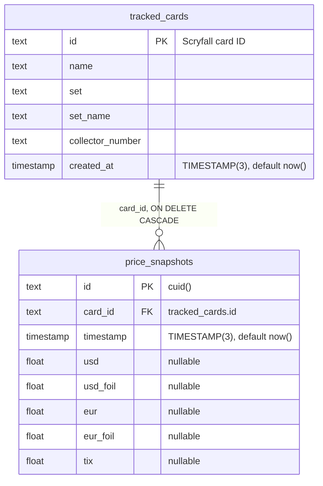

# Mox Market — Entity relationship diagram

> Living ERD. Update it in the same branch as any migration: `tests/contract/erd.test.ts` fails until every model, column and relation in `prisma/schema.prisma` appears here. Seeded by S1.1 (`0000_baseline`); S0.1 (`0001_price_history`) and S5.1 (`0002_recommendation_log`) extend it.

Both tables below are **V1, retained until the contract migration (F0 W5)**. Entity names are the database table names (`@@map`) and attribute names are the database column names (`@map`), not the Prisma field names.

Index: `price_snapshots_card_id_timestamp_idx` on `price_snapshots (card_id, timestamp)`.
