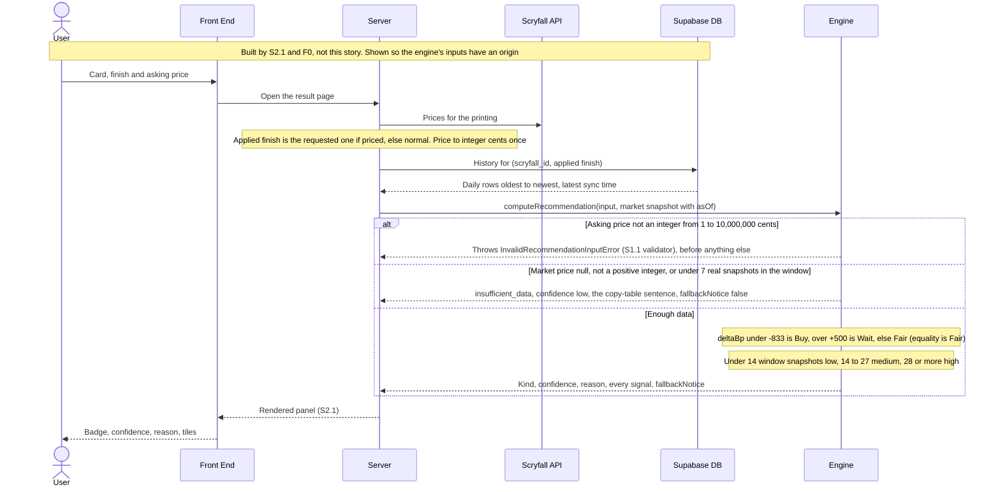
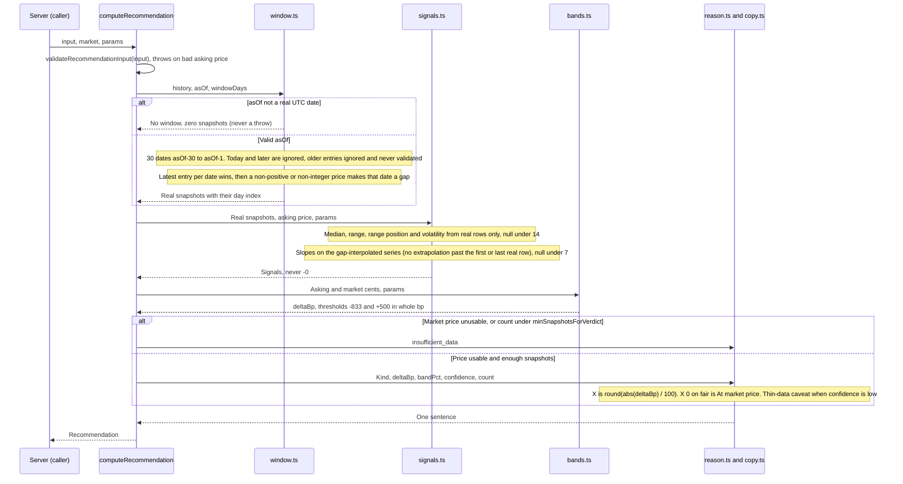
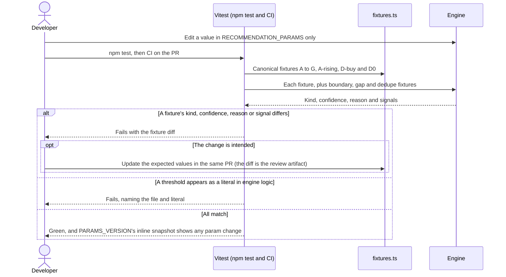

# S1.2 — Basic price-only Buy / Fair / Wait recommendation

> Story: [Notion S1.2](https://app.notion.com/p/394a7227e26f81c4b0fdde80b8897d4f) · Design: [F1 Price Recommendation Engine](https://app.notion.com/p/394a7227e26f813e8e97f395b70c0eb3) (Approved, Josh 2026-10-08; Functionality, Signal definitions, Locked copy table, Worked examples) · Standards: [Development Standards](https://app.notion.com/p/394a7227e26f810e956ef0c76c907c95) · PR: #10 · Critique: docs/critiques/C1-2026-10-04-phase1-designs.md#C1.21, C1.22, C1.23, C1.24, C1.36, C1.57, C1.64 (rulings C1.05 = B, C1.09 = A, C1.10 = A, C1.41 = A, C1.48 = B) · docs/critiques/C3-2026-10-08-s1.1-plan.md#C3.7, C3.9

## Objective
Implement `computeRecommendation(input, market, params = RECOMMENDATION_PARAMS)` in `src/lib/recommendation/`: F1's Tier 1 price-only engine. It validates the asking price (S1.1's validator), reads only the 30 UTC dates ending at `asOf − 1` after keeping the latest entry per date, returns `insufficient_data` for a missing or non-positive market price or fewer than 7 real snapshots, otherwise compares `deltaBp` with the integer-bp thresholds (−833 / +500, strict, equality → Fair), sets confidence from the window count, computes every descriptive signal per the F1 contract (nulls below minimums, gaps interpolated for slope only), sets `fallbackNotice`, and builds the reason from F1's factual templates. Pure functions, integer cents, no clock. F1's worked examples A–G, A-rising, D-buy and D0 are the canonical fixtures. The copy lock and forbidden-phrase lint stay with S1.3 (C1.48 = B).

## Endpoints
None. No API surface, no route, no UI. The first caller is S2.1's result page.

## Data Model
None. No schema change, no migration, no database read or write. The engine receives history from its caller (S2.1, through F0's `getPriceHistory`) and never touches Prisma. `docs/architecture/erd.md` is unchanged.

## Sequence Diagrams

### W1: Compute a recommendation (F1 W1; S1.2 builds the Engine lane only)


### W2: Inside the engine (one call)


### W3: Fixture suite and tuning (F1 W2)


## Test Manifest
| ID | Test | Type | Covers | Notes |
|----|------|------|--------|-------|
| T1 | `src/lib/recommendation/engine.test.ts`: each canonical fixture from `fixtures.ts` through `computeRecommendation` gives exactly: A buy/high, A-rising fair/high, B fair/high, C buy/high, D wait/low, D-buy buy/low, D0 insufficient_data/low, E insufficient_data/low, F wait/high, G fair/medium; its `deltaBp` (A −920, A-rising −500, B −184, C −920, D +1905, D-buy −1429, D0 +1905, E null, F +1043, G −184); and its Tier-1 reason from the F1 table ("9% below market.", "Within 5% of market.", "Within 2% of market.", "9% below market.", "19% above market; only 10 price snapshots.", "14% below market; only 10 price snapshots.", the insufficient_data sentence twice, "10% above market.", "Within 2% of market.") | unit | AC-1, AC-4, AC-10 | Reasons are asserted as design copy; S1.3 AC-3 locks them |
| T2 | `bands.test.ts`: at market 10000, asking 9167 → deltaBp −833 fair; 9166 → −834 buy; 9160 → −840 buy; 10500 → +500 fair; 10501 → +501 wait; 10510 → +510 wait. Rounding at market 20000: 18333 (raw −833.5) → −833 fair, 18332 → −834 buy, 21000 → +500 fair, 21001 (raw +500.5) → +501 wait; market 50000, 52502 (raw +500.4) → +500 fair. `thresholdsBp(RECOMMENDATION_PARAMS)` is `{ buyBp: -833, waitBp: 500 }`. Each case also runs through `computeRecommendation` with 30 flat snapshots at the market price, so the engine uses the same comparison | unit | AC-2 | 18333/20000 is Buy under a float compare (−8.335 < −8.333…) and Fair under integer bp, so it proves C1.41 = A |
| T3 | `bands.test.ts`: `deltaPct === deltaBp / 100` on every T1 and T2 case; asking 100000 against market 100001 gives `deltaBp` +0 (`Object.is(x, 0)`, where `Math.round` alone gives −0), `deltaPct` +0, fair, "At market price."; every outcome, insufficient_data included, reports `bandPct` 5, `wideningFactor` 1, `buyThresholdPct` −8.33 and `waitThresholdPct` 5 | unit | AC-2, AC-7 | S1.2d6 |
| T4 | `engine.test.ts`: flat histories at the market price with 7 and 13 window snapshots → low; 14 and 27 → medium; 28, 29 and 30 → high. A 60-entry history with 13 in the window and 47 older → low with `snapshotCount30d` 13. Every insufficient_data result is low, including E with 30 snapshots | unit | AC-3 | |
| T5 | `engine.test.ts`: `currentPriceCents` null, 0, −100, NaN, Infinity, 81.5, `undefined` and the string "8150" each give insufficient_data, low, the insufficient_data sentence verbatim (U+2014 em dash, straight apostrophe), `fallbackNotice` false, and null `marketPriceCents`, `deltaBp` and `deltaPct`, with no throw. A valid price with 6 window snapshots (D0), with an empty history, and with 30 entries all outside the window (older than `asOf − 30`, or dated `asOf` and later) is insufficient_data. Check order: asking 0 with a null market price, and asking 74.99 with an empty history, both throw `InvalidRecommendationInputError` (field `askingPriceCents`). E with 30 flat snapshots still reports `snapshotCount30d` 30 and `median30dCents` 2000 (S1.2d10) | unit | AC-4 | C3.9: S1.1 left the behaviour half of its AC-3 here |
| T6 | `engine.test.ts`: input `foil` with `{ appliedFinish: 'normal', currentPriceCents: 8150 }` and A's history computes on 8150 (buy, −920) with `fallbackNotice` true; `etched` → `normal` is true; `appliedFinish === finish` for each of normal, foil and etched is false; differing finishes with a null price, and with D0's 6 snapshots, are false because the kind is insufficient_data | unit | AC-5 | C1.21: the caller picks `appliedFinish`, the engine never re-picks it |
| T7 | `types.test.ts` (S1.1 purity scan, extended): the scanned file list includes `engine.ts`, `window.ts`, `signals.ts`, `bands.ts`, `reason.ts`, `copy.ts` and `fixtures.ts`, and none imports React, Next or anything outside `src/lib/recommendation`; no non-test engine source contains `Date.now`, a zero-argument `new Date()`, a bare `Date()`, `performance.now`, `Math.random` or `process.env`. `engine.test.ts`: with input, market, every history entry and a params copy deep-frozen, `computeRecommendation` does not throw, returns deep-equal output on a second call and leaves the history order unchanged; `latestSnapshotAt` null and a Date give identical output | unit | AC-6 | ESM is strict, so a write to a frozen object throws |
| T8 | `no-literals.test.ts`: the TypeScript compiler API walks every non-test `.ts` file in `src/lib/recommendation` except `params.ts`, `limits.ts` and `fixtures.ts`, and finds no `NumericLiteral` outside {0, 1, 2, 10, 100, 10000}; the test also asserts no `RECOMMENDATION_PARAMS` value is in that allowlist. A self-test on inline sources flags `count < 7`, `0.6` and `-833`, and passes `x * 100` | unit | AC-6; AGENTS.md params-in-one-place | S1.2d13. `typescript` is already a devDependency |
| T9 | `signals.test.ts`: A-rising (ramp 7304 → 8696, +48/day, asking 7600) gives exactly `median30dCents` 7976 (lower median), `range30dCents` {7304, 8696, 8000}, `rangePosition` 37/174, `slope30dPct` 0.6, `slope7dPct` 600/1069 (0.56127221702525…), `volatility30d` 0.05193264869039514, `trendDirection` rising, `snapshotCount30d` 30 | unit | AC-7 | Floats with `toBeCloseTo(v, 12)`; integers and nulls with `toBe` |
| T10 | `signals.test.ts`: fixture S (30 unsorted values below, asking 8000, market 8150) gives `median30dCents` 8090 (upper would be 8100, midpoint 8095), `range30dCents` {7780, 8400, 8096}, `rangePosition` 11/31, `slope30dPct` −250/227447 (−0.00109915716628489), `slope7dPct` 175/1418 (0.12341325811001410), `volatility30d` 0.019011576944286428, `trendDirection` flat; the engine returns fair, high, "Within 2% of market." | unit | AC-7 | Non-linear, so OLS differs from an endpoint slope |
| T11 | `signals.test.ts`: A and B (30 flat at 8150) have `rangePosition` null (zero-width range), `median30dCents` 8150, `range30dCents` {8150, 8150, 8150}, `slope30dPct` and `slope7dPct` +0, `volatility30d` +0, `trendDirection` flat; G (20 flat) the same with `snapshotCount30d` 20 | unit | AC-7 | |
| T12 | `signals.test.ts`: C (8696 → 7304, −48/day, asking 7400) gives `slope30dPct` −0.6, `slope7dPct` −600/931, `trendDirection` falling, `median30dCents` 7976, `range30dCents` {7304, 8696, 8000}, `rangePosition` 2/29, `volatility30d` 0.05193264869039514; the engine returns buy, high, "9% below market." | unit | AC-7 | C1.10 = A re-pinned C at −0.6 %/day |
| T13 | `signals.test.ts`: at 6 window snapshots every history signal is null; at 7 and 13 the slopes and `trendDirection` are set while `median30dCents`, `range30dCents`, `rangePosition` and `volatility30d` are null; at 14 all are set. Thirteen 8000s and one 8007 give `range30dCents.avg` 8001 (mean 8000.5, `Math.round`). Asking below the range low gives `rangePosition` 0 and above the high gives 1. No numeric signal on any fixture in this file or T1 is −0 | unit | AC-7 | |
| T14 | `signals.test.ts`: a 30-day ramp at +40/day around mean 8000 gives `slope30dPct` exactly 0.5 → flat; +48/day → rising; −40/day → −0.5 → flat; −48/day → falling | unit | AC-7 | Strict comparison, as F1 states |
| T15 | `signals.test.ts`, gaps: GAP (A-rising's ramp without window days 3–12, 20 real rows) gives `snapshotCount30d` 20, medium, `median30dCents` 8216, `range30dCents` {7304, 8696, 8168} and `volatility30d` 0.04969109067175640 from real rows only, `slope30dPct` 0.6 (an OLS over real rows only, or a real-row divisor, gives 0.58766) and `slope7dPct` 600/1069. BIGGAP (days 0 and 24–29, a 23-day gap, 7 rows): `slope30dPct` 0.6 (real-row OLS 0.57182), median, range and volatility null. NONLIN (8000 on days 0–5, 8290 on day 29): `slope30dPct` 8200/60419 (0.13571889637365730), `slope7dPct` 2900/19809, flat; the real-row OLS value 0.13224 is rejected. LEAD (ramp on days 0–9 only): `slope30dPct` 30/47 over days 0–9 (no extrapolation) and `slope7dPct` null, because the last 7 window dates hold no series point | unit | AC-8 | Moved from S3.1 AC-5. S1.2d8 |
| T16 | `window.test.ts`: three entries on one UTC date (8000, 8100, 8200 in array order) give `snapshotCount30d` 1 and insufficient_data; 14 dates where one holds 1000, 2000 and 9999 give 14 (not 16) and a range high of 9999 (the last entry wins); a date whose last entry is 0 after a valid 8000 becomes a gap, and 8000 is not used | unit | AC-9 | S1.2d4 |
| T17 | `window.test.ts`: for asOf 2026-10-10, entries on 2026-09-10 (`asOf − 30`) count, while 2026-09-09, 2026-10-10 (asOf) and 2026-10-11 are ignored; `windowDates` gives 30 ascending distinct dates, 2026-01-30 … 2026-02-28 for asOf 2026-03-01, a window holding 2028-02-29 for 2028-03-01, and 2026-12-02 … 2026-12-31 for 2027-01-01. asOf "2026-02-30", "2026-10-10T00:00:00Z", "20261010" and "" give no window, so a valid price returns insufficient_data without a throw. Entries that are null, have dates "2026-10-9", "2026-10-09T12:00:00Z", a Date object or a number, or have `priceCents` 0, −5, 81.5, NaN, Infinity, "8150" or null are gaps, never a throw; a `history` that is null or not an array counts as empty; a shuffled history with distinct dates gives the same result as the sorted one | unit | AC-4, AC-9, C1.22 | Market-data problems never throw (F1 W1 step 2) |
| T18 | `reason.test.ts`: 8130 against 8150 with 30 flat snapshots → deltaBp −25, fair, "At market price."; `buildReason` for fair at deltaBp −49 → "At market price.", −50 → "Within 1% of market.", −149 → "Within 1% of market.", −150 → "Within 2% of market.", −500 → "Within 5% of market.", +500 → "Within 5% of market.", −501 → "5% below market.", −833 → "8% below market.", +700 → "7% above market."; buy at −840 → "8% below market."; wait at +510 → "5% above market."; low confidence adds the thin-data caveat on buy, fair and wait ("…; only 7 price snapshots.", "At market price; only 10 price snapshots."), medium and high never do; insufficient_data ignores the caveat. No reason across T1, T2, T4 and T18 contains "{", "}", "NaN", "undefined", "Infinity", "-0" or a double space, and each ends with exactly one "." | unit | AC-10, AC-1 | Fair's "above" frame is unreachable at Tier 1, so `buildReason` covers it directly |
| T19 | `engine.test-d.ts`: `Parameters<typeof computeRecommendation>` equals `[RecommendationInput, MarketSnapshot, RecommendationParams?]` (the default makes `params` optional); `ReturnType` equals `Recommendation`; a market literal without `asOf` carries `// @ts-expect-error` | unit (typecheck) | AC-1, AC-6 | Covered by `tsconfig.vitest.json` (`src/**/*.test-d.ts`) |
| T20 | `engine.test.ts` (tuning, F1 W2): `{ ...RECOMMENDATION_PARAMS, fairBandPct: 10 }` turns A into fair "Within 9% of market." with `buyThresholdPct` −16.67, `waitThresholdPct` 10 and `bandPct` 10; `minSnapshotsForVerdict: 5` turns D0 into wait/low "19% above market; only 6 price snapshots."; `windowDays: 60` counts all 45 entries of a 45-day history (high); `highConfidenceSnapshotCount: 31` makes A medium. Afterwards `RECOMMENDATION_PARAMS` and `PARAMS_VERSION` are unchanged | unit | AC-1, AC-7; Conventions | Tuning needs no logic change |
| T21 | `scripts/test-report.test.ts`: `featureOf` maps `src/lib/recommendation/{engine,bands,signals,window,reason,no-literals}.test.ts` and `engine.test-d.ts` to F1; `src/lib/recommendation/volatility.test.ts` stays F3 | unit | DoD 3 | S1.2d12: no file name starts with an F3 prefix |
| T22 | `npm run lint`, `npm run build` and `npm test` exit 0 locally on Node 22, and every PR check is green in CI; `npm run test:report` lists T1–T21's files under F1 with no Unmapped | functional | AC-1 to AC-10 | Engine story evidence (Standards DoD 4): the test-report F1 section plus command output in the PR |
| T23 | `signals.test.ts` (ADV-1): the reviewer's non-linear history with exact `slope30dPct` +1/2 and its mirror (exact −1/2) give `slope30dPct` exactly ±0.5 and flat; one cent more on the newest day turns them rising and falling; 300 seeded non-linear histories exactly on ±0.5 (half with a gap) are all flat; `exactSlopePct` equals an independent centred-sum BigInt reference on 300 seeded gappy histories; the threshold is whole bp (0.49 rising, 0.501 flat). `bands.test.ts`: `trendThresholdBp` 50 at F1's params | unit | AC-7; C1.10 = A, C1.41 = A | D9 |
| T24 | `signals.test.ts` (ADV-2): the reviewer's palindrome and 500 seeded palindromes give `slope30dPct` +0 (`Object.is`) and flat; the no −0 sweep also fails on any nonzero numeric signal under 1e-12 | unit | AC-7 | D9 |
| T25 | `engine.test.ts` (ADV-3): `appliedFinish` missing, null, "Normal" or "" → insufficient_data, `fallbackNotice` false, null price, count 0, for every requested finish; requested normal/foil, normal/etched, foil/etched, etched/foil → the same; input finish undefined, null, "Foil", "" or "nonfoil" throws `InvalidRecommendationInputError` (field `finish`) before any market check; a bad asking price is reported first. `validate.test.ts`: each finish in FINISHES passes, six others throw | unit | AC-3, AC-5; C1.21 | D5, D6 |
| T26 | `reason.test.ts` (ADV-4): `buildReason` buy at −9849 "98% below market.", −9850, −9949, −9950, −9999 and −10000 "99% below market."; wait +10000 "100% above market."; end to end with 30 flat snapshots: 1/8150 −9999 buy, 41/8150 −9950 buy and 1/30000 −10000 buy all "99% below market.", 10,000,000/1 +99,999,990,000 wait "999999900% above market." | unit | AC-10 | D8 |
| T27 | `engine.test.ts` (ADV-5): 60 entries with 13 in the window → "At market price; only 13 price snapshots."; 10 dates plus 3 duplicates → "19% above market; only 10 price snapshots."; 27 dates plus 3 duplicates → medium, "At market price."; 7 dates with one 0 → insufficient_data, count 6; 14 dates with one date's last entry 0 → low, "only 13" | unit | AC-3, AC-9, AC-10 | No code change |
| T28 | `engine.test.ts` and `validate.test.ts` (ADV-6): input null, undefined, 42 and "x" throw `InvalidRecommendationInputError` (field `askingPriceCents`), with a valid and a null market | unit | AC-3 | D7 |
| T29 | `window.test.ts` (ADV-7): under TZ Pacific/Kiritimati (UTC+14) and Pacific/Pago_Pago (UTC−11), `windowDates` for four asOf dates, `readWindow` and every canonical fixture equal the UTC results, after asserting the zone switch took effect. `types.test.ts`: the impurity scan also flags local-time Date getters and setters, `toLocale*String`, `toDateString`, `toTimeString`, `Intl.*`, `Date.parse` and `new Date(y, m, …)` | unit | AC-6 | D10 |
| T30 | `signals.test.ts` (ADV-8): A-rising's rows 0–5 and 23 give `slope7dPct` null (one series point in the last 7 dates) and rising; rows 0–5 and 24 give `slope7dPct` 300/527 (0.5692599620493358, from interpolated day 23 and real day 24) | unit | AC-8 | No code change |
| T31 | `signals.test.ts` (CODEX.1): 14 snapshots at 9_007_199_254_740_990 and 30 at `Number.MAX_SAFE_INTEGER` give that price as `range30dCents` low, high and avg, `median30dCents` that price and `volatility30d` +0; with B = 9_007_199_254_740_980, 8 × B + 6 × (B + 1) gives avg B, 7 + 7 gives B + 1 (mean B + ½, `Math.round`) and 6 + 8 gives B + 1; 7 + 7 gives `volatility30d` 1 / (2B + 1) to a relative 1e-14; 400 seeded histories (half within 1000 cents of `MAX_SAFE_INTEGER`, half across the safe range) match a quotient-and-remainder avg reference exactly and a 36-digit centred-sum BigInt volatility reference to a relative 1e-14; 200 seeded equal-price histories give that avg and volatility +0. These call the engine directly, so the 1e-12 residue sweep (T24) does not see the legitimate 5.6e-17 volatility | unit | AC-7; Money is integer cents | D11 |

### Fixture data (`src/lib/recommendation/fixtures.ts`, asOf 2026-10-10)
Every history below sits on consecutive window dates ending 2026-10-09 (`asOf − 1`), oldest first. Input finish and `appliedFinish` are `normal` unless a test says otherwise; `latestSnapshotAt` is 2026-10-09T06:00:00Z.

| Fixture | Asking | Market | History |
|---|---|---|---|
| A | 7400 | 8150 | 30 × 8150 |
| A-rising | 7600 | 8000 | 30, 7304 + 48·d (d = 0…29) |
| B | 8000 | 8150 | 30 × 8150 |
| C | 7400 | 8150 | 30, 8696 − 48·d (F1's listed values) |
| D | 5000 | 4200 | 10 × 4200 |
| D-buy | 3600 | 4200 | 10 × 4200 |
| D0 | 5000 | 4200 | 6 × 4200 |
| E | 2000 | null | 30 × 2000 |
| F | 9000 | 8150 | 30 × 8150 |
| G | 8000 | 8150 | 20 × 8150 |
| S (T10) | 8000 | 8150 | 8150, 8020, 8310, 7990, 8100, 8240, 7870, 8060, 8180, 7950, 8400, 8010, 8120, 7780, 8290, 8050, 7930, 8210, 8070, 8330, 7900, 8160, 8040, 8260, 7820, 8190, 8090, 7960, 8270, 8130 |

T9–T15's expected values were computed with exact rational arithmetic (Python `fractions`, `decimal` for the square root), independently of the engine. GAP, BIGGAP, NONLIN and LEAD index days 0–29 from 2026-09-10.

### Evidence commands (Node 22, repo root)
```bash
source ~/.nvm/nvm.sh && nvm use 22 >/dev/null
# AGENTS.md Databases limit: `npm test` runs S1.1's integration project, so check hosts first.
# Print hostnames only; anything but localhost or 127.0.0.1 means stop.
{ env; cat .env* 2>/dev/null; } | grep -oE 'postgres(ql)?://[^[:space:]"]+' | sed -E 's#^[^@]*@##; s#[:/?].*##' | sort -u
# A host or hostaddr query parameter overrides the hostname; this must print nothing.
{ env; cat .env* 2>/dev/null; } | grep -oE 'postgres(ql)?://[^[:space:]"]+' | grep -oiE '[?&]host(addr)?=[^&#]*' | sort -u
npm run lint
npm run build
npx vitest run src/lib/recommendation scripts/test-report.test.ts   # the engine evidence for the PR
npm test
npm run test:report   # regenerate and commit docs/test-report.md
```

## Results                                      <!-- filled in Review; tests are authored in Testing, run here -->
| ID | Pass/Fail | Evidence |
|----|-----------|----------|
| T1 | Pass | `src/lib/recommendation/engine.test.ts`: `CANONICAL_FIXTURES` is exactly A, A-rising, B, C, D, D-buy, D0, E, F, G; each gives its exact kind, confidence, `deltaBp` and reason (A buy/high −920 "9% below market."; A-rising fair/high −500 "Within 5% of market."; B fair/high −184 "Within 2% of market."; C buy/high −920; D wait/low +1905 "19% above market; only 10 price snapshots."; D-buy buy/low −1429 "14% below market; only 10 price snapshots."; D0 insufficient_data/low +1905; E insufficient_data/low null; F wait/high +1043 "10% above market."; G fair/medium −184); a second table written inline (independent of `fixtures.ts`) asserts the same; the insufficient_data sentence equals F1's copy with U+0027 and U+2014 · `6dce50c` |
| T2 | Pass | `bands.test.ts` (17 tests with T3): `thresholdsBp(RECOMMENDATION_PARAMS)` is `{ buyBp: -833, waitBp: 500 }`; 9167/10000 −833 fair, 9166 −834 buy, 9160 −840 buy, 10500 +500 fair, 10501 +501 wait, 10510 +510 wait; 18333/20000 (raw −833.5) −833 fair, 18332 −834 buy, 21000 +500 fair, 21001 (raw +500.5) +501 wait, 52502/50000 (raw +500.4) +500 fair; each case also through `computeRecommendation` with 30 flat snapshots (same `deltaBp` and kind, high); 18333/20000 shown to be below −25/3 as a float percent yet Fair in integer bp (C1.41 = A); equality with either threshold Fair, one bp past it not · `6dce50c` |
| T3 | Pass | `bands.test.ts`: `deltaPct === deltaBp / 100` on every T1 and T2 outcome (null with null); 100000/100001: raw `Math.round` is −0, `deltaBpOf` and the engine's `deltaBp` and `deltaPct` are +0 (`Object.is`), fair, "At market price."; every outcome, insufficient_data included, reports `bandPct` 5, `wideningFactor` 1, `buyThresholdPct` −8.33, `waitThresholdPct` 5 · `6dce50c` |
| T4 | Pass | `engine.test.ts`: flat histories with 7 and 13 window snapshots low, 14 and 27 medium, 28, 29 and 30 high (fair, matching `snapshotCount30d`); 60 entries (47 dated `asOf − 77` … `asOf − 31`, 13 in the window) → low, count 13; every insufficient_data fixture is low, E with 30 snapshots included · `6dce50c` |
| T5 | Pass | `engine.test.ts`: market price null, 0, −100, NaN, Infinity, 81.5, `undefined` and "8150" each → insufficient_data, low, the sentence verbatim, `fallbackNotice` false, null `marketPriceCents`/`deltaBp`/`deltaPct`, no throw; a snapshot with the key absent too; D0 (6), an empty history, 30 entries older than `asOf − 30` and 30 dated `asOf` and later → insufficient_data; asking 0 with a null price and 74.99 with an empty history throw `InvalidRecommendationInputError` (field `askingPriceCents`); E reports `snapshotCount30d` 30 and `median30dCents` 2000 (S1.2d10); a `market` of null, undefined, 42 or a string → insufficient_data, never a throw (D1) · `6dce50c` |
| T6 | Pass | `engine.test.ts`: foil requested with `appliedFinish` normal and A's history → buy, −920, `marketPriceCents` 8150, `fallbackNotice` true; etched → normal true; equal finishes (normal, foil, etched) false; differing finishes with a null price and with 6 snapshots → insufficient_data, false · `6dce50c` |
| T7 | Pass | `types.test.ts` (6 tests): the import scan's file list includes `engine.ts`, `window.ts`, `signals.ts`, `bands.ts`, `reason.ts`, `copy.ts`, `fixtures.ts`, with no React, Next or out-of-engine import; a TypeScript-AST clock scan (self-tested on 13 samples, comments and strings ignored) finds no `Date.now`, zero-argument `new Date`, bare `Date()`, `performance.now`, `Math.random` or `process.env`, `globalThis.` forms included, in any non-test engine source. `engine.test.ts`: with input, market, history entries and a params copy deep-frozen (`structuredClone` of every canonical fixture plus a 10-row sparse case), no throw, the second call `toStrictEqual` the first and equals the unfrozen call, history order unchanged; `latestSnapshotAt` null vs a Date give identical output on every fixture; mutating a returned range does not leak into the next call · `6dce50c` |
| T8 | Pass | `no-literals.test.ts` (4 tests): the TS-AST walker flags `count < 7`, `0.6`, `-833` (as 833) and `30n`, passes `x * 100`, `10_000` and numbers in comments and strings; it scans `engine`, `window`, `signals`, `bands`, `reason`, `copy`, `types`, `validate`, `errors` and not `params`, `limits`, `fixtures`; no literal outside {0, 1, 2, 10, 100, 10000} in any of them; no `RECOMMENDATION_PARAMS` value is in the allowlist · `6dce50c` |
| T9 | Pass | `signals.test.ts` (24 tests, T9–T15): A-rising: median 7976, range {7304, 8696, 8000}, `rangePosition` 37/174, `slope30dPct` 0.6, `slope7dPct` 600/1069, `volatility30d` 0.05193264869039514, rising, count 30 (floats `toBeCloseTo(v, 12)`) · `6dce50c` |
| T10 | Pass | `signals.test.ts`: fixture S: median 8090, range {7780, 8400, 8096}, `rangePosition` 11/31, `slope30dPct` −250/227447, `slope7dPct` 175/1418, `volatility30d` 0.019011576944286428, flat; fair, high, "Within 2% of market." · `6dce50c` |
| T11 | Pass | `signals.test.ts`: A, B and G: `rangePosition` null, median 8150, range {8150, 8150, 8150}, `slope30dPct`, `slope7dPct` and `volatility30d` +0 (`Object.is`), flat; count 30, 30, 20 · `6dce50c` |
| T12 | Pass | `signals.test.ts`: C: `slope30dPct` −0.6, `slope7dPct` −600/931, falling, median 7976, range {7304, 8696, 8000}, `rangePosition` 2/29, `volatility30d` 0.05193264869039514; buy, high, "9% below market." · `6dce50c` |
| T13 | Pass | `signals.test.ts`: 6 snapshots → every history signal null; 7 and 13 → slopes and trend set, median, range, position, volatility null; 14 → all set; thirteen 8000s and one 8007 → avg 8001; asking 1 and 7304 → 0, 8696 and 99999 → 1; no numeric signal (range fields included) on any outcome in the file or T1 is −0 · `6dce50c` |
| T14 | Pass | `signals.test.ts`: +40/day → `slope30dPct` exactly 0.5 (`toBe`), flat; +48 → 0.6 rising; −40 → exactly −0.5, flat; −48 → −0.6 falling · `6dce50c` |
| T15 | Pass | `signals.test.ts`: GAP (20 rows) count 20, medium, median 8216, range {7304, 8696, 8168}, `volatility30d` 0.0496910906717564, `slope30dPct` 0.6 (not 0.58766), `slope7dPct` 600/1069; BIGGAP (7 rows) `slope30dPct` 0.6 (not 0.57182), `slope7dPct` 600/1069, median, range, position, volatility null; NONLIN `slope30dPct` 8200/60419 (not 0.13224), `slope7dPct` 2900/19809, flat; LEAD `slope30dPct` 30/47, `slope7dPct` null, rising; a trailing gap is not extrapolated; `interpolatedSeries` fills a gap linearly between its real neighbours; `slopePct` is null under two points · `6dce50c` |
| T16 | Pass | `window.test.ts` (44 tests with T17): three entries on one date → count 1, insufficient_data, the kept row is the last (8200); 14 dates with one holding 1000, 2000, 9999 → count 14, range high 9999; a date whose last entry is 0 after 8000 is a gap and 8000 is not used (count 13); a valid entry after an invalid one on the same date is kept · `6dce50c` |
| T17 | Pass | `window.test.ts`: for asOf 2026-10-10, 2026-09-10 counts (index 0), 2026-09-09, 2026-10-10 and 2026-10-11 ignored; `windowDates` 30 ascending distinct dates 2026-09-10 … 2026-10-09; 2026-01-30 … 2026-02-28 for 2026-03-01; 2028-02-29 is the last date for 2028-03-01; 2026-12-02 … 2026-12-31 for 2027-01-01; asOf "2026-02-30", "2026-10-10T00:00:00Z", "20261010", "", "2026-13-01", "2026-10-00", "0099-03-01", " 2026-10-10", null, undefined, a number and a Date give no window and insufficient_data without a throw; 19 malformed entries (null, undefined, number, string, array, unpadded date, timestamp, Date object, number date, missing date; `priceCents` 0, −5, 81.5, NaN, Infinity, "8150", null, missing, 2^53) are gaps; a history that is null, undefined, an array-like object, a string or a number is empty; a shuffled history `toStrictEqual`s the sorted one · `6dce50c` |
| T18 | Pass | `reason.test.ts` (23 tests): 8130/8150 → −25, fair, "At market price."; fair −49, +49, 0 → "At market price."; −50 and −149 → "Within 1% of market."; −150 → "Within 2%"; ±500 → "Within 5%"; −501 → "5% below market."; −833 → "8% below market."; +700 → "7% above market."; buy −840 "8% below market."; wait +510 "5% above market."; low confidence adds "; only {n} price snapshots" on buy, fair (both frames) and wait; medium and high never; insufficient_data ignores every field; 57 reasons across T1, T2, T4 and T18 hold no "{", "}", "NaN", "undefined", "Infinity", "-0" or double space and end in exactly one "." · `6dce50c` |
| T19 | Pass | `engine.test-d.ts` (2 type tests): `Parameters` equals `[RecommendationInput, MarketSnapshot, RecommendationParams?]`, `ReturnType` equals `Recommendation`; a market literal without `asOf` carries `@ts-expect-error` (tsc would flag it unused otherwise) and the same literal with `asOf` compiles; Vitest typecheck "no errors" · `6dce50c` |
| T20 | Pass | `engine.test.ts`: `fairBandPct` 10 → A fair "Within 9% of market.", −16.67 / 10, `bandPct` 10; `minSnapshotsForVerdict` 5 → D0 wait/low "19% above market; only 6 price snapshots."; `windowDays` 60 → 45 of 45 entries counted (30 at default), high; `highConfidenceSnapshotCount` 31 → A medium; `trendThresholdPct` 0.4 relabels a +40/day ramp rising with the kind unchanged; afterwards the params hold their F1 values and `PARAMS_VERSION` is still `46ec1cd7` · `6dce50c` |
| T21 | Pass | `scripts/test-report.test.ts` (67 tests): `engine`, `bands`, `signals`, `window`, `reason`, `no-literals` tests and `engine.test-d.ts` map to F1; `volatility.test.ts` stays F3 · `6dce50c` |
| T22 | Pass | Local, Node 22.23.3, at `6dce50c`: host check printed only `localhost`, the `host=` check nothing; `npm run lint` exit 0 (0 errors, 1 warning, the pre-existing `/sample` one, S1.1 D2); `npm run build` green with `POSTGRES_PRISMA_URL` inline to the local server; `npx vitest run src/lib/recommendation scripts/test-report.test.ts` 13 files, 285 passed, type errors none; `npm test` 36 files, 999 passed, 2 skipped, type errors none (throwaway Postgres 14.8 on `localhost:55432`); `npm run test:report` "✅ All green", 1001 tests, F1 30 files 702 tests, no Unmapped row. CI [run 38076461527](https://github.com/ayfor/mox-market/actions/runs/38076461527) on `6dce50c`: "lint + build + test" green in 1m33s (`prisma migrate deploy` applied, lint 0 errors 1 warning, 36 files, 999 passed, 2 skipped, type errors none); Vercel preview green. After the ADV fixes, local at `8b9fcff`: host check `localhost` only, `host=` check empty; lint 0 errors 1 warning; build green; engine run 13 files, 338 passed; `npm test` 36 files, 1052 passed, 2 skipped, type errors none; `npm run test:report` "✅ All green", 1054 tests, F1 30 files 755 tests, no Unmapped. CI [run 38078209364](https://github.com/ayfor/mox-market/actions/runs/38078209364) on `9ba20ff` (the fix plus its plan update): "lint + build + test" green in 1m25s (lint 0 errors 1 warning, 36 files, type errors none); Vercel preview green. After CODEX.1, local at `214c816`: host check `localhost` only, `host=` check empty; lint 0 errors 1 warning; build green; engine run 13 files, 346 passed; `npm test` 36 files, 1060 passed, 2 skipped, type errors none (throwaway Postgres 14.8 on `localhost:55432`); `npm run test:report` "✅ All green", 1062 tests, F1 30 files 763 tests, no Unmapped. CI [run 38079205012](https://github.com/ayfor/mox-market/actions/runs/38079205012) on `c78ba56` (the fix plus its plan update): "lint + build + test" green in 1m31s; Vercel preview green |
| T23 | Pass | `signals.test.ts` "the trend label at exactly ±trendThresholdPct": both reviewer histories exactly ±0.5 and flat (they were 0.5000000000000001 rising and −0.5000000000000001 falling before `8b9fcff`); one cent past turns them; 300 boundary histories flat; 300 reference comparisons equal; 0.49 rising, 0.501 flat; `bands.test.ts` `trendThresholdBp` 50, 40, 50, 51, +0 · `8b9fcff` |
| T24 | Pass | `signals.test.ts`: the palindrome gives +0 and flat (−4.997688485217045e-18 before `8b9fcff`); 500 seeded palindromes +0; the residue sweep finds nothing · `8b9fcff` |
| T25 | Pass | `engine.test.ts` "unusable finishes": 4 bad `appliedFinish` values × 3 requested finishes, 4 contract-breaking pairs, 5 bad input finishes × 2 markets, asking-price-first order; `validate.test.ts` 3 + 6 finish cases (before `8b9fcff` the bad `appliedFinish` cases gave buy −920 with `fallbackNotice` true) · `8b9fcff` |
| T26 | Pass | `reason.test.ts` "extreme deltas": 9 `buildReason` cases and 5 end-to-end cases, all exact (41/8150 read "100% below market." before `8b9fcff`) · `8b9fcff` |
| T27 | Pass | `engine.test.ts`: five cases, exact reasons, counts and confidence · `8b9fcff` |
| T28 | Pass | `engine.test.ts` and `validate.test.ts`: 4 inputs × 2 markets, 4 validator cases, each the typed error (a TypeError before `8b9fcff`) · `8b9fcff` |
| T29 | Pass | `window.test.ts` "time-zone independence": both zones equal UTC; mutation check: rewriting `isoDate` with `getFullYear`/`getMonth`/`getDate` fails 27 window tests (local zone America/Toronto) and the scanner; `types.test.ts` scanner self-test flags 21 samples and passes `getUTCFullYear`/`toISOString` · `8b9fcff` |
| T30 | Pass | `signals.test.ts`: null and rising; 300/527 and rising · `8b9fcff` |
| T31 | Pass | `signals.test.ts` "prices near 2^53 keep whole cents in avg and volatility": 7 tests; mutation check: with `17605e5`'s `signals.ts` all 7 fail (avg off by one or more cents, volatility nonzero for equal prices) and the T24 residue sweep fails too · `214c816` |

## Deviations                                   <!-- what changed from the plan and why -->
No behaviour in the plan changed. Additions, each covered by a test:
- **D1 — Non-object market.** S1.2d2 assumed a `MarketSnapshot` object. `computeRecommendation` now treats a `market` that is null, undefined or not an object as empty (insufficient_data, `fallbackNotice` false), because a market-data problem never throws (F1 W1 step 2). T5.
- **D2 — Extra exports.** Beyond S1.2d2 and S1.2d14: `readWindow` (window), `interpolatedSeries`, `slopePct` and `computeHistorySignals` (signals), `deltaBpOf`, `bandKind`, `withoutNegativeZero` and `BP_PER_PCT` (bands), `fillTemplate`, `CLAUSE_SEPARATOR` and `SENTENCE_END` (copy), and the fixture helpers `fixtureInput`, `fixtureMarket`, `flat`, `ramp`, `canonicalFixture`, `INSUFFICIENT_DATA_SENTENCE`, `FIXTURE_CARD_ID`, `FIXTURE_LATEST_SNAPSHOT_AT`. Tests and S1.3/S3.1 use them; app code imports none.
- **D3 — Scanner method.** T7's clock scan and T8's literal scan both read the TypeScript AST, so comments and strings never count; T7 also catches `globalThis.` forms and `new Date` without parentheses, and T8 also flags BigInt literals.
- **D4 — Interpolation arithmetic.** S1.2d8's linear fill is computed as `(y0 × (span − k) + y1 × k) / span`: integer products, one rounding per point, so a gap in a linear ramp reproduces the ramp exactly (T15's GAP and BIGGAP). Superseded by D9: the point is now kept as the exact fraction, with no rounding at all.

Added after the adversarial review (ADV, 2026-10-10). D5, D6, D8 and D9 change behaviour; each is a choice taken under Josh's overnight directive that Josh can overturn, and F1 in Notion carries a dated note for D5, D6, D8 and D9:
- **D5 — Unusable applied finish (ADV-3).** Extends D1 and S1.2d11. A market whose `appliedFinish` is neither the requested finish nor `normal` (missing, null, misspelt such as "Normal", or a contract-breaking pair such as normal requested with foil applied) is treated as empty: insufficient_data, `fallbackNotice` false, null price and delta, `snapshotCount30d` 0. The price and history would belong to an unknown finish, and C1.21 lets the caller fall back to `normal` only. `fallbackNotice` can therefore be true only for foil or etched requested with normal applied. T25.
- **D6 — Finish validated as user input (ADV-3).** S1.2d1 listed `validate.ts` (S1.1) as untouched. `validateRecommendationInput` now throws `InvalidRecommendationInputError` with field `finish` ("finish must be one of normal, foil, etched") for a finish outside FINISHES, after the asking-price check. The finish comes from `?finish=`, F2 already treats a bad one as a validation error, and F2 renders the inline error on this exception. S1.1's test "only the asking price is validated" is renamed "cardId is not validated"; its assertion is unchanged. The alternative Josh can pick: leave the finish to S2.1's parser and only force `fallbackNotice` false. T25.
- **D7 — Non-object input (ADV-6).** `validateRecommendationInput` reads the fields from `{}` when the input is not an object, so `computeRecommendation(null, market)` throws the typed error (field `askingPriceCents`) rather than a TypeError. T28.
- **D8 — Below clauses read at most 99% (ADV-4).** F1's X rule (`Math.round(|deltaBp| / 100)`) gave "100% below market." for deltaBp from −9950 down, which is false for any asking price of at least one cent. A below clause now states `min(X, 99)`. Above clauses are not capped: "999999900% above market." (asking 10,000,000 against market 1) is a true observed fact. `deltaBp` itself still follows C1.41 = A, so asking 1 against a market above 20,000 reports `deltaBp` −10000 and `deltaPct` −100 while the reason says 99%. T26.
- **D9 — Exact slopes and an exact trend test (ADV-1, ADV-2).** Extends C1.41 = A from deltas to the trend label. Each series point is the exact fraction `num / den` (den is the gap's span, 1 on a real row); `exactSlopePct` computes `100·n·(nΣxy − ΣxΣy) / ((nΣx² − (Σx)²)·Σy)` from BigInt sums with every y scaled by the lcm of the spans, reduced to lowest terms. `slope30dPct` and `slope7dPct` are the nearest doubles of those fractions (an exact zero is +0). `trendDirection` compares the exact fraction with `trendThresholdBp(params) = Math.round(trendThresholdPct × 100)` (50 bp/day), strictly, so a float error never flips the label and S3.1's shift gate inherits one exact test. Within one ulp of the threshold, the reported double can read 0.5 while the exact slope is just above it (rising); the label follows the exact value. New exports: `exactSlopePct`, `ratioToNumber`, `ExactRatio` (signals) and `trendThresholdBp` (bands); `SeriesPoint` is now `{ x, num, den }`. `tsconfig.json` targets ES2017, so the code uses `BigInt()` calls rather than BigInt literals. T23, T24.
- **D10 — Time-zone test and local-time scan (ADV-7).** `window.test.ts` switches `process.env.TZ` (Vitest runs each file in a forked process, and Node re-reads TZ on assignment) and asserts the switch took effect before comparing; no CI workflow change. The T7 scanner also flags local-time Date methods, `Intl.*`, `Date.parse` and `new Date(y, m, …)`. T29.

Added after the ChatGPT Codex review (CODEX, 2026-10-10):
- **D11 — Exact cent sums (CODEX.1).** Extends S1.2d8's arithmetic, not its definitions. `range30dCents.avg` is `Math.round(Σp / n)` computed as `floor((2Σp + n) / 2n)` from BigInt sums, and `volatility30d` is `sqrt(nΣp² − (Σp)²) / Σp` (the same population σ / μ) with the radicand an exact BigInt, so a 30-day sum past 2^53 keeps every cent and equal prices give exactly +0 at any safe price. Values for real card prices are unchanged (T9–T15 pass as written). **Choice Josh can overturn:** Codex also offered capping accepted history prices; exact arithmetic keeps S1.2d4's "any positive safe integer" contract instead of adding a bound F1 does not state. Checked and unchanged: `deltaBpOf` (the asking price is at most 10,000,000, so the bp quotient cannot land on a false tie), `rangePosition` (one exact subtraction, one division) and the median, low and high (selections). T31.

## Decisions                                    <!-- S#.#d1, S#.#d2 … one line each; design-level decisions stay in Notion -->
- **S1.2d1 (scope).** New in `src/lib/recommendation/`: `engine.ts`, `window.ts`, `signals.ts`, `bands.ts`, `reason.ts`, `copy.ts`, `fixtures.ts`, the tests `engine.test.ts`, `bands.test.ts`, `signals.test.ts`, `window.test.ts`, `reason.test.ts`, `no-literals.test.ts` and `engine.test-d.ts`. Edited: `types.test.ts` (T7's coverage list and clock scan), `types.ts` (the `reason` comment says the forbidden-word lint lands with S1.3, not S1.2), `scripts/test-report.test.ts` (T21) and `docs/test-report.md`. Not touched: `params.ts` values, `limits.ts`, `validate.ts`, `errors.ts`, `scripts/test-report.mjs`, Prisma, `src/app/**`, `src/lib/copy/**` and every harness file except `.cursor/hooks/active-story.json`. No new dependency.
- **S1.2d2 (API).** `computeRecommendation(input: RecommendationInput, market: MarketSnapshot, params: RecommendationParams = RECOMMENDATION_PARAMS): Recommendation` in `engine.ts`, the F3 Engine API shape S1.1d8 prepared. Order (F1 W1 step 2b): `validateRecommendationInput(input)` first, so a bad asking price throws before any market check; then the window; then the market-price check; then the window count against `minSnapshotsForVerdict`; then bands, confidence and reason. Signals are computed for every outcome. Params are trusted code constants and are not validated (W2: tuning is a reviewed code change).
- **S1.2d3 (window).** `windowDates(asOf, windowDays): string[] | null` returns the dates `asOf − windowDays` … `asOf − 1`, oldest first, built with `Date.UTC(y, m − 1, d − k)` and formatted with `toISOString().slice(0, 10)`, so month, year and leap-day boundaries come from the platform and no local time is read. `asOf` is valid only when it matches `^\d{4}-\d{2}-\d{2}$` and round-trips through `Date.UTC` (this rejects 2026-02-30 and, through `Date.UTC`'s two-digit-year mapping, years 0000–0099); otherwise the result is null and the window is empty. Membership is exact string equality with a window date, so timestamps and unpadded dates are ignored.
- **S1.2d4 (dedupe, then validate).** Entries are walked in array order and the last one per window date wins (F1's history invariant: latest entry per date, idempotent). Then a date whose kept entry has a `priceCents` that is not a positive safe integer becomes a gap; the earlier superseded value is not resurrected, because the latest row is the truth for that date. Non-object entries, and a non-array `history`, are ignored. Real snapshots carry their window index 0…windowDays−1.
- **S1.2d5 (market price).** Usable only when `Number.isSafeInteger(currentPriceCents) && currentPriceCents > 0`. Otherwise the result is insufficient_data and `marketPriceCents`, `deltaBp` and `deltaPct` are null. A float, NaN or string price is a market-data problem, so it never throws (F1 W1 step 2).
- **S1.2d6 (bands, C1.41 = A).** `deltaBp = Math.round(((asking − market) × 10000) / market)`. `thresholdsBp(params)` gives `buyBp = Math.round((−fairBandPct × 100) / buyThresholdAsymmetry)` (−833) and `waitBp = Math.round(fairBandPct × 100)` (500). Buy iff `deltaBp < buyBp`; wait iff `deltaBp > waitBp`; else fair. `deltaPct = deltaBp / 100`, `buyThresholdPct = buyBp / 100` (−8.33) and `waitThresholdPct = waitBp / 100` (5). **Choice Josh can overturn:** `deltaPct` is F1's percentage quantised to the whole bp every comparison uses, so the reported delta and the verdict never disagree (raw −8.335 % would read as below −8.33 while landing Fair). `bandPct` is `fairBandPct` and `wideningFactor` is 1 until F3.
- **S1.2d7 (confidence).** Below `lowConfidenceSnapshotCount` (14) → low; below `highConfidenceSnapshotCount` (28) → medium; else high. Every insufficient_data result is low (F1 fixtures D0 and E, "not rendered").
- **S1.2d8 (signals).** Over the real snapshots only: `median30dCents` is the lower median (`sorted[(n − 1) >> 1]`, an integer); `range30dCents` is `{ low, high, avg: Math.round(sum / n) }`; `rangePosition = clamp((asking − low) / (high − low), 0, 1)`, null when high equals low; `volatility30d = sqrt(Σ(p − μ)² / n) / μ` (population). All four are null below their minimums (14, 14, 14 and `minSnapshotsForVolatility` 14). Slopes: the series runs from the first to the last real index, with each gap filled by linear interpolation (floats, unrounded) and nothing extrapolated beyond either end. `slope30dPct = (b × 100) / ȳ`, with `b` the OLS slope of price on day index and `ȳ` the mean of the same series; `slope7dPct` is the same over series points whose index is at least `windowDays − shortSlopeDays` (the last 7 dates). Both are null below `minSnapshotsForTrend` (7), and `slope7dPct` is also null when those dates hold fewer than two series points. `trendDirection` is rising iff `slope30dPct > trendThresholdPct`, falling iff `< −trendThresholdPct`, else flat, and null when `slope30dPct` is null. **Choice Josh can overturn:** F1's "÷ window mean" is read as the mean of the interpolated series the slope is fitted to, so slope and divisor come from one series; with no gaps it equals the real-row mean (T15 pins the difference). Every numeric signal is normalised so −0 never appears (`Math.round` of a small negative gives −0, and `toBe` tells them apart). `monthlyTrend` is not emitted (S1.1d7).
- **S1.2d9 (reason).** `copy.ts` holds F1's Tier-1 templates as frozen literals: the insufficient_data sentence, "At market price", "Within {X}% of market", "{X}% below market", "{X}% above market" and "only {n} price snapshots". `reason.ts` exports `buildReason({ kind, deltaBp, bandPct, confidence, snapshotCount30d })`: insufficient_data returns the sentence; otherwise `X = Math.round(Math.abs(deltaBp) / 100)`, and the primary clause is "At market price" for fair with X 0, "Within X% of market" for fair with `|deltaBp| ≤ Math.round(bandPct × 100)`, and below or above market by the sign of deltaBp otherwise (buy is always below, wait always above); a low confidence appends "; only {n} price snapshots"; one final ".". No trend, stale or volatility clause exists before F3. X prints as a plain integer. S1.3 locks the copy, adds the UI strings and the forbidden-phrase lint, and may rename the exports (C1.48 = B).
- **S1.2d10 (insufficient_data signals).** An insufficient_data result still carries every signal its data supports (E with 30 snapshots reports `median30dCents` 2000; D0 reports `deltaBp` +1905), because F5 logs the signals and F2 renders only the insufficient_data panel. **Choice Josh can overturn:** the alternative is to null every signal on insufficient_data.
- **S1.2d11 (fallback, C1.21).** `fallbackNotice = market.appliedFinish !== input.finish && kind !== 'insufficient_data'`. The engine never re-picks a finish and never reads `latestSnapshotAt` (it passes through for F2).
- **S1.2d12 (file names and the report map).** No engine file name starts with `tier2`, `tiered`, `adjust`, `trend`, `volatil`, `shock` or `liquidity`, because S1.1d12 maps those prefixes to F3 and every signal here is F1's (F1: "F1/S1.2 computes every descriptive signal"). So `scripts/test-report.mjs` needs no change; T21 pins it.
- **S1.2d13 (no literals in logic).** AGENTS.md and `.cursor/rules/recommendation-engine.mdc` say every threshold is a `RECOMMENDATION_PARAMS` field. T8 enforces it with an allowlist of unit constants {0, 1, 2, 10, 100, 10000} (index steps, halving, the ISO date length, percent and basis points), disjoint from every param value. Any other literal in engine logic needs a plan deviation.
- **S1.2d14 (fixtures module).** `fixtures.ts` exports `FIXTURE_AS_OF` ("2026-10-10"), `dailyHistory(asOf, values)` (values on consecutive dates ending `asOf − 1`) and `CANONICAL_FIXTURES` (A, A-rising, B, C, D, D-buy, D0, E, F, G, each with input, market and expected kind, confidence and reason), so S1.3's reason matrix and S3.1's Tier-2 fixtures import one copy. It imports types only, sits inside the purity scan, and is not imported by app code.
- **S1.2d15 (open questions that do not block).** F1 Open Question 1 (price basis: Scryfall `usd` against MTGJson history) changes what `currentPriceCents` the caller passes, not the engine; C's market 8150 against a history ending at 7304 stays as F1 states it. Design F3 is Draft, so no Tier-2 behaviour, param or clause is built.
- **S1.2d16 (production and Notion).** No Vercel or GitHub settings change; production stays paused (C2-B.2 = A). Bitey commits `.cursor/hooks/active-story.json` = `{"story":"S1.2"}` on this branch so Cursor's fence allows S1.2's own Status writes, and deletes it in the branch's last commit before the PR goes ready.

## Critique                                     <!-- entries from docs/critiques/ that touched this story; implementation-mode change list lands here -->
- **C1.21** (major): the foil fallback belongs to the caller; the engine reports `fallbackNotice` only (S1.2d11, T6).
- **C1.22** (major): history contract, with `asOf` from the caller, one row per UTC date and per-finish rows (S1.2d3, S1.2d4, T16, T17).
- **C1.23** (major): F1 signal definitions and the complete param list (S1.2d8, T9–T15).
- **C1.24** (major): Tier-1 reason strings and X rounding (S1.2d9, T1, T18).
- **C1.36** (major): the A-rising fixture is Tier 1 fair (T1, T9). **C1.57** (minor): fixture coverage, including C's kind, D's kind and confidence, and F as wait/high (T1). **C1.64** (minor): AC hygiene.
- **Rulings:** C1.05 = B (insufficient_data below 7, T5), C1.09 = A (window ends at `asOf − 1`, high at 28, T4, T17), C1.10 = A (one strict test for the trend label, T14), C1.41 = A (integer bp, T2), C1.48 = B (copy lock and lint stay in S1.3).
- **C3.9** (S1.1 plan critique): the market-data behaviour of S1.1 AC-3 is asserted here (T5). **C3.7 = B:** the eleven F1 params only; `TIER2_ENABLED` joins at S3.1.
- **Adversarial review (ADV, 2026-10-10)**, one major and seven minor findings; every one verified against the code before fixing:
  - ADV.1 — the trend label flipped at exactly ±trendThresholdPct from float error (0.5000000000000001 rising on a non-linear history whose exact slope is 1/2; 3 of the reviewer's 11 boundary probes), and T14's linear ramps happened to be exact → fixed: exact BigInt OLS and an exact comparison in whole bp (D9, T23)
  - ADV.2 — an exactly zero slope came back as a residue such as −4.997688485217045e-18 (prints "-0.00"), unseen by the −0 guard → fixed: the exact slope is +0 (D9), and the sweep now fails on any nonzero value under 1e-12 (T24)
  - ADV.3 — `fallbackNotice` was true beside a real verdict when `appliedFinish` was missing, null or misspelt, when `input.finish` was undefined or misspelt, and when normal was requested with foil applied → fixed: such a market is insufficient_data (D5) and a finish outside FINISHES throws with field `finish` (D6, T25)
  - ADV.4 — "100% below market." for deltaBp from −9950 to −10000, false for any asking price of at least one cent → fixed: below clauses state at most 99% (D8); the above extreme is a true fact and is pinned (T26)
  - ADV.5 — no test tied the caveat's n or the confidence to the de-duplicated window count → fixed: five tests added (T27); no code change, the behaviour was already correct
  - ADV.6 — `computeRecommendation(null, market)` threw a TypeError instead of `InvalidRecommendationInputError` → fixed: the validator reads a non-object input as empty (D7, T28)
  - ADV.7 — nothing proved the window is time-zone independent, and CI runs in UTC → fixed: a two-zone test (UTC+14, UTC−11) and a local-time scan (D10, T29)
  - ADV.8 — no test pinned the `slope7dPct` boundary between one and two series points in the last 7 dates → fixed: both cases pinned (T30); no code change, F1's rule (null below 7 window snapshots, and below two series points) is kept
- **ChatGPT Codex review (CODEX, 2026-10-10, on `17605e5`)**, one P2 finding, verified against the code before fixing:
  - CODEX.1 — `range30dCents.avg` and `volatility30d` summed cents as doubles, so a history of large but safe prices lost cents (14 × 9_007_199_254_740_990 gave avg 9_007_199_254_740_991 and a nonzero volatility; reproduced) → fixed: BigInt sums, an exact half-up mean and an exact-radicand volatility (D11, T31, `214c816`); replied in the thread and resolved it

## Review                                       <!-- Josh's comments VERBATIM, each followed by a Disposition. One round for ordinary stories. -->
### Round 1 — Operator comments (verbatim)
Josh, 2026-10-10 02:49 (overnight directive): "alright we are going against the plan here in the interest of time. I am running you overnight. Set a goal to keep going and merging until you have completed the approved features. For each PR, perform an adversarial review prior to merge as a sub agent who is verifying the unhappy paths of the feature functionality and ensuring proper test coverage for cases presented by the feature. Also before merge, check the PR for other comments from ChatGPT and address them with updates if they present valid edge cases or errors in the implementation. Make any retroactive updates to the Notion docs if you need to pivot."

Plan approved under Josh's overnight directive, 2026-10-10 (see /Users/joshstubbington/Documents/bitey-a/notes/assets/night-run-2026-10-10.md)

### Disposition (Round 1)
- Plan approved under the directive. On that basis Bitey applied the `plan-approved` label to PR #10. Notion S1.2 Status → In Progress, and its PR property → PR #10.
- No gate questions are open. Four choices Josh can overturn: `deltaPct` is quantised to whole bp (S1.2d6); the slope divisor is the mean of the interpolated series (S1.2d8); insufficient_data results still carry their computable signals (S1.2d10); a date whose latest entry is invalid is a gap rather than falling back to an earlier entry (S1.2d4). After the adversarial review, four more: D5 (unusable applied finish → insufficient_data), D6 (finish validated, field `finish`), D8 (below clauses capped at 99%) and D9 (exact slopes and trend test, extending C1.41 = A). After the Codex review, one more: D11 (exact cent sums rather than a cap on history prices).

## Session Log                                  <!-- append-only; one entry per agent session; newest last -->
### 2026-10-10 · bitey · S1.2
- Decided: plan compiled from the Notion story (AC-1 to AC-10, Notes, Sequence), Design F1 (Approved), the Standards page and S1.3's page (scope boundary); S1.2d1–S1.2d16; branch `story/S1.2-price-only-recommendation` from `main` at `22d6f42`.
- Tried and dropped: comparing float `deltaPct` against −8.33 / +5 (C1.41 = A uses integer bp, T2 pins the case where they differ); OLS over real rows only (it ignores F1's interpolation rule, T15 pins the difference); placing the reason templates under `src/lib/copy/` (the purity scan forbids engine imports outside `src/lib/recommendation`, so `copy.ts` sits beside the engine as F1 and the Cursor rule name it); naming a module `trend.ts` or `volatility.ts` (the report would file F1 tests under F3, S1.2d12).
- Deviated: none.
- Open: none.
- Next: build per the manifest (T1–T22), then the adversarial review and the Codex review.
Evidence: plan commit on `story/S1.2-price-only-recommendation` · `npm test` not run (no code yet) · fixture values from an exact-rational reference script (Python `fractions`)

### 2026-10-10 · bitey · S1.2 (build)
- Decided: built S1.2d1–S1.2d16 as planned in `engine.ts`, `window.ts`, `signals.ts`, `bands.ts`, `reason.ts`, `copy.ts` and `fixtures.ts`; wrote every manifest test (T1–T21) plus the T7 clock scan in `types.test.ts` and T21's map cases; regenerated `docs/test-report.md`. Every exact-rational value in T9–T15 matched on the first run. Notion S1.2 Status → Testing once the tests were written.
- Tried and dropped: a regex clock scan (comments such as "never reads the clock" would trip it; the AST is exact, D3); `t = k / span` interpolation (two roundings per point, D4); naming the slope helper's ×100 `BP_PER_PCT` (it is a percent, so `signals.ts` has its own `PERCENT`).
- Deviated: D1–D4 (additions only; no planned behaviour changed).
- Open: none. Local integration ran against the throwaway Postgres 14.8 (EDB binaries, data dir in Bitey's scratchpad, `localhost:55432`), as in S1.1 D9; the Homebrew Postgres 14.9 on this Mac cannot start (missing ICU 73).
- Next: the adversarial review (unhappy paths and coverage), then the Codex review.
Evidence: commit `6dce50c` · host check printed only `localhost` and the `host=` check printed nothing before every suite run · `npm run lint` exit 0 (0 errors, 1 warning, S1.1 D2) · `npm run build` green · `npm test` 36 files, 999 passed, 2 skipped, type errors none · engine run 13 files, 285 passed · `npm run test:report` "✅ All green", 1001 tests, F1 30 files 702 tests, no Unmapped · CI [run 38076461527](https://github.com/ayfor/mox-market/actions/runs/38076461527) green on `6dce50c` (lint + build + test 1m33s; Vercel preview green)

### 2026-10-10 · bitey · S1.2 (adversarial fixes)
- Decided: all eight ADV findings verified real (probes reproduced ADV-1's 0.5000000000000001 and its mirror's −0.5000000000000001, and ADV-2's −4.997688485217045e-18) and fixed: D5–D10, tests T23–T30. ADV-5 and ADV-8 needed tests only. Choices Josh can overturn: D5, D6, D8, D9; F1 in Notion gained a dated note for each.
- Tried and dropped: rounding the slope itself to whole bp (it would quantise `slope30dPct` and move T9–T15's exact values; the exact comparison keeps them); BigInt literals (`tsconfig.json` targets ES2017, TS2737); a CI matrix step for time zones (a workflow change; the in-file TZ switch with a took-effect assertion covers it); capping "above" clauses (a large multiple is a true fact).
- Deviated: D5–D10 (D6 and D7 edit S1.1's `validate.ts`).
- Open: none blocking. ADV-8's optional question (whether a 2-point `slope7dPct` is too thin) is left as F1 states it.
- Next: push, CI, then mark ready and the Codex review.
Evidence: commit `8b9fcff` · host check printed only `localhost`, the `host=` check nothing · `npm run lint` exit 0 (0 errors, 1 warning, S1.1 D2) · `npm run build` green · `npx vitest run src/lib/recommendation scripts/test-report.test.ts` 13 files, 338 passed · `npm test` 36 files, 1052 passed, 2 skipped, type errors none (throwaway Postgres 14.8 on `localhost:55432`) · `npm run test:report` "✅ All green", 1054 tests, F1 30 files 755 tests · mutation check: local-time `isoDate` fails T29 · CI [run 38078209364](https://github.com/ayfor/mox-market/actions/runs/38078209364) green on `9ba20ff` ("lint + build + test" 1m25s, 36 files, type errors none; Vercel preview green)

### 2026-10-10 · bitey · S1.2 (Codex review)
- Decided: PR #10 marked ready at 15:06; Codex reviewed `17605e5` at 15:12 with one P2 comment (CODEX.1). Verified it (a probe of the old code gave avg 9_007_199_254_740_991 for 14 × 9_007_199_254_740_990) and fixed it with exact BigInt sums (D11, T31). No other review comments on the PR.
- Tried and dropped: capping history prices (Codex's other option; it adds a bound F1 does not state, and the exact sums cost nothing at 30 rows); routing `deltaBpOf` through BigInt (checked: with the asking price at most 10,000,000 the quotient cannot round onto a false .5 tie, so it is exact enough for C1.41 = A).
- Deviated: D11.
- Open: none.
- Next: CI on the push, then the last commit (delete `active-story.json`, WORKLOG line) and the squash-merge.
Evidence: commit `214c816` · host check printed only `localhost`, the `host=` check nothing · `npm run lint` exit 0 (0 errors, 1 warning, S1.1 D2) · `npm run build` green · `npx vitest run src/lib/recommendation scripts/test-report.test.ts` 13 files, 346 passed · `npm test` 36 files, 1060 passed, 2 skipped, type errors none (throwaway Postgres 14.8 on `localhost:55432`) · `npm run test:report` "✅ All green", 1062 tests, F1 30 files 763 tests · mutation check: the 7 T31 tests fail on `17605e5`'s `signals.ts` · Codex thread replied and resolved · CI [run 38079205012](https://github.com/ayfor/mox-market/actions/runs/38079205012) green on `c78ba56` ("lint + build + test" 1m31s; Vercel preview green)
