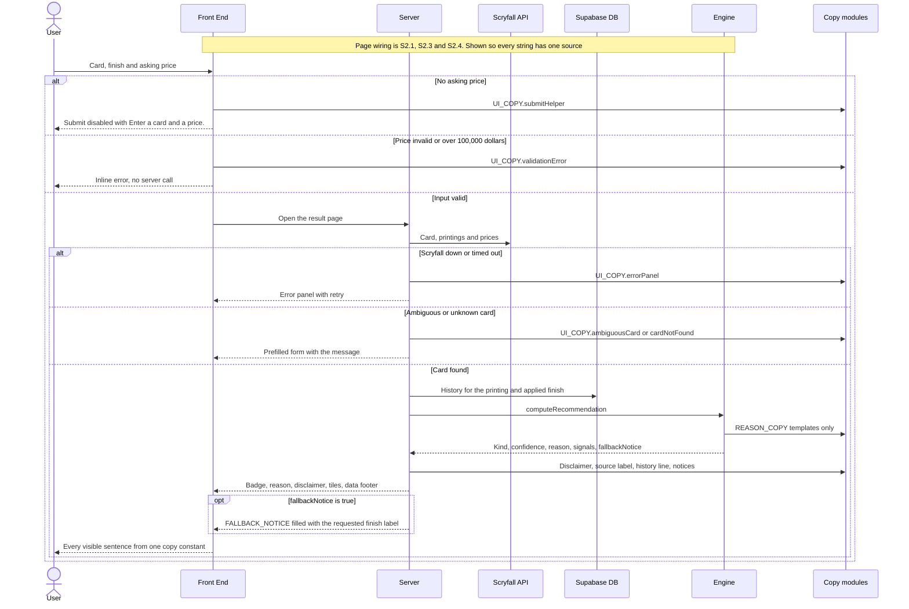
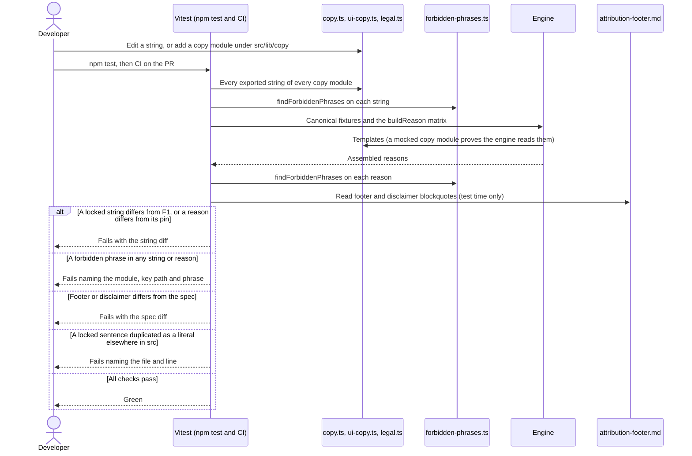
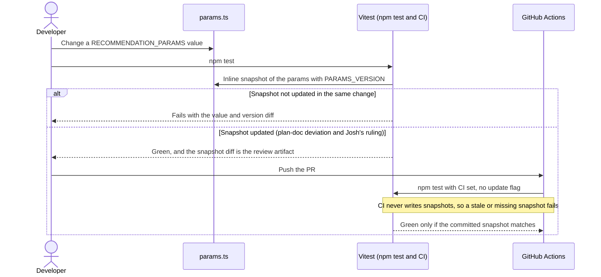

# S1.3 — Explanation copy lock + params guardrail

> Story: [Notion S1.3](https://app.notion.com/p/394a7227e26f81f68c9fd7a8841ce441) · Design: [F1 Price Recommendation Engine](https://app.notion.com/p/394a7227e26f813e8e97f395b70c0eb3) (Approved, Josh 2026-10-08; Locked copy table, X rounding rule with S1.2's D8 note, Composition rule, Forbidden phrases, UI strings, Legal strings, W2) and [F2 Live Evaluation Integration](https://app.notion.com/p/394a7227e26f81b7b3ccf5f51168130c) (Approved, Josh 2026-10-08; the surface the UI strings serve) · Standards: [Development Standards](https://app.notion.com/p/394a7227e26f810e956ef0c76c907c95) · PR: #11 · Critique: docs/critiques/C1-2026-10-04-phase1-designs.md#C1.24, C1.25, C1.54, C1.58, C1.64 (ruling C1.48 = B) · docs/critiques/C2-2026-10-05-new-pages.md#C2-B.8 (= A)

## Objective
Lock every user-facing string F1 and F2 name as frozen constants with exactly one source each: F1's reason templates, clauses and notices in `src/lib/recommendation/copy.ts`, F2's UI strings in the sibling `src/lib/recommendation/ui-copy.ts`, and the source label beside the footer and disclaimer in `src/lib/copy/legal.ts`. Add one forbidden-phrase list (`src/lib/recommendation/forbidden-phrases.ts`) and a lint test that runs it over every copy module and every reason the engine assembles. Pin the canonical Tier-1 reasons, the X rule with S1.2's 99% cap, and both fair frames. Pin `RECOMMENDATION_PARAMS` and `PARAMS_VERSION` together in one inline snapshot, and document each param's meaning, unit and rationale inline. No math changes: the engine's arithmetic, every param value and `PARAMS_VERSION` (`46ec1cd7`) stay as S1.2 left them (C1.48 = B).

## Endpoints
None. No route, no API surface, no UI. S2.1, S2.3 and S2.4 are the first callers of the UI strings.

## Data Model
None. No schema change, no migration, no database read or write. `docs/architecture/erd.md` is unchanged.

## Sequence Diagrams

### W1: Locked strings reach the user (S2.1 wires the page; S1.3 supplies every string)


### W2: Copy lock and forbidden-phrase guard (developer and CI)


### W3: Params guardrail (F1 W2)


## Test Manifest
| ID | Test | Type | Covers | Notes |
|----|------|------|--------|-------|
| T1 | `src/lib/recommendation/copy.test.ts`: `REASON_COPY` `toStrictEqual`s F1's Locked copy table transcribed inline (keys `insufficientData`, `atMarket`, `within`, `below`, `above`, `thinData`, `stale`, `trend`, `volatility`); `FALLBACK_NOTICE` is "This printing has no {finish} price — showing Normal pricing." and `SHOCK_TOOLTIP` "Price moved {signedX}% over the last 7 days."; `CLAUSE_SEPARATOR` is "; " and `SENTENCE_END` "."; every object is frozen and a write throws `TypeError`; `copy.ts` code has no import, `import()`, `require`, `fs` or `.md` | unit | AC-1, AC-5 | Strict equality against literals, never a snapshot (as S2.2's legal test) |
| T2 | `src/lib/recommendation/reason-source.test.ts`: with `./copy` mocked (`vi.mock`, `importOriginal` spread) so each Tier-1 template is a sentinel (`below` "BELOW {X} PCT", `within` "FAIR WITHIN {X}", `atMarket` "AT PAR", `above` "ABOVE {X}", `thinData` "THIN {n}", `insufficientData` "NO DATA"), `computeRecommendation` on fixtures A, B, D, D-buy, D0 and F returns the sentinel sentences ("BELOW 9 PCT.", "FAIR WITHIN 2.", "ABOVE 19; THIN 10.", "BELOW 14 PCT; THIN 10.", "NO DATA", "ABOVE 10."), `buildReason` fair at 0 gives "AT PAR.", and no output contains "market" or "snapshots" | unit | AC-1 | Proves the engine reads `copy.ts` at run time and keeps no duplicate of the text |
| T3 | `copy.test.ts`, grammar: a pattern built at test time from `REASON_COPY`, `CLAUSE_SEPARATOR` and `SENTENCE_END` accepts exactly the insufficient_data sentence, or one of `atMarket`, `within`, `below`, `above` (X a whole number from 1, with no sign or leading zero) followed by an optional thin-data clause (n ≥ 1) and one final "."; every reason from T7's matrix matches. Self-test rejects "9% below market", "9% below market..", "9% below market; 30-day trend is falling 18%.", "9% below market; only 10 price snapshots; only 10 price snapshots.", "Within -5% of market.", "At market price; only 0 price snapshots.", "Within 05% of market." and "Within 0% of market." | unit | AC-1, AC-3 | No trend, stale or volatility clause exists at Tier 1 (F3 is Draft) |
| T4 | `copy.test.ts`, AST scan: `engine.ts`, `reason.ts`, `bands.ts`, `signals.ts`, `window.ts` and `types.ts` hold no string or template-literal text containing whitespace, "%", "—" or a trailing "." (import specifiers aside). Self-test flags `"At market price"`, `` `${x}% below market` ``, `"only " + n` and `"Within"` + `" "`, and passes `"insufficient_data"`, `"low"`, `"-"` and comments that quote copy | unit | AC-1 | S1.3d6: `validate.ts` and `errors.ts` hold developer-facing exception messages, never rendered |
| T5 | `src/lib/recommendation/forbidden-phrases.test.ts`: `FORBIDDEN_PHRASES` equals F1's list in order (likely, expect, expected, will rise, will fall, will drop, will climb, should, probably, forecast, predict) and is frozen. `findForbiddenPhrases` flags each phrase in lower, UPPER and Mixed case; inside words ("unlikely", "Predicted", "forecasting", "shouldn't", "improbably", "unexpectedly"); multi-word phrases across two spaces, a newline, a tab and U+00A0; with U+200B, U+00AD or U+2060 inside the word ("lik" + U+200B + "ely", "pre" + U+00AD + "dict"); and in fullwidth letters (NFKC). It returns each phrase once, in list order. It passes "9% below market.", "like 74.99", "Rises 5%", "will", "falling 18%" and the empty string | unit | AC-2 | S1.3d4: case-insensitive substring after normalisation, so it fails closed |
| T6 | `forbidden-phrases.test.ts`, module lint: every string reachable from the exports of `copy.ts`, `ui-copy.ts` and every non-test module under `src/lib/copy/` (found with `import.meta.glob`, so S2.4's `entry-points.ts` joins on arrival) has no finding. The walker skips functions, reaches nested objects and tuples (self-test on a nested sample), reports a planted "Prices will  rise" with its key path (`SAMPLE.nested[1]`), reaches every key of `REASON_COPY`, `UI_COPY` and `FINISH_LABELS`, and finds at least one string in each module | unit | AC-2, AC-5 | Legal, reason and UI copy under one lint |
| T7 | `forbidden-phrases.test.ts`, reason lint: every canonical fixture through `computeRecommendation`, and `buildReason` at bandPct 5 for every deltaBp each kind can carry at F1's params (buy −10000 to −834, fair −833 to +500, wait +501 to +10000, and wait +99,999,990,000), each at high and at low with n cycling 7–13, plus insufficient_data: no reason has a finding, and each matches T3's grammar | unit | AC-2 | About 40,000 calls, pure string work. Fair's above frame is unreachable at Tier 1; T20 covers it |
| T8 | `tests/contract/copy-lock.test.ts`, one list: `tests/helpers/attribution-spec.ts`'s `FORBIDDEN_REASON_WORDS` and `findForbiddenReasonWords` are the very exports of `forbidden-phrases.ts` (`toBe`); the comma lists after "Forbidden words" in `AGENTS.md` and `.cursor/rules/recommendation-engine.mdc` equal `FORBIDDEN_PHRASES` (read-only drift guard); no non-test source under `src/`, `scripts/` or `tests/helpers/` other than `forbidden-phrases.ts` holds a string literal equal to a phrase | unit | AC-2 | C1-F.15: two forbidden-phrase lists existed |
| T9 | `copy.test.ts`, reason lock (literals written inline, independent of `fixtures.ts`): through `computeRecommendation`, A and C give "9% below market."; B and G "Within 2% of market."; F "10% above market."; D "19% above market; only 10 price snapshots."; D-buy "14% below market; only 10 price snapshots."; A-rising "Within 5% of market."; D0 and E the insufficient_data sentence, whose code points include U+0027 in "don't" and U+2014, with no U+2019 or U+2013. `fixtures.ts`'s expected reasons equal this table. No reason contains "trend", "volatile" or "days old" | unit | AC-3 | C and D are their Tier-1 reasons; S3.1 and S3.2 pin Tier 2 |
| T10 | `copy.test.ts`, X rule: 8130 against 8150 → "At market price."; `buildReason` buy at −9849 "98% below market.", at −9850, −9950 and −10000 "99% below market." (S1.2 D8, F1's X-rule note); wait at +10000 "100% above market."; through the engine, asking 1 against 30,000 → "99% below market." | unit | AC-3 | The cap stays in `reason.ts` (no math change); S1.3 pins it as copy |
| T11 | `src/lib/recommendation/params.test.ts`: `expect({ PARAMS_VERSION, RECOMMENDATION_PARAMS }).toMatchInlineSnapshot(…)` holds all eleven values and `"46ec1cd7"`, replacing S1.1's version-only snapshot; the strict F1 deep-equal, the per-param version bump and the key-order tests stay | unit | AC-4 | C1.58: values and version pinned together, so the test is not tautological |
| T12 | `tests/contract/ci-workflow.test.ts`: the workflow's `npm test` step, `package.json`'s `test` script and `vitest.config.mts` carry no `-u`, `--update` or `update:` setting, so CI (where `CI` is set) never writes a snapshot and a stale or missing one fails | unit | AC-4 | Unhappy path of AC-4 in CI |
| T13 | `params.test.ts`, docs presence (TypeScript AST): every property of `interface RecommendationParams` has a JSDoc block containing "Unit:" and "Why:", and the property set equals `Object.keys(RECOMMENDATION_PARAMS)`. Self-test flags an undocumented field and one missing "Why:" | unit | Description, AC-4 | Presence only. Quality is the plan gate's (story Notes); the text to review is S1.3d9 |
| T14 | `src/lib/recommendation/ui-copy.test.ts`: `UI_COPY` `toStrictEqual`s F1's UI-strings table (15 keys, S1.3d3) and `FINISH_LABELS` is `{ normal: "Normal", foil: "Foil" }` with no etched key; frozen; `ui-copy.ts` has only `import type`, no `fs` or `.md`. Filled: `historyLine` with N 12 and relativeTime "3 hours ago" → "Price history: 12 snapshots, newest 3 hours ago"; `staleFlag` with hours 36 → "Over 36 hours old"; `printingOption` → "Modern Horizons 2 (MH2) · #12"; `FALLBACK_NOTICE` with `FINISH_LABELS.foil` → "This printing has no Foil price — showing Normal pricing."; the notice's "Normal" equals `FINISH_LABELS.normal` | unit | AC-5 | S1.3d3, S1.3d5 |
| T15 | `ui-copy.test.ts`: the dollar amounts in `UI_COPY.validationError` are `MIN_ASKING_PRICE_CENTS` and `MAX_ASKING_PRICE_CENTS` formatted ("$0.01", "$100,000"), and its example "74.99" passes F2's price pattern within those limits | unit | AC-5 | A limit change without a copy change fails |
| T16 | `src/lib/copy/legal.test.ts`: `SOURCE_LABEL` is "Market price via Scryfall (TCGplayer), updated daily"; S2.2's T2 (footer and disclaimer `toBe` the spec blockquotes, read at test time) still passes; `legal.ts` still imports nothing. S2.2's "whole words only" test becomes "the shared lint flags 'unexpectedly' and 'predictable'" (S1.3d4) | unit | AC-5 | One source, no runtime markdown loading |
| T17 | `copy-lock.test.ts`, hygiene over every string from T6's walk except the declared fragments (`CLAUSE_SEPARATOR`, `SENTENCE_END`, `FAN_CONTENT_LINE.before` and `.after`, and the link `href`; the test asserts each named fragment exists): no leading or trailing whitespace, double space, newline or tab; no U+2018, U+2019, U+201C, U+201D, U+2013, "--" or spaced hyphen; no format character (category Cf: zero-width, bidi, soft hyphen); U+2014 appears only in the insufficient_data sentence, `FALLBACK_NOTICE` and `UI_COPY.errorPanel`; each string's `{…}` placeholders are balanced and equal its declared set (S1.3d7), and filling them leaves no "{" or "}". Self-test flags "{X", "X}", "a  b" (two spaces), "a" + U+200B + "b" and "it" + U+2019 + "s" | unit | AC-1, AC-5 | Tamper-evident text |
| T18 | `src/lib/recommendation/copy.test-d.ts`: `fillTemplate(REASON_COPY.within, {})` and `fillTemplate(REASON_COPY.within, { X: 5, Y: 1 })` are type errors (`@ts-expect-error`); `{ X: 5 }` compiles; `UI_COPY.printingOption` needs `set_name`, `SET` and `collector_number`; a `string`-typed template accepts any record | unit (typecheck) | AC-1, AC-5 | S1.3d7. `tsconfig.vitest.json` covers `src/**/*.test-d.ts` |
| T19 | `copy-lock.test.ts`, single source: no non-test `.ts` or `.tsx` under `src/` (`src/generated/` and `fixtures.ts` excepted) other than a string's home module holds a string literal, template literal or JSX text whose trimmed text equals a locked placeholder-free string that contains a space. Self-test flags a planted `"Couldn't reach price data — try again."` and JSX text `<p>Couldn't find that card</p>`, and passes "Enter a card and a price. We'll tell you." | unit | AC-5 | C1.54, C1-F.15. Short labels ("Normal", "soon") stay out: they collide with enum and demo values |
| T20 | `copy.test.ts`, fair frames: `buildReason` fair at bandPct 5: −500 and +500 "Within 5% of market.", −501 "5% below market.", +501 "5% above market.", −49 "At market price."; bandPct 10: −1000 "Within 10% of market.", −1001 "10% below market."; bandPct 2.5: −250 "Within 3% of market.", −251 "3% below market."; low confidence appends "; only 7 price snapshots" on both frames. Through the engine: 9499 against 10000 → fair, high, "5% below market."; with `fairBandPct: 10`, 9000 against 10000 → "Within 10% of market." and 8999 → "10% below market." | unit | AC-6 | The frame test reads `Math.round(bandPct × 100)`; Tier-2 fixtures belong to S3.1 |
| T21 | `types.test.ts`: the purity scan's file list includes `ui-copy.ts` and `forbidden-phrases.ts`; `no-literals.test.ts` scans both | unit | AC-1; engine purity | Both import no runtime code |
| T22 | `scripts/test-report.test.ts`: `featureOf` maps `src/lib/recommendation/{copy,forbidden-phrases,reason-source}.test.ts`, `copy.test-d.ts` and `tests/contract/copy-lock.test.ts` to F1, and `src/lib/recommendation/ui-copy.test.ts` to F2 | unit | DoD 3 | The existing map already does this (S1.3d10) |
| T23 | `npm run lint`, `npm run build` and `npm test` exit 0 locally on Node 22 and every PR check is green in CI; `npm run test:report` lists T1–T22's files with no Unmapped. Mutation checks, each run and reverted: `fairBandPct` 5 → 6 fails T11; "Within" → "Around" in `copy.ts` fails T1 and T9; "likely" planted in `UI_COPY` fails T6; a literal "% below market" in `reason.ts` fails T2 and T4; a duplicate error-panel literal in a component fails T19 | functional | AC-1 to AC-6 | Engine and tooling evidence (Standards DoD 4) |
| T24 | `tests/contract/engine-callers.test.ts` (ADV-3): no non-test source under `src/` or `scripts/` calls `computeRecommendation` with a third argument or a spread, uses it as a value (`.call`, an alias, a string key) or renames it on import, and no non-test code outside `src/lib/recommendation` references `buildReason`, `computeHistorySignals`, `thresholdsBp` or `readWindow`. Self-test plants each route | unit | AC-4; F1 W2 | Production tunes only by editing `RECOMMENDATION_PARAMS` |
| T25 | `copy.test.ts` (ADV-8): `fillTemplate` keeps the placeholder for undefined, null, "", a blank string, NaN, ±Infinity, a boolean, an object and an array, over every placeholder template; finite numbers (0 and −0 included) and visible strings fill, strings trimmed | unit | AC-1, AC-5 | S1.3d7 extended (D7) |

### Evidence commands (Node 22, repo root)
```bash
source ~/.nvm/nvm.sh && nvm use 22 >/dev/null
# AGENTS.md Databases limit: `npm test` runs S1.1's integration project, so check hosts first.
# Print hostnames only; anything but localhost or 127.0.0.1 means stop.
{ env; cat .env* 2>/dev/null; } | grep -oE 'postgres(ql)?://[^[:space:]"]+' | sed -E 's#^[^@]*@##; s#[:/?].*##' | sort -u
# A host or hostaddr query parameter overrides the hostname; this must print nothing.
{ env; cat .env* 2>/dev/null; } | grep -oE 'postgres(ql)?://[^[:space:]"]+' | grep -oiE '[?&]host(addr)?=[^&#]*' | sort -u
npm run lint
npm run build
npx vitest run src/lib/recommendation src/lib/copy tests/contract/copy-lock.test.ts tests/contract/ci-workflow.test.ts scripts/test-report.test.ts
npm test
npm run test:report   # regenerate and commit docs/test-report.md
```

## Results                                      <!-- filled in Review; tests are authored in Testing, run here -->
| ID | Pass/Fail | Evidence |
|----|-----------|----------|
| T1 | Pass | `copy.test.ts` "REASON_COPY is F1's Locked copy table (T1)": 4 tests (nine templates `toStrictEqual`, notices, separator and sentence end, frozen write throws `TypeError`, no import/require/fs/.md in code) · local and CI at `ef8e325` |
| T2 | Pass | `reason-source.test.ts`: 8 tests; fixtures A, B, D, D-buy, D0, F give the sentinel sentences, fair at 0 "AT PAR.", no "market" or "snapshots" in any output · mutation M4 (a literal "% below market" in `reason.ts`) fails 3 of them |
| T3 | Pass | `copy.test.ts` "Tier-1 reason grammar (T3)": 7 accepted, 11 rejected (the plan's 8 plus a trailing space, a doubled final stop and a caveat on the insufficient_data sentence), every fixture matches |
| T4 | Pass | `copy.test.ts` "the engine's logic modules hold no copy (T4)": self-test (5 flagged, enum values, comments, JSDoc and import specifiers passed) and 6 module scans clean · mutation M4 fails `reason.ts holds no copy-like literal` with `reason.ts:48 "% below market"` |
| T5 | Pass | `forbidden-phrases.test.ts` "FORBIDDEN_PHRASES (T5)" and "findForbiddenPhrases (T5)": list equality and freeze; each phrase lower, UPPER, Mixed and fullwidth; 7 in-word cases; 5 whitespace cases (two spaces, newline, tab, U+00A0, CRLF); 5 format-character cases (U+200B twice, U+00AD, U+2060, U+FEFF); once each in list order; 7 passes |
| T6 | Pass | `forbidden-phrases.test.ts` "no copy module holds a forbidden phrase (T6)": walker self-test (`SAMPLE.nested[1]: "will rise"`), module list = `recommendation/copy.ts`, `recommendation/ui-copy.ts`, `copy/legal.ts` via `import.meta.glob`, each module non-empty and clean, every key of REASON_COPY, UI_COPY and FINISH_LABELS reached · mutation M3 ("likely" in `UI_COPY.navSoon`) fails with `UI_COPY.navSoon: "likely"` |
| T7 | Pass | `forbidden-phrases.test.ts` "no assembled reason holds a forbidden phrase (T7)": band check (+500, −833), every fixture clean and grammatical, `buildReason` matrix of 40,004 calls (buy 9,167, fair 1,334, wait 9,501 deltas, each high and low with n 7–13) plus insufficient_data: 0 findings, 0 grammar misses (112 ms for the file) |
| T8 | Pass | `copy-lock.test.ts` "one forbidden-phrase list (T8)": the spec helper's exports `toBe` the list and matcher; AGENTS.md and `.cursor/rules/recommendation-engine.mdc` lists equal it; no other non-test source under `src/`, `scripts/`, `tests/helpers/` holds a phrase literal (literal types skipped, D3), and the home module holds all 11 |
| T9 | Pass | `copy.test.ts` "Tier-1 reasons are locked (T9)": all 10 fixtures pinned to inline literals; `fixtures.ts` agrees; U+0027 and U+2014 present, U+2019 and U+2013 absent; no "trend", "volatile" or "days old" · mutation M2 ("Within" → "Around") fails B, G and A-rising here and T1 |
| T10 | Pass | `copy.test.ts` "X rounding rule (T10)": 8130/8150 "At market price."; −9849 "98%"; −9850, −9950, −10000 "99% below market."; +10000 "100% above market."; engine 1 against 30,000 "99% below market." |
| T11 | Pass | `params.test.ts` "params guardrail (S1.3 T11)": one inline snapshot of `{ PARAMS_VERSION: "46ec1cd7", RECOMMENDATION_PARAMS: {…11 values} }` replaces S1.1's version-only snapshot; T3/T4 tests kept (20 tests in the file) · mutation M1 (`fairBandPct` 5 → 6) fails the snapshot and 3 other tests |
| T12 | Pass | `ci-workflow.test.ts` "CI never writes snapshots (S1.3 T12)": flag-pattern self-test, the workflow's test step is exactly `- run: npm test`, the workflow never sets `CI`, `package.json` test is `vitest run`, `vitest.config.mts` has no `update:` (13 tests in the file) |
| T13 | Pass | `params.test.ts` "param docs (S1.3 T13)": AST self-test flags `bare`, `lineComment` and `noWhy`; all 11 `RecommendationParams` fields carry JSDoc with "Unit:" and "Why:", and the field set equals `Object.keys(RECOMMENDATION_PARAMS)` |
| T14 | Pass | `ui-copy.test.ts`: `UI_COPY` (15 keys) and `FINISH_LABELS` strict-equal F1, no etched key, both frozen, only `import type`; history line, stale flag, printing option and fallback notice filled as the manifest states (11 tests) |
| T15 | Pass | `ui-copy.test.ts` "the validation error agrees with the input limits (T15)": "$0.01" and "$100,000" from MIN/MAX_ASKING_PRICE_CENTS; "74.99" matches `^\d{1,6}(\.\d{1,2})?$` and is 7499 cents, within the limits |
| T16 | Pass | `legal.test.ts` (38 tests): S2.2's T2 spec equality still passes; `SOURCE_LABEL` is F1's text, makes no claim and holds no phrase; the old whole-word test now asserts the shared lint flags "unexpectedly" (`expect`, `expected`) and "predictable" (`predict`); `legal.ts` still imports nothing |
| T17 | Pass | `copy-lock.test.ts` "tamper-evident copy text (T17)": self-test ("{X", "X}", double space, U+200B, U+2019, en dash, spaced hyphen); all 6 fragments, 3 em-dash homes and 12 templates exist; no hygiene problem; U+2014 only in the 3 homes; every placeholder set equals its declaration; filling leaves no brace |
| T18 | Pass | `copy.test-d.ts` (7 type tests): placeholder unions; missing, extra and misspelt keys are `@ts-expect-error`; exact keys compile; the printing option needs all three keys; a `string` template takes any record · vitest typecheck "no errors", `next build` TypeScript step green |
| T19 | Pass | `copy-lock.test.ts` "every locked sentence has one home (T19)": the locked set holds the sentences and not "Normal" or "soon"; self-test flags the planted literal, the JSX text and a template literal, and passes "Enter a card and a price. We'll tell you."; no non-test `.ts`/`.tsx` under `src/` repeats one · mutation M5 (the error panel as a literal in `nav-bar.tsx`) fails with `src/components/nav-bar.tsx:75 duplicates src/lib/recommendation/ui-copy.ts` |
| T20 | Pass | `copy.test.ts` "the fair row carries both frames (T20)": 9 `buildReason` frames at bandPct 5, 10 and 2.5; the caveat on both frames; engine 9499/10000 fair, high, "5% below market."; with `fairBandPct: 10`, 9000 "Within 10% of market." and 8999 "10% below market." |
| T21 | Pass | `types.test.ts` (6) and `no-literals.test.ts` (4) list `ui-copy.ts` and `forbidden-phrases.ts`; both pass the purity, clock and numeric-literal scans |
| T22 | Pass | `scripts/test-report.test.ts` (73): the five copy-lock files map to F1 and `ui-copy.test.ts` to F2; `docs/test-report.md` lists them so, no Unmapped row |
| T23 | Pass | Local, Node 22, at `ef8e325`: host check printed only `localhost`, the `host=` check nothing; `npm run lint` exit 0 (0 errors, 1 warning, the pre-existing `/sample` one); `npm run build` green (DB URLs inline to localhost, as S1.2); `npm test` 42 files, 1230 passed, 2 skipped, type errors none (throwaway Postgres 14.8 on `localhost:55432`); `npm run test:report` "✅ All green", 1232 tests, F1 35 files 915 tests, F2 7 files 317 tests, no Unmapped. Mutations M1–M5 each failed as planned and were reverted (`git status` clean). CI [run 38081477256](https://github.com/ayfor/mox-market/actions/runs/38081477256) on `ef8e325`: "lint + build + test" green in 1m34s (`0000_baseline` applied, lint 0 errors 1 warning, 42 files, 1230 passed, 2 skipped, type errors none); Vercel preview green |
| T24 | Pass | `engine-callers.test.ts` (3 tests): self-test flags 9 planted routes and passes 2-argument calls and the engine's own helper use; the src/scripts scan is clean · mutation: `computeRecommendation(i, m, { ...RECOMMENDATION_PARAMS, fairBandPct: 6 })` in `src/lib/zz-plant.ts` fails it · local at `915c751` |
| T25 | Pass | `copy.test.ts` "fillTemplate never prints a bad value (ADV-8)": the five planted cases, 10 bad values × 12 templates keep their placeholders with no "undefined", "null", "NaN", "Infinity", "[object" or double space; 0, −0, 9 and " Foil " fill · local at `915c751` |

## Deviations                                   <!-- what changed from the plan and why -->
- **D1 (`reason.test.ts` edited, outside S1.3d1's list).** S1.2's "fills known placeholders and leaves unknown ones" test called `fillTemplate("{X} and {Y}", { X: 1 })` and `fillTemplate("{toString}", {})` with literal templates, which the typed signature (S1.3d7) now rejects at build. Both calls now pass `string`-typed templates, so the run-time behaviour they pin (a missing key keeps its placeholder) is unchanged. No other line of the file changed.
- **D2 (`import.meta.glob` typing).** T6 and T17 find the `src/lib/copy` modules with `import.meta.glob`, typed by `/// <reference types="vite/types/import-meta.d.ts" />` in the two test files (Vite's documented workaround; `vite` is already installed under Vitest, no new dependency). A `readdirSync` plus `import()` was dropped: S1.2's purity scan reads test files in `src/lib/recommendation` and flags a non-literal `import()`.
- **D3 (T8 skips literal types).** `fixtures.ts` holds `CanonicalFixture["expected"]`, an indexed-access type whose `"expected"` is a type, never a value or rendered text, so T8 scans runtime string and template literals only.
- **D4 (walker kept twice).** T17 lives in `tests/contract/copy-lock.test.ts` with its own copy of T6's 15-line string walker, and T7 rebuilds T3's grammar from the copy module: a shared helper under `tests/helpers/` would fail S1.2's purity scan from `src/lib/recommendation`, and an app module should not carry test machinery.
- **D5 (small additions).** `copy.ts` also exports the `Placeholders` and `TemplateValues` types; `ui-copy.ts` exports `ShownFinish` and keeps `FINISH_LABELS`' literal types with `satisfies`. T3 rejects three more malformed reasons than the manifest names; T12 also asserts the workflow never sets `CI`. The JSDoc "Why" for `minSnapshotsForVolatility` and `shortSlopeDays` reads "F1 (Signal definitions), …" with a short factual gloss, the rest as S1.3d9's table.
- **D6 (`vitest.config.mts` edited, ADV-1).** Outside S1.3d1's list. The `.env` loader skips `UPDATE_SNAPSHOT`, and a CI run (CI set and not "false", or `GITHUB_ACTIONS`) deletes it before Vitest resolves the snapshot mode. T11 also fails any CI run whose mode is not "none", which covers `-u`; T12 pins the config lines and that `ci.yml` and `package.json` never name the variable.
- **D7 (`fillTemplate` checks values at run time, ADV-8).** S1.3d7 kept a missing key's placeholder; an unfillable value (undefined, null, a blank string, a non-finite number, any other type) now does the same, and strings are trimmed, so copy never shows "undefined", "null" or "NaN" and never breaks a render. The typed signature is unchanged. T25.
- **D8 (new test file and a second T19 exemption).** `tests/contract/engine-callers.test.ts` (T24, ADV-3) maps to F1 through the existing `tests/contract/` pattern (no report-map change). T19 exempts `src/app/sample/decision-analysis.tsx`, the V1 demo that S2.4 deletes (S2.4 AC-12): its two template literals repeat "% below market" and "% above market". A test asserts each exempt file exists, so S2.4 removes the entry in its PR.
- **D9 (lint normaliser, ADV-7).** S1.3d4's matcher now runs NFKD, removes combining marks and default-ignorable code points (variation selectors, CGJ, Hangul fillers) as well as Cf, maps Cyrillic and Greek lookalikes to Latin (a 67-pair subset of Unicode's confusables), lowercases, strips again (U+0130), and reads a dash run between letters as a space. T17's denylist became an allowlist: printable ASCII, U+2014, ±, · and ©.

## Decisions                                    <!-- S#.#d1, S#.#d2 … one line each; design-level decisions stay in Notion -->
- **S1.3d1 (scope).** New: `src/lib/recommendation/ui-copy.ts`, `src/lib/recommendation/forbidden-phrases.ts`, and the tests `copy.test.ts`, `copy.test-d.ts`, `ui-copy.test.ts`, `forbidden-phrases.test.ts`, `reason-source.test.ts` (all in `src/lib/recommendation/`) and `tests/contract/copy-lock.test.ts`. Edited: `copy.ts` (new constants, `as const`, typed `fillTemplate`), `params.ts` (JSDoc only, values untouched), `params.test.ts`, `types.ts` (the `reason` comment), `types.test.ts` and `no-literals.test.ts` (scan lists), `src/lib/copy/legal.ts` (`SOURCE_LABEL` and the header comment), `legal.test.ts`, `tests/helpers/attribution-spec.ts` (re-exports the one list), `tests/contract/ci-workflow.test.ts`, `scripts/test-report.test.ts` and `docs/test-report.md`. Not touched: every param value, `reason.ts`, `engine.ts`, `bands.ts`, `signals.ts`, `window.ts`, `validate.ts`, `fixtures.ts`, `scripts/test-report.mjs`, Prisma, `src/app/**`, `src/components/**`, `docs/specs/**` and every harness file except `.cursor/hooks/active-story.json`. No new dependency.
- **S1.3d2 (reason copy, `copy.ts`).** `REASON_COPY` keeps S1.2's six keys and names (`insufficientData`, `atMarket`, `within`, `below`, `above`, `thinData`; C1.48 = B allowed a rename, and none is needed) and gains F1's three clauses: `stale` "latest price data is {d} days old", `trend` "30-day trend is {direction} {X}%" and `volatility` "price has been volatile (±{X}%)". Two notices sit beside it: `FALLBACK_NOTICE` "This printing has no {finish} price — showing Normal pricing." and `SHOCK_TOOLTIP` "Price moved {signedX}% over the last 7 days.". Every object is `Object.freeze`d with `as const`. **Choice Josh can overturn:** the trend, volatility and shock text is locked now, from the Approved F1 table, with no caller until S3.1 (F3 is Draft and no behaviour is built); the alternative leaves them to S3.1. The composition rule (one trend clause, one caveat, stale > thin-data > volatility) is S3.1's to assemble; at Tier 1 the only caveat is thin-data.
- **S1.3d3 (UI copy, `ui-copy.ts`).** `UI_COPY` holds F1's UI-strings table verbatim: `errorPanel` "Couldn't reach price data — try again.", `submitHelper` "Enter a card and a price.", `validationError` "Enter a price from $0.01 to $100,000, like 74.99.", `thinDataNote` "thin data", `historyLine` "Price history: {N} snapshots, newest {relativeTime}", `staleFlag` "Over {hours} hours old", `noHistory` "No price history yet for this printing.", `staleBanner` "Price data is temporarily out of date.", `historyUnavailable` "Price history temporarily unavailable", `ambiguousCard` "Pick from the suggestions", `cardNotFound` "Couldn't find that card", `printingLabel` "Printing", `finishLabel` "Finish", `printingOption` "{set_name} ({SET}) · #{collector_number}" and `navSoon` "soon". `FINISH_LABELS` is `{ normal: "Normal", foil: "Foil" }`. It imports types only, so a client component may import it. `STALENESS_FLAG_HOURS` (36) and `HISTORY_TIMEOUT_MS` (500) are not copy and land with their predicates in S2.1. The file name follows AC-5 ("a sibling `ui-copy.ts`"), and S1.1's report map already files `ui-copy` tests under F2.
- **S1.3d4 (one forbidden-phrase list and its matcher).** `forbidden-phrases.ts` exports `FORBIDDEN_PHRASES` (F1's eleven, in F1's order) and `findForbiddenPhrases(text)`: NFKC, then remove format characters (category Cf), collapse whitespace to one space, lowercase, then report each phrase found as a substring, once, in list order. It is the only list in code: `tests/helpers/attribution-spec.ts` re-exports it under S2.2's names, and AGENTS.md and the Cursor rule restate it as documentation that T8 compares. A module of its own keeps the list out of the lint's own scan. **Choice Josh can overturn:** substring matching fails closed, catching inflections and negations ("predicted", "unlikely", "unexpectedly"), so S2.2's whole-word test changes ("predictable" and "unexpectedly" are now flagged; no shipped string contains either). The alternative keeps whole words and misses "predicted" and "forecasting".
- **S1.3d5 (source label and finish names).** `SOURCE_LABEL` lives in `src/lib/copy/legal.ts`, because F1 and AC-5 both list it with the legal strings, and one string serves everywhere (C1.02). It is not in the attribution spec, so it is pinned against F1's text, while the footer and disclaimer stay pinned against the spec (S2.2's T2). `FALLBACK_NOTICE`'s `{finish}` takes the requested finish's label, "Foil", matching the capitalised "Normal" in the same sentence and F1's finish-names row. **Choice Josh can overturn:** the lowercase "foil" reading. No "Etched" label exists: etched is hidden in Phase 1 (C1.08 = A) and F2 rejects `finish=etched` before compute, so the story that unhides etched adds the F1 row first.
- **S1.3d6 (reasons only from templates).** `reason.ts` already assembles every reason from `REASON_COPY`, `CLAUSE_SEPARATOR` and `SENTENCE_END`, so it does not change. T2 proves it at run time with a mocked copy module, T3 proves the grammar, and T4 keeps copy-like literals out of the engine modules. `validate.ts` and `errors.ts` are outside T4: their exception messages are developer-facing, and F2 renders `UI_COPY.validationError` on `InvalidRecommendationInputError`, never the message.
- **S1.3d7 (placeholders).** F1's wording is kept verbatim; only the placeholder names become identifiers so `fillTemplate`'s `\{(\w+)\}` can fill them: "{relative time}" becomes `{relativeTime}`, "{rising/falling}" `{direction}` and "{+/−X}" `{signedX}`. `fillTemplate<T extends string>(template: T, values: Readonly<Record<Placeholders<T>, string | number>>)` reads each template's placeholders from its literal type, so a missing or misspelt key fails the build (T18). At run time a missing key still leaves the placeholder in place rather than throwing, so a render never fails on copy; T17 checks every template's declared set.
- **S1.3d8 (params guardrail, AC-4).** One inline snapshot of `{ PARAMS_VERSION, RECOMMENDATION_PARAMS }` replaces S1.1's version-only snapshot, so any value change fails unless the same change updates the snapshot; GitHub Actions sets `CI`, so Vitest never writes snapshots there (T12). `PARAMS_VERSION` is derived (S1.1 AC-2), so there is no manual bump. A param change still needs a plan-doc deviation and Josh's ruling (AGENTS.md).
- **S1.3d9 (param JSDoc, for review at this gate).** Each field of `RecommendationParams` gets `/** Meaning. Unit: … Why: … */`. Comments do not change the hash. The text, from F1 and the C1 rulings:

| Param | Value | Unit | Meaning | Why |
|---|---|---|---|---|
| `fairBandPct` | 5 | percent | Half-width of the Fair band; Wait iff deltaBp > round(5 × 100) | F1: a research-backed conservative band |
| `buyThresholdAsymmetry` | 0.6 | ratio | Buy threshold = −fairBandPct / 0.6 = −8.33% (−833 bp) | F1: a wrong Wait costs $0, a wrong Buy costs money |
| `minSnapshotsForVerdict` | 7 | real snapshots in the window | Fewer gives insufficient_data, even with a price | C1.05 = B: no Buy, Fair or Wait on under a week of data |
| `minSnapshotsForRange` | 14 | real snapshots | Median, range and rangePosition are null below | F1: equal to the medium-confidence floor, so range signals appear when confidence reaches medium |
| `lowConfidenceSnapshotCount` | 14 | real snapshots | Below is low confidence; 7–13 also add the thin-data caveat | F1 and Josh's ruling of 2026-10-08 (caveat on buy, fair and wait) |
| `highConfidenceSnapshotCount` | 28 | real snapshots | At or above is high | C1.09 = A: one missed sync does not downgrade the whole catalogue |
| `trendThresholdPct` | 0.5 | percent per day | Dead zone for the trend label (and F3's shift), compared exactly at 50 bp | C1.10 = A: one test makes every shifted result explainable; S1.2 D9 |
| `minSnapshotsForTrend` | 7 | real snapshots | Slopes and trendDirection are null below | F1: the same floor as a verdict |
| `minSnapshotsForVolatility` | 14 | real snapshots | volatility30d is null below (volWiden 1.0) | F1 |
| `windowDays` | 30 | UTC dates | The window is asOf − 30 to asOf − 1 | C1.09 = A: the window ends at asOf − 1, so high confidence never waits on the day's 06:00 UTC sync |
| `shortSlopeDays` | 7 | UTC dates | slope7dPct runs over the last 7 window dates | F1 |

- **S1.3d10 (report map).** No change to `scripts/test-report.mjs`. No new file name starts with an F3 prefix (`tier2`, `tiered`, `adjust`, `trend`, `volatil`, `shock`, `liquidity`), so the copy tests file under F1, while `ui-copy.test.ts` files under F2 through S1.1's existing `/ui-copy/` pattern. T22 pins both.
- **S1.3d11 (D8 alignment).** S1.2's D8 99% cap stays in `reason.ts` (no math change), and F1's X-rounding row already carries the note, so S1.3 pins it as locked copy (T10) and Notion needs no edit.
- **S1.3d12 (fixtures data).** `fixtures.ts` keeps its own `INSUFFICIENT_DATA_SENTENCE` and expected reasons as literals. They are test data, deliberately independent of `copy.ts` (S1.2 T1), so T19 exempts `fixtures.ts`, and T9 checks the two agree.
- **S1.3d13 (production and Notion).** No Vercel or GitHub settings change; production stays paused (C2-B.2 = A). Bitey commits `.cursor/hooks/active-story.json` = `{"story":"S1.3"}` on this branch so Cursor's fence allows S1.3's own Status writes, and deletes it in the branch's last commit before the PR goes ready.
- **S1.3d14 (marketing copy and the lint, ADV-4).** T6 lints every module under `src/lib/copy`, and S2.4 AC-10 moves the landing copy there (`entry-points.ts`), including the tagline "Mox Market — Should you buy it?", which holds "should". F1's forbidden list governs reason copy and its UI strings; the tagline is a question to the user, not a prediction. T6 therefore carries `LINT_ALLOWLIST`: exact entries of module, export key path, full string and the exact phrases it holds (the source pass matches module and exact string). It is empty in S1.3; S2.4 adds the tagline entries, and a test fails any entry that no longer matches a live export. **Choice Josh can overturn:** reword the tagline instead (a new marketing string, his call). Recorded on S2.4 in Notion.
- **S1.3d15 (one-snapshot history line, ADV-9). Open for Josh.** F1 locks "Price history: {N} snapshots, newest {relative time}" with no singular row, so N = 1 reads "1 snapshots". A singular row is a locked-copy change that needs Josh's ruling, so S1.3 pins the locked output at N = 1 (T14) and leaves the text alone. Nothing renders the line before F0 (S2.1's empty history reader). The thin-data clause never meets n = 1: it shows only at 7–13 snapshots. Recorded on S1.3 in Notion.

## Critique                                     <!-- entries from docs/critiques/ that touched this story; implementation-mode change list lands here -->
- **C1.24** (major): Tier-1 canonical reason strings and the X rounding rule (T9, T10).
- **C1.25** (major): reason frames when the delta and the band disagree; the fair row carries both frames (AC-6, T20). Tier-2 frames when the shift crosses zero are S3.1's.
- **C1.54** (minor): every user-facing string in the locked copy module (S1.3d2, S1.3d3, S1.3d5, T14, T19). **C1-F.15** within C1.64: two forbidden-phrase lists and two source-label strings existed (S1.3d4, S1.3d5, T8, T16).
- **C1.58** (minor): AC-4 was tautological; it now pins values and version together (T11).
- **C1.64** (minor): AC hygiene. **C1.48 = B**: S1.3 stays a separate story, copy and guardrails only.
- **C2-B.8 = A**: the UI strings S2.1, S2.3 and S2.4 need were added to F1's table, and S1.3 locks them (S1.3d3).
- **S1.2 D8** (ADV-4): below clauses state at most 99%; F1's X-rule row carries the note (S1.3d11, T10).

### Adversarial review (2026-10-10, under Josh's overnight directive)
- ADV.1 — Vitest reads any truthy `UPDATE_SNAPSHOT` (shell, workflow env, or a `.env*` file copied in by `vitest.config.mts`) as "rewrite every snapshot" even with `CI` set, so a params change passed T11 → fixed: T11 fails a CI run whose snapshot mode is not "none" (every route, `-u` included); the config never loads the variable from `.env*` and drops it in CI; T12 asserts the config guard and that `ci.yml` and `package.json` never name it (D6). Reproduced and re-run: `CI=true UPDATE_SNAPSHOT=all` and `UPDATE_SNAPSHOT=all` in `.env.local`, each with `fairBandPct` 6, now fail and leave the snapshot untouched.
- ADV.2 — T19 matched only exact trimmed literals and skipped every template, so `&rsquo;`, curly quotes, a final period, a hyphen for the em dash, a `${label}` fallback notice and a `{n}`-split history line all passed → fixed: keys are normalised on both sides (entities decoded, NFKC, Cf dropped, quotes straight, dashes one " - ", case, final . ! ?), and the 11 placeholder templates with six or more static letters match by their static segments in order across template literals and JSX children; the self-test plants all five cases plus `${x}% below market`. The printing option (punctuation only) stays out; the V1 `/sample` demo is exempt until S2.4 deletes it (D8).
- ADV.3 — `computeRecommendation`'s exported `params` argument let production code compute with other params while T11 and `PARAMS_VERSION` stayed green → fixed: T24 (`tests/contract/engine-callers.test.ts`) fails any non-test call with a third argument or a spread, any value use, string-key access or rename, and any use of the param-taking helpers outside `src/lib/recommendation`.
- ADV.4 — S2.4 AC-10 moves the landing tagline "Should you buy it?" into `src/lib/copy`, where T6 fails on "should" → fixed: an exact allowlist (module, key path, string, phrases) in T6, empty in S1.3, with self-tests and a stale-entry check; S2.4 adds the tagline (S1.3d14, Notion S2.4). Josh can overturn by rewording.
- ADV.5 — T6 saw only own enumerable export values, a one-level `*.ts` glob and an `arrayContaining` module list → fixed: the walker reads Map keys and values and Set values; a source pass reads every string, template part, whole template, JSX text and `+` chain of literals in each copy module (functions, unexported consts and getters included); the glob is `../copy/**/*.{ts,tsx}` and must equal a recursive readdir. Mutations (a), (b) and (c) each fail.
- ADV.6 — T4 scanned a fixed list of six engine modules → fixed: it scans every non-test `.ts`/`.tsx` under `src/lib/recommendation` except a named exempt set (copy, ui-copy, forbidden-phrases, fixtures, validate, errors, params, limits), asserts each exempt file exists and the two sets cover the folder; a planted `tiered.ts` fails.
- ADV.7 — the matcher missed combining marks, CGJ, variation selectors, Hangul fillers, Cyrillic lookalikes, U+0130 and "will-rise", and T17's denylist passed them → fixed: D9's normaliser flags all eight probes (T5 gains 13 cases); T17 is a code-point allowlist and names any other code point (U+0435, U+3164, U+FE0F in its self-test).
- ADV.8 — `fillTemplate` printed "undefined", "NaN", "null" or a double space for a present but bad value → fixed: unfillable values keep their placeholder, strings are trimmed (D7, T25).
- ADV.9 — the locked history line reads "1 snapshots" at N = 1 → fixed as far as the lock allows: N = 1 pinned in T14 as F1 locks it; the singular row is open for Josh (S1.3d15, Notion S1.3).

## Review                                       <!-- Josh's comments VERBATIM, each followed by a Disposition. One round for ordinary stories. -->
### Round 1 — Operator comments (verbatim)
Josh, 2026-10-10 02:49 (overnight directive): "alright we are going against the plan here in the interest of time. I am running you overnight. Set a goal to keep going and merging until you have completed the approved features. For each PR, perform an adversarial review prior to merge as a sub agent who is verifying the unhappy paths of the feature functionality and ensuring proper test coverage for cases presented by the feature. Also before merge, check the PR for other comments from ChatGPT and address them with updates if they present valid edge cases or errors in the implementation. Make any retroactive updates to the Notion docs if you need to pivot."

Plan approved under Josh's overnight directive, 2026-10-10 (see /Users/joshstubbington/Documents/bitey-a/notes/assets/night-run-2026-10-10.md)

### Disposition (Round 1)
- Plan approved under the directive. On that basis Bitey applied the `plan-approved` label to PR #11. Notion S1.3 Status → In Progress, and its PR property → PR #11.
- No gate questions are open. Choices Josh can overturn: the F3 clause and shock text locked now with no caller (S1.3d2); substring matching for the forbidden-phrase lint, which changes S2.2's whole-word test (S1.3d4); `SOURCE_LABEL` in `legal.ts`, and "Foil" (the finish label) in the fallback notice, with no Etched label (S1.3d5); placeholder names as identifiers (S1.3d7). The param JSDoc text for gate review is S1.3d9.

## Session Log                                  <!-- append-only; one entry per agent session; newest last -->
### 2026-10-10 · bitey · S1.3
- Decided: plan compiled from the Notion story (AC-1 to AC-6, Notes, Sequence), Design F1 (Approved: Locked copy table, X rule with S1.2's D8 note, Composition rule, Forbidden phrases, UI strings, Legal strings, W2), Design F2 (Approved), the Standards page and S2.1's page (the first caller); S1.3d1–S1.3d13; branch `story/S1.3-copy-lock-params-guardrail` from `main` at `1c18faf`.
- Tried and dropped: the forbidden list inside `copy.ts` (the module lint would flag the list itself, S1.3d4); `SOURCE_LABEL` in `ui-copy.ts` (F1 and AC-5 group it with the legal strings, S1.3d5); a `fillTemplate` that throws on a missing key (a copy slip would fail a render; the typed signature catches it at build, S1.3d7); a substring single-source check (the landing and `/evaluate` marketing sentences start with "Enter a card and a price." and are not the submit helper, so T19 compares whole literals); moving the 99% cap into `copy.ts` (a logic change, and S1.3 makes none, S1.3d11).
- Deviated: none.
- Open: none.
- Next: build per the manifest (T1–T23), then the adversarial review and the Codex review.
Evidence: plan commit on `story/S1.3-copy-lock-params-guardrail` · `npm test` not run (no code yet)

### 2026-10-10 · bitey · S1.3 (build)
- Built per the plan: `copy.ts` (F1's nine templates, `FALLBACK_NOTICE`, `SHOCK_TOOLTIP`, typed `fillTemplate`), `ui-copy.ts` (15 UI strings, `FINISH_LABELS`), `forbidden-phrases.ts` (the one list, NFKC + Cf-strip + whitespace-collapse substring matcher), `SOURCE_LABEL` in `legal.ts`, param JSDoc (values untouched, `PARAMS_VERSION` still `46ec1cd7`), `tests/helpers/attribution-spec.ts` re-exports the list. Tests T1–T22 written (6 new files, 7 edited). Notion S1.3 Status → Testing once the tests were written.
- Tried and dropped: a `readdirSync` + `import()` module discovery (S1.2's purity scan flags a non-literal `import()` in engine-folder tests, D2); a shared walker under `tests/helpers/` (same scan, D4); parsing every `.ts` as TSX in T8 (breaks `<T>` casts; script kind now follows the extension).
- Deviated: D1–D5 above.
- Open: none.
- Next: the adversarial review, then the Codex review.
Evidence: commits `4b5e14a` (code and tests) and `ef8e325` (test report) · host check printed only `localhost`, the `host=` check nothing · `npm run lint` exit 0 (0 errors, 1 warning, S1.1 D2) · `npm run build` green · `npx vitest run tests/contract/copy-lock.test.ts src/lib/recommendation` 18 files, 431 passed · `npm test` 42 files, 1230 passed, 2 skipped, type errors none (throwaway Postgres 14.8 on `localhost:55432`) · `npm run test:report` "✅ All green", 1232 tests, no Unmapped · mutations M1–M5 failed as planned, reverted · CI [run 38081477256](https://github.com/ayfor/mox-market/actions/runs/38081477256) green on `ef8e325` ("lint + build + test" 1m34s; Vercel preview green)

### 2026-10-10 · bitey · S1.3 (adversarial fixes)
- Verified all nine adversarial findings against the code; each was real. Fixed ADV.1–ADV.8 with tests (T4, T5, T6, T11, T12, T17, T19 extended; T24 and T25 new) and pinned ADV.9 as locked copy; each is recorded under Critique.
- Tried and dropped: a `-u`-only check for ADV.1 (Vitest also reads the variable from the environment and `.env*`, so the test reads the run's actual snapshot mode); separate allowlist entries for the source pass (one entry now covers both passes by module and exact string); a lookbehind in the dash rule (a capture group keeps the regex inside the ES2017 target); throwing on a bad template value (a copy slip would fail the whole result page, S1.3d7).
- Deviated: D6–D9 above. Decided: S1.3d14 (marketing allowlist; Notion S2.4 note), S1.3d15 (singular history line, open for Josh; Notion S1.3 note).
- Open: S1.3d15 needs Josh's ruling (no caller before F0).
- Next: CI on the push, then the Codex review.
Evidence: commit `915c751` · host check printed only `localhost`, the `host=` check nothing · `npm run lint` exit 0 (0 errors, 1 warning, S1.1 D2) · `npm run build` green · `npm test` 43 files, 1277 passed, 2 skipped, type errors none (throwaway Postgres 14.8 on `localhost:55432`) · `npm run test:report` "✅ All green", 1279 tests, F1 36 files 961 tests, F2 7 files 318 tests, no Unmapped · mutations, each run and reverted: `CI=true UPDATE_SNAPSHOT=all` and `.env.local` `UPDATE_SNAPSHOT=all` with `fairBandPct` 6 fail T11/T3 and leave the snapshot untouched; an `&rsquo;` error literal and a `${label}` fallback notice in a component fail T19; a 3-argument `computeRecommendation` in `src/lib` fails T24; `src/lib/copy/entry/miss.ts` ("Likely a typo") and a function in `ui-copy.ts` returning "Prices will rise soon" fail T6; `src/lib/recommendation/tiered.ts` fails T4; `src/lib/copy/entry-points.ts` with the tagline fails T6 and passes once allowlisted
