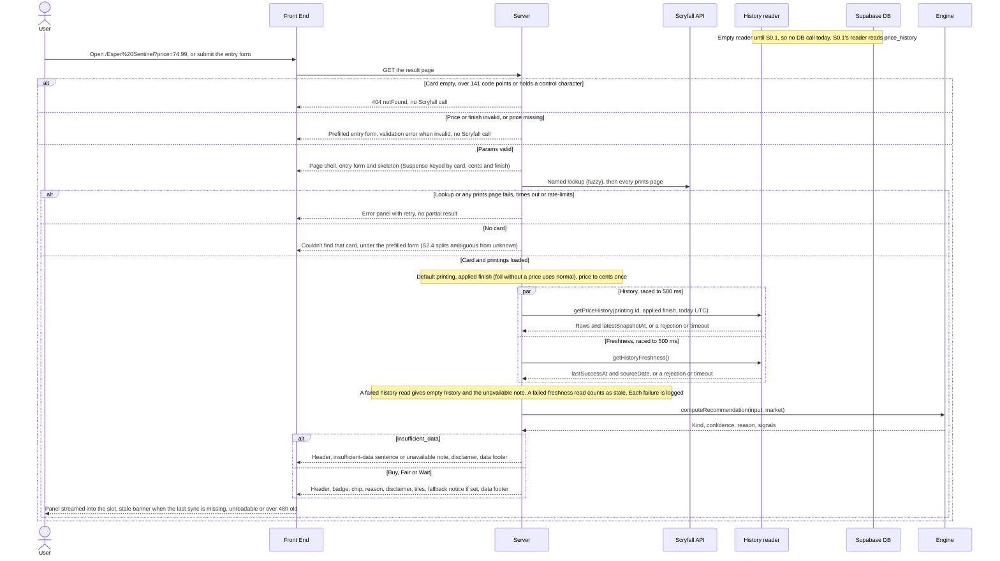
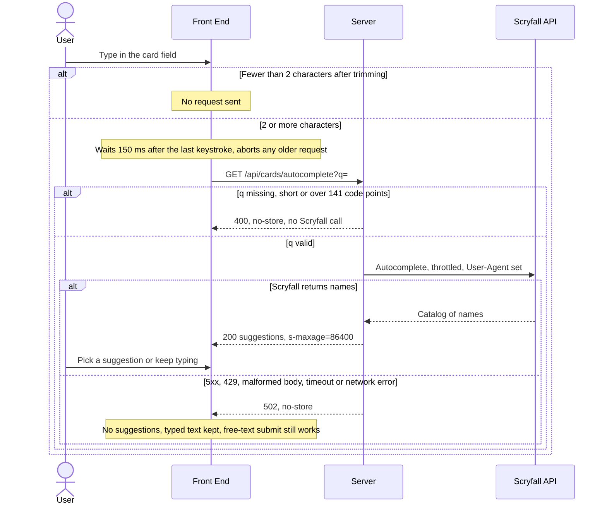
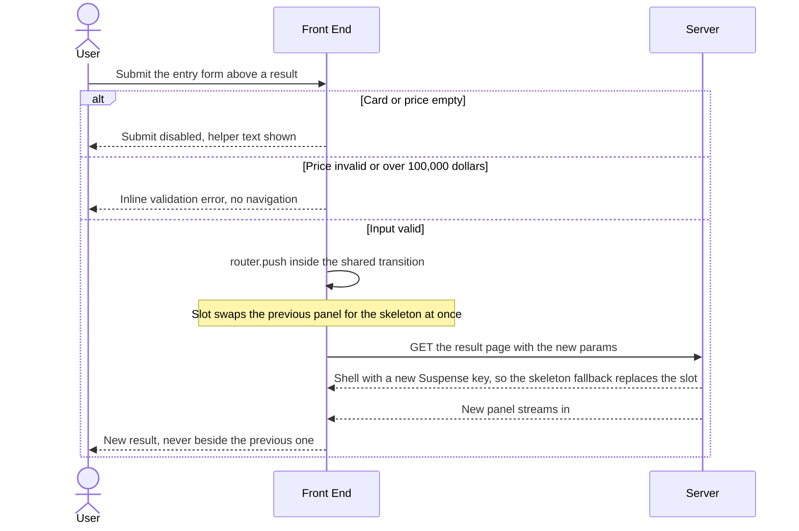

# S2.1 — Live recommendation on the evaluation page

> Story: [Notion S2.1](https://app.notion.com/p/394a7227e26f81f480a5f055fbd17825) · Design: [F2 Live Evaluation Integration](https://app.notion.com/p/394a7227e26f81b7b3ccf5f51168130c) (Approved, Josh 2026-10-08; §UI, §Functionality, §Default printing, W1, §Fields) and [F1 Price Recommendation Engine](https://app.notion.com/p/394a7227e26f813e8e97f395b70c0eb3) (Approved, Josh 2026-10-08; contract, finish fallback, UI strings) · Contract source: [F0 Price History Pipeline](https://app.notion.com/p/3f1a7227e26f81dfb405f63e9d3adc71) W3 (Draft; only the reader signatures are used, see S2.1d2) · Standards: [Development Standards](https://app.notion.com/p/394a7227e26f810e956ef0c76c907c95) · PR: #12 · Critique: docs/critiques/C1-2026-10-04-phase1-designs.md#C1.02, C1.21, C1.22, C1.26, C1.29, C1.30, C1.31, C1.32, C1.33, C1.52, C1.53, C1.54 (rulings C1.04 = A, C1.05 = B, C1.06 = A, C1.07 = A, C1.08 = A, C1.14 = A, C1.28 = A, C1.44 = A, C1.46 = A) · docs/critiques/C2-2026-10-05-new-pages.md#C2-B.2, C2-B.8, C2-B.10, C2-B.11

## Objective
Serve the result page `/[card]?price=&finish=` (C1.06 = A) as an async server component that resolves the card on Scryfall, picks the default printing and applied finish, reads history through a `PriceHistoryReader`, runs S1.2's `computeRecommendation` on the server and renders the recommendation panel with S1.3's locked copy: card header, badge, confidence chip, reason line with the recommendation disclaimer directly below it, four signal tiles, fallback notice, data footer and stale-data banner. Add the card search (`CardCombobox` over a new `GET /api/cards/autocomplete`) and the entry form it lives in, and delete the client mock (`Math.random` verdicts) and the Recent Evaluations list from `/evaluate`.

**Pivot (F0 not approved; Josh's overnight directive, 2026-10-10).** F0 (S0.1–S0.3) is still Draft, so this story ships before the data lane. History and freshness are read only through a `PriceHistoryReader` interface with F0 W3's signatures, and the default implementation is empty (no rows, null freshness). Until S0.1 swaps in the real reader, every card renders `insufficient_data` with "No price history yet for this printing." and the stale-data banner. Recorded on Notion S2.1, F2 and S0.1 (2026-10-10). Logging (F5, S5.1) is out of scope.

## Endpoints
| Method | Path | Request | Response | Auth | Errors |
|--------|------|---------|----------|------|--------|
| GET | `/[card]` | path `card` (≤ 141 printable code points); query `price` (normalised per C1.52), `finish` ∈ {normal, foil} (default normal) | 200 HTML (RSC-rendered panel; `robots: noindex`) | none | 404 for an empty, over-long or control-character card (pre-Scryfall guard); invalid price or finish → 200 with the prefilled entry form and the inline validation error, no Scryfall call; Scryfall failure → 200 with the error panel; history or freshness failure → 200 degraded panel; never a 500 for these |
| GET | `/api/cards/autocomplete` | `q` (trimmed, 2 to 141 code points) | 200 `{ "data": string[] }`, `Cache-Control: public, max-age=0, s-maxage=86400` | none | 400 `{ "error": "invalid_query" }` for a missing, short or long `q` (no Scryfall call); 502 `{ "error": "upstream" }` for a Scryfall 5xx, 429, malformed body, timeout or rejected fetch; every non-2xx carries `Cache-Control: no-store` |

Neither route writes anything (Standards: no writes in renders or GET handlers). No other route changes; `/api/prices/snapshot` is never called.

## Data Model
None. No schema change, no migration, no database read or write: the default history reader is empty and imports no Prisma. `docs/architecture/erd.md` is unchanged. S0.1 adds `price_history` and the real reader.

## Sequence Diagrams

### W1: Evaluate a card on the result page (F2 W1)


### W2: Card search (C1.30)


### W3: Submit while a result is showing (AC-8)


## Test Manifest
| ID | Test | Type | Covers | Notes |
|----|------|------|--------|-------|
| T1 | `src/lib/evaluation/result-params.test.ts`, price: `normalisePrice` strips `$`, commas and whitespace; `parsePriceCents` gives "$74.99" → 7499, " 1,234.50 " → 123450, "0.01" → 1, "100000" → 10,000,000, "$ 74.99" → 7499; rejects (null) "74.999", "1e3", "0", "0.00", "-1", "", "100000.01", ".99", "74.", "１２" (fullwidth), "NaN", "Infinity", "0x10" and a 40-digit string; the accepted range equals `MIN_ASKING_PRICE_CENTS`..`MAX_ASKING_PRICE_CENTS` (boundaries 1 and 10,000,000 in, 0 and 10,000,001 out) | unit | AC-9 | One parser for the client form and the server (S2.1d5) |
| T2 | `result-params.test.ts`, route params: `parseResultParams` gives `not_found` for a 200-char card, 142 code points, a whitespace-only card and cards holding U+0000, U+0007, U+007F or U+0085; 141 code points, "Lim-Dûl's Vault", "Fire // Ice", "+2 Mace", "Question Elemental?" and a 141-emoji card pass; finish absent → normal, "foil" → foil, "etched", "Foil", "" and an array → `form` with the error; price absent → `form` without the error; price invalid or repeated (`?price=1&price=2`) → `form` with the error; the `paramsKey` differs when card, cents or finish differ, and is equal for "74.99" and "$74.99" | unit | AC-9 (C1.52) | `printing` is ignored until S2.3 |
| T3 | `src/lib/printings.test.ts`: `selectDefaultPrinting` on the Esper Sentinel fixture (sld #2123 foil-only, pmh2 promo, plst, mh2 #328, h2r, mh2 #12, j21 digital, plus a synthetic `memorabilia` gold-border printing priced lowest) picks mh2 #12 at 5917 for normal and mh2 #12 at 7647 for foil; the memorabilia, promo (flag and set_type), token, minigame, box and digital printings are never picked even when cheapest; a printing without the mapped finish, or with a null, "", "abc", "0.00" or "-1" price for it, is skipped; tie on price → earliest `released_at`, then lowest id; shuffling the input never changes the pick; no candidate → null. `scryfallPriceCents`: "59.17" → 5917, "0.01" → 1, null, "", "abc", "0.00", "-3", "1e3" → null | unit | AC-10 | Fixture is hand-built from the AC's values (S2.1d7) |
| T4 | `src/lib/scryfall.test.ts`, fetch mocked: `getAllPrintings` follows `prints_search_uri` then `next_page` until `has_more` is false (two-page fixture, one request per page, order kept); a 503 or HTML 502 on page 2, a rejected fetch, a `next_page` off `https://api.scryfall.com` (never fetched), a missing `prints_search_uri`, a page without a `data` array, and `has_more` still true after 20 pages each throw; `autocomplete` returns the names on 200, throws on 503, 429 and a rejected fetch (the `catch { return [] }` is gone) and makes no request under 2 characters; every request aborts after `SCRYFALL_TIMEOUT_MS` (fake timers) and throws | unit | AC-4, AC-10, AC-20 | Story Notes: both catches removed |
| T5 | `src/lib/evaluation/history-reader.test.ts` and `history-reader.test-d.ts`: `PriceHistoryReader.getPriceHistory` is `(scryfallId: string, finish: Finish, asOf: string) => Promise<{ history: PriceSnapshot[]; latestSnapshotAt: Date \| null }>` and `getHistoryFreshness` is `() => Promise<{ lastSuccessAt: Date \| null; sourceDate: string \| null }>` (type tests); `emptyHistoryReader` returns `{ history: [], latestSnapshotAt: null }` and `{ lastSuccessAt: null, sourceDate: null }`, a fresh array per call; `defaultHistoryReader` is `emptyHistoryReader` | unit (incl. typecheck) | AC-13 (pivot) | S0.1 flips the default assertion to its reader in its PR |
| T6 | `src/lib/evaluation/with-timeout.test.ts` (fake timers): resolves with the value before the deadline; rejects with `HistoryTimeoutError` at 500 ms (499 resolves); clears its timer on settle; a reader that throws synchronously becomes a rejection; a promise that rejects after the deadline raises no unhandled rejection | unit | AC-14 | C1.32 race |
| T7 | `src/lib/evaluation/load-market-snapshot.test.ts`: foil requested and `usd_foil` null → `appliedFinish` normal, `currentPriceCents` from `usd`, history read for normal; foil priced → foil; normal requested, `usd` null, `usd_foil` set → `appliedFinish` normal and `currentPriceCents` null (no reverse fallback); the reader is called exactly once with `(printing.id, appliedFinish, asOf)` and `getHistoryFreshness` once with no arguments; `asOf` is the UTC date (TZ=America/Toronto at 2026-10-10 23:30 local → "2026-10-11"); the reader's history reaches the snapshot unchanged | unit | AC-12, AC-13 | C1.21 |
| T8 | `load-market-snapshot.test.ts`, faults: a rejected history read and one resolving at 501 ms each give `history` [], `latestSnapshotAt` null and `historyUnavailable` true, with one log entry naming the failure; a rejected or slow freshness read gives `syncStale` true and its own log entry; both reads start together, so two 400 ms reads finish at 400 ms; a malformed result (history not an array) counts as a failed read; a `latestSnapshotAt` that is not a valid `Date` becomes null; a `lastSuccessAt` that is not a valid `Date` counts as stale | unit | AC-14 | Log entries carry no URL or secret |
| T9 | `src/lib/evaluation/build-evaluation.test.ts`: a named lookup that rejects, answers 503, 429 or an HTML 502, or times out → `{ status: "error" }` with the prints fetch, reader and engine each called 0 times; a prints page failure → error with the reader at 0 calls; a null lookup → `not_found`; with a fixture reader (30 flat daily rows at 5917), asking 5400, 5900 and 6500 give buy "9% below market.", fair and wait through the real engine, called with exactly two arguments and `cardId` = the default printing's id; the default empty reader gives `insufficient_data`, "No price history yet" state and `syncStale` true; `InvalidRecommendationInputError` (cents 0 forced past the parser) → `{ status: "invalid" }`, never a throw | unit | AC-1, AC-4, AC-13 | `buildEvaluation()` per the story's Verification |
| T10 | `src/lib/evaluation/staleness.test.ts`: `isHistoryStale` is false for null, false at exactly 36 h, true at 36 h + 1 ms, false for an invalid or future date; `isSyncStale` is true for null, false at exactly 48 h, true at 48 h + 1 ms, false for a future date; `relativeTime` gives "1 minute ago" under a minute, "5 minutes ago", "3 hours ago", "2 days ago" and never a future phrase | unit | AC-7 | STALENESS_FLAG_HOURS 36, STALE_BANNER_HOURS 48 |
| T11 | `src/app/[card]/result-view.test.tsx`, panel by props: buy, fair and wait each render one badge with the kind's label and class `mm-rec-badge--{kind}`; the chip shows the confidence label; the reason is visible text in the panel (not a `title` or tooltip); four tiles render with their labels and formatted values (delta and market price, 30-day trend, range position, volatility); a null signal renders "—" with the "thin data" note when the window count is under that signal's minimum, and "—" alone for a flat range (S2.1d9) | component | AC-2 | |
| T12 | `src/app/[card]/result-css.test.ts`: in `result.css` `.mm-rec-badge--buy`, `--fair` and `--wait` take `var(--verdict-buy)`, `var(--verdict-fair)` and `var(--verdict-wait)` with no literal colour; no rule selects `footer` or the site footer's class; `evaluate.css` keeps no `.mm-pill` rule | unit | AC-2 (C1.14 = A) | S2.2's footer contract (T14 there) stays green |
| T13 | `result-view.test.tsx`, insufficient data: the panel carries `data-kind="insufficient_data"`, shows `REASON_COPY.insufficientData` verbatim (it contains "try a different printing") and no badge, chip or tile; with `historyUnavailable` the sentence is replaced by "Price history temporarily unavailable" | component | AC-3, AC-14 | |
| T14 | `result-view.test.tsx`, Scryfall failure: the error panel shows `UI_COPY.errorPanel` and a retry button that calls `router.refresh()` once inside the shared transition; no card header, badge, chip, reason, tile, disclaimer or data footer renders. `status: "not_found"` renders only `UI_COPY.cardNotFound` (S2.1d6) | component | AC-4 | |
| T15 | `result-view.test.tsx`: with `signals.fallbackNotice` true and finish foil the notice reads "This printing has no Foil price — showing Normal pricing."; with false it is absent; `build-evaluation.test.ts` reaches it end to end (foil requested, `usd_foil` null, a fixture reader with 30 normal rows) | component, unit | AC-6 | |
| T16 | `result-view.test.tsx`, data footer and banner: `SOURCE_LABEL` renders for every kind, the unavailable variant included; with `latestSnapshotAt` 3 hours old and 22 window snapshots the line reads "Price history: 22 snapshots, newest 3 hours ago" with no flag; at 37 hours "Over 36 hours old" also shows; with null the line is "No price history yet for this printing."; the data footer is not a `<footer>` element; the banner "Price data is temporarily out of date." renders iff `syncStale` | component | AC-7, AC-14 | |
| T17 | `src/app/[card]/result-slot.test.tsx` and `entry-form.test.tsx`: with a pending navigation (mocked `router.push` returning an unsettled promise inside the shared transition), submitting the form above a buy panel shows the skeleton (badge placeholder, four tile placeholders, two selector slots, `aria-busy="true"`) and the previous reason, badge and tiles are gone in the same render; settling it and re-rendering the slot with the new key shows the new panel; `page.test.tsx` checks that the page wraps the panel in `Suspense` keyed by `paramsKey` with the skeleton as fallback | component | AC-8 | S2.1d10 |
| T18 | `src/components/entry-form.test.tsx`: empty card or empty price → submit disabled and "Enter a card and a price." tied to it by `aria-describedby`; a whitespace-only card is empty; "100000.01", "74.999", "1e3" and "0" → "Enter a price from $0.01 to $100,000, like 74.99." inline with `aria-invalid`, and `router.push` 0 times; "$74.99" with "Esper Sentinel" → exactly one push to `/Esper%20Sentinel?price=74.99`; a second submit while pending pushes nothing; editing the price clears the error; the card input has `maxLength` 141 | component | AC-9 | |
| T19 | `src/app/[card]/page.test.tsx` (the page awaited as a function, `next/navigation` mocked): a 200-char card throws `notFound()` with fetch called 0 times; an invalid price, `finish=etched` and a missing price each return the prefilled entry form (error shown for the first two, not the third) with fetch 0 times; `metadata.robots` is `{ index: false, follow: false }` | component | AC-9, C1.28 = A | Async server components are tested by awaiting them (S2.1d18) |
| T20 | `result-view.test.tsx`, disclaimer: for buy, fair, wait, insufficient_data and the unavailable variant, the element right after the reason line is the disclaimer, whose text equals `RECOMMENDATION_DISCLAIMER`; one inline snapshot pins the reason and disclaimer markup per kind | component | AC-11 (C1.02) | Inline snapshots are committed; CI never writes them (S1.3 T11/T12) |
| T21 | `build-evaluation.test.ts` and `src/app/[card]/client-boundary.test.ts`: the reader mock records `getPriceHistory(printingId, appliedFinish, asOf)` and one `getHistoryFreshness()` per evaluation; no non-test file under `src/app/[card]`, `src/app/api/cards`, `src/lib/evaluation`, `src/components` or `src/lib/printings.ts` imports `@/lib/prisma` or `@/generated/prisma`, or names `priceSnapshot` or `price_snapshots` | unit | AC-13 | |
| T22 | `src/app/[card]/result-panel.test.tsx`: `ResultPanel` awaited with deps whose reader rejects (fixture 1) or answers after 501 ms (fixture 2), freshness failing the same way in each, resolves (no throw, so the streamed page stays 200) and renders the insufficient panel with the unavailable note and the banner, never the error panel; the injected logger records two failures per fixture | component | AC-14 | |
| T23 | `client-boundary.test.ts`: no non-test file under `src/` contains `Math.random` (S2.1d19); `evaluate-client.tsx` has no mock market, `VerdictPill`, `RecentSection` or `localStorage` | unit | AC-15, AC-16 (C1.33, C1.44 = A) | |
| T24 | `client-boundary.test.ts`: the static import closure of every `"use client"` module under `src/` (relative and `@/` specifiers resolved) reaches no module that imports `server-only` and none of the engine's logic modules (`engine`, `bands`, `reason`, `signals`, `window`, `validate`, `params`, `copy`); no client module names `mm-rec-badge` or `mm-pill`; `engine.ts` and `build-evaluation.ts` each import `server-only` first. Self-test: a planted client module importing `@/lib/recommendation/engine` through one hop is flagged | unit | AC-1, AC-16 | `next build` fails the same plant (T30 mutation) |
| T25 | `result-view.test.tsx`, header (D2): the printing's name in the heading, `UI_COPY.printingOption` filled as the set line ("Modern Horizons 2 (MH2) · #12"), an `img` with `image_uris.normal` and the name as `alt`; a double-faced card uses its front face; no image URI → no `img`; the `img` sits outside the glass panel and carries no `style` or filter class (R3, R4) | component | AC-17 (C1.07 = A) | |
| T26 | `src/components/card-combobox.test.tsx` (fake timers, fetch mocked): "j" → 0 requests; "ja" → 0 at 149 ms and 1 at 150 ms; "ja" then "jac" within 150 ms → one request, for "jac"; "  j " → 0; a superseded request is aborted and its late response ignored; picking a suggestion fills the input | component | AC-18 (C1.30) | |
| T27 | `src/app/api/cards/autocomplete/route.test.ts` (fetch mocked): Scryfall 200 → 200 `{ data }` whose `Cache-Control` contains `s-maxage=86400`, upstream URL encodes `q`; `q` missing, "a", "  a  " and 142 code points → 400 with `no-store` and 0 upstream calls | unit | AC-19 | |
| T28 | `route.test.ts`: Scryfall 503, 429, an HTML 502, a body without `data` and a rejected fetch → 502 with `Cache-Control: no-store`, never `s-maxage`; `card-combobox.test.tsx` and `entry-form.test.tsx`: on a 502 the combobox shows no options and keeps the typed text, and submit pushes the typed text | unit, component | AC-20 | |
| T29 | `scripts/test-report.test.ts`: `featureOf` maps `src/lib/printings.test.ts`, `src/lib/scryfall.test.ts`, every new `src/lib/evaluation/*`, `src/app/[card]/*`, `src/app/api/cards/*` and `src/components/*` test, and `src/lib/copy/result-labels` to F2; `docs/test-report.md` has no Unmapped row | unit | DoD 3 | S2.1d20 |
| T30 | `npm run lint`, `npm run build` and `npm test` exit 0 on Node 22 locally and every PR check is green in CI; `npm run test:report` lists T1–T29's files with no Unmapped. Local `next start` (production build, live Scryfall, empty reader): `curl -H "RSC: 1" '/Esper%20Sentinel?price=74.99'` carries the rendered reason and disclaimer text; `.next/static` holds no engine string ("askingPriceCents must be an integer", "only {n} price snapshots"); `curl -I` on a 200-char card answers 404; `curl -i '/api/cards/autocomplete?q=esper'` shows `s-maxage=86400`; screenshots of the Esper Sentinel result (insufficient_data, no-history line, banner), the invalid-price form and the skeleton, with DOM measurements of the skeleton against the panel. Mutations, each run and reverted: `Math.random` in a component fails T23; a client component importing the engine fails T24 and `next build`; dropping the history race fails T8 and T22; moving the disclaimer above the reason fails T20; swapping the buy badge token fails T12 | functional | AC-1 to AC-20 (AC-5 moved to S2.3) | Standards DoD 4; Playwright not added (S2.1d17) |

### Evidence commands (Node 22, repo root)
```bash
source ~/.nvm/nvm.sh && nvm use 22 >/dev/null
# AGENTS.md Databases limit: `npm test` runs S1.1's integration project, so check hosts first.
{ env; cat .env* 2>/dev/null; } | grep -oE 'postgres(ql)?://[^[:space:]"]+' | sed -E 's#^[^@]*@##; s#[:/?].*##' | sort -u
{ env; cat .env* 2>/dev/null; } | grep -oE 'postgres(ql)?://[^[:space:]"]+' | grep -oiE '[?&]host(addr)?=[^&#]*' | sort -u
npm run lint
npm run build
npx vitest run src/lib/evaluation src/lib/printings.test.ts src/lib/scryfall.test.ts 'src/app/[card]' src/app/api/cards src/components scripts/test-report.test.ts
npm test
npm run test:report   # regenerate and commit docs/test-report.md
# Functional evidence (AC-1, AC-9, AC-19): production build on localhost, live Scryfall, no database
npx next start -p 3100 &
curl -s -H "RSC: 1" 'http://localhost:3100/Esper%20Sentinel?price=74.99' | grep -c "Recommendations are automated"
grep -rl "askingPriceCents must be an integer" .next/static || echo "no engine code in client chunks"
curl -sI "http://localhost:3100/$(printf 'x%.0s' {1..200})?price=1" | head -1
curl -si 'http://localhost:3100/api/cards/autocomplete?q=esper' | grep -i cache-control
```

## Results                                      <!-- filled in Review; tests are authored in Testing, run here -->
| ID | Pass/Fail | Evidence |
|----|-----------|----------|
| T1 | Pass | Local `3ed95da`: `result-params.test.ts` price block, 24 prices (7 accepted incl. "$74.99" → 7499, "100000" → 10,000,000; 17 rejected incl. "74.999", "1e3", "0", fullwidth, 40 digits), boundaries 1 and 10,000,000 pinned to `limits.ts` |
| T2 | Pass | Local `3ed95da`: `result-params.test.ts` param block: 8 not_found cases (200/142 chars, blank, U+0000/0007/007F/0085), malformed `%E0%A4%A` → not_found, 6 passing names incl. 141 emoji, `%2541` decodes once to `%41`, finish/price/repeat cases, paramsKey equalities (D-1) |
| T3 | Pass | Local `3ed95da`: `printings.test.ts`: mh2 #12 at 5917 normal and 7647 foil; sld (box), pmh2 (promo), j21 (digital), wc21 (memorabilia) are cheaper and never picked; 7 exclusion variants, finish and bad-price skips, tie → earliest `released_at` → lowest id over 4 orders, null when none; `scryfallPriceCents` 4 good / 8 null |
| T4 | Pass | Local `3ed95da`: `scryfall.test.ts`: two-page walk (one request per page, order kept, User-Agent), 503 / HTML 502 on page 2, rejected fetch, 3 off-host `next_page` never fetched, missing URI, no `data`, `has_more` without `next_page`, 20-page cap; autocomplete 200 / 503 / 429 / rejection / under 2 chars; `getPrintings` throws; 8 s abort for lookup, prints and autocomplete (fake timers), timer cleared on settle |
| T5 | Pass | Local `3ed95da`: `history-reader.test-d.ts` (typecheck: F0 W3 signatures, `PriceSnapshot`) and `history-reader.test.ts` (no rows, null freshness, fresh array per call, frozen, default is the empty reader) |
| T6 | Pass | Local `3ed95da`: `with-timeout.test.ts`: 499 ms resolves, 500 ms rejects with `HistoryTimeoutError`, 501 ms read rejects, timers cleared both ways, synchronous throw → rejection, late rejection raises no `unhandledRejection` |
| T7 | Pass | Local `3ed95da`: `load-market-snapshot.test.ts`: foil without `usd_foil` → normal + usd + normal history; foil priced → foil; normal with only `usd_foil` → normal + null price; reader called once with `(id, appliedFinish, asOf)`, freshness once with no arguments; `TZ=America/Toronto` 23:30 local → asOf `2026-10-11`; rows reach the snapshot by reference |
| T8 | Pass | Local `3ed95da`: same file: rejection and 501 ms history → [], null, `historyUnavailable`, one `history_read_failed`; rejected or hanging freshness → `syncStale`, one `freshness_read_failed`; two 400 ms reads finish at 400 ms; malformed results, invalid `latestSnapshotAt` and `lastSuccessAt` handled; 48 h boundary |
| T9 | Pass | Local `3ed95da`: `build-evaluation.test.ts` with the real `getCardByName` and fetch mocked: rejection, 503, 429, HTML 502 and an 8 s timeout → `error` with prints, reader and engine at 0 calls; prints failure → error, reader 0; null → `not_found`; 5400 / 5900 / 6500 against 30 flat rows → buy "9% below market.", fair "At market price.", wait "10% above market." via the real engine, called with two arguments and `cardId` = mh2 #12; empty reader → insufficient_data + `syncStale`; cents 0 and 10,000,001 → `invalid`; unexpected engine throw → `error` |
| T10 | Pass | Local `3ed95da`: `staleness.test.ts`: 36 h boundary (null, invalid and future false), 48 h banner (null and invalid stale, future not), 11 relative-time cases plus the future clamp |
| T11 | Pass | Local `3ed95da`: `result-view.test.tsx` T11 block: buy / fair / wait each one badge `mm-rec-badge--{kind}`, chip, visible reason with no `title` or tooltip; medium and low chips; four tiles with labels and values ("−8.7%", "Market $59.17", "Low $50.00 · High $58.70"); thin-data note on null range and volatility at 10 snapshots; flat range shows "—" alone |
| T12 | Pass | Local `3ed95da`: `result-css.test.ts`: each badge kind takes `var(--verdict-*)` and no literal colour; no selector names the footer; `evaluate.css` has no `.mm-pill`, `.mm-recent`, `.mm-stale` or `.mm-empty`. S2.2's `tests/contract/site-footer.test.ts` green (D-4) |
| T13 | Pass | Local `3ed95da`: `result-view.test.tsx` T13 block: `data-kind="insufficient_data"`, the sentence verbatim, no badge, chip or tile; unavailable variant shows "Price history temporarily unavailable" |
| T14 | Pass | Local `3ed95da`: `result-view.test.tsx` T14 block: error copy and Retry → `router.refresh()` once; no header, image, badge, chip, reason, tile, disclaimer or data footer; `not_found` and `invalid` render only their copy |
| T15 | Pass | Local `3ed95da`: `result-view.test.tsx` (notice text with Foil, absent otherwise) and `build-evaluation.test.ts` end to end (foil requested, no `usd_foil`, 30 normal rows → buy, `fallbackNotice`, reader called with normal) |
| T16 | Pass | Local `3ed95da`: `result-view.test.tsx` T16 block: source label in a `div` for all five variants; "Price history: 22 snapshots, newest 3 hours ago" with no flag; 37 h adds "Over 36 hours old"; exactly 36 h no flag; null → no-history line; unavailable variant omits the line (D-6); banner iff `syncStale` |
| T17 | Pass | Local `3ed95da`: `result-slot.test.tsx` (submit above a buy panel → skeleton with `aria-busy`, 1 badge, 4 tile and 2 selector placeholders, previous reason, badge and tiles gone in the same render; settle + new key → new panel; Retry shares the transition) and `page.test.tsx` (Suspense keyed `Esper Sentinel|7499|foil`, `PanelSkeleton` fallback, inside `ResultSlot`; key changes with the query). Browser DOM measurement on `next start` (see Session Log) |
| T18 | Pass | Local `3ed95da`: `entry-form.test.tsx`: 5 empty cases disable submit with the helper as its accessible description; 6 invalid prices → inline alert, `aria-invalid`, 0 pushes; edit clears the error; `initialError` prefilled; "$74.99" → one push to `/Esper%20Sentinel?price=74.99`; trimmed and encoded card; second submit while pending pushes nothing; `maxLength` 141 |
| T19 | Pass | Local `3ed95da`: `page.test.tsx`: 200-char card, `%00` and a malformed encoding throw `notFound()` with fetch 0 times; invalid price, `finish=etched`, repeated price and missing price return the prefilled form (error on the first three) with fetch 0 times; `robots` `{ index: false, follow: false }`, title "Evaluation" |
| T20 | Pass | Local `3ed95da`: `result-view.test.tsx` T20 block: for buy, fair, wait, insufficient_data and unavailable the reason's next element is the disclaimer equal to `RECOMMENDATION_DISCLAIMER`; committed inline snapshot of the five markups (CI never writes it) |
| T21 | Pass | Local `3ed95da`: `build-evaluation.test.ts` T21 block (one `getPriceHistory(mh2 #12, appliedFinish, asOf)` and one `getHistoryFreshness()` per evaluation) and `client-boundary.test.ts` (AST scan of every result-surface file: no Prisma import, no `priceSnapshot`, no `price_snapshots`; self-test flags 4 plants) |
| T22 | Pass | Local `3ed95da`: `result-panel.test.tsx`: rejecting and 501 ms readers (freshness failing alike) resolve to the insufficient panel with the unavailable note and banner, never the error panel, two failures logged each; a healthy reader renders buy |
| T23 | Pass | Local `3ed95da`: `client-boundary.test.ts`: no non-test file under `src/` contains `Math.random`; `evaluate-client.tsx` has no mock market, `VerdictPill`, `RecentSection`, `RecentRow`, `localStorage` or the S2.1 lint disables |
| T24 | Pass | Local `3ed95da`: `client-boundary.test.ts`: 6 client modules found; no static import closure reaches `server-only` or an engine logic module, and none names `mm-rec-badge` or `mm-pill`; `engine.ts` and `build-evaluation.ts` import `server-only` first; self-tests flag a one-hop plant and skip type-only imports |
| T25 | Pass | Local `3ed95da`: `result-view.test.tsx` T25 block: `h1` "Esper Sentinel", set line "Modern Horizons 2 (MH2) · #12", `img` with `image_uris.normal` and the name as `alt`, outside the glass panel with no `style`; double-faced front face; no URI → no `img` |
| T26 | Pass | Local `3ed95da`: `card-combobox.test.tsx` (fake timers): "j" → 0; "ja" → 0 at 149 ms, 1 at 150 ms; "ja" then "jac" → one request for "jac"; "  j " → 0; trimmed and encoded query; suggestions shown and a pick fills the input; superseded request aborted and its late answer ignored; `maxLength` 141 |
| T27 | Pass | Local `3ed95da`: `route.test.ts`: 200 → `{ data }` with `public, max-age=0, s-maxage=86400`, upstream URL encodes `q`, `q` trimmed; missing, "a", "  a  ", 142 chars, 142 emoji, repeated `q` and a control character → 400 `invalid_query`, `no-store`, 0 upstream calls; 141 emoji passes (D-9) |
| T28 | Pass | Local `3ed95da`: `route.test.ts` (503, 429, HTML 502, no `data`, non-string `data`, rejected fetch → 502 `upstream`, `no-store`, never `s-maxage`; the log names no URL); `card-combobox.test.tsx` (502, 400, network error, malformed 200 → no options, typed text kept; a later failure clears earlier options); `entry-form.test.tsx` (502 → typed text pushed) |
| T29 | Pass | Local `3ed95da`: `scripts/test-report.test.ts` maps 20 new test paths to F2; `docs/test-report.md` "✅ All green", 1654 tests, F1 36 files / 981, F2 25 files / 673, no Unmapped row |
| T30 | Pass | Local `3ed95da`, Node 22.23.3: host check printed only `localhost`, the `host=` check nothing; `npm run lint` exit 0 (0 errors, 1 warning, the pre-existing `/sample` one); `npm run build` green; manifest run green; `npm test` 61 files, 1652 passed, 2 skipped, type errors none (throwaway Postgres 14.8 on `localhost:55432`); `npm run test:report` all green. `next start` with live Scryfall and the empty reader: `curl -H "RSC: 1" '/Esper%20Sentinel?price=74.99'` carries the reason, the disclaimer, `insufficient_data`, "No price history yet for this printing.", the banner and "Modern Horizons 2 (MH2) · #12"; `.next/static` holds neither "askingPriceCents must be an integer", "price snapshots" nor "fairBandPct"; 200-char card → `HTTP/1.1 404`; `autocomplete?q=esper` → 200 `public, max-age=0, s-maxage=86400`, `q=e` → 400 `no-store`; `/Fire%20%2F%2F%20Ice` resolves; foil picks mh2 #12; robots meta `noindex, nofollow`. Mutations, each run and reverted: `Math.random` in `entry-form.tsx` fails T23; a client module reaching the engine through one hop fails T24 and `next build` ("You're importing a component that needs \"server-only\""); dropping the history race fails T8 and T22; the disclaimer above the reason fails T20 (6 tests); `--verdict-fair` on the buy badge fails T12. CI [run 38088615463](https://github.com/ayfor/mox-market/actions/runs/38088615463) on `3ed95da`: "lint + build + test" green in 2m6s (61 files, 1652 passed, 2 skipped, type errors none). Screenshots: not captured, the Browser pane was hidden overnight; DOM measurements instead (Session Log) |

## Deviations                                   <!-- what changed from the plan and why -->
- **D-1 (S2.1d5, decoding).** Next 16.1.6 hands `params.card` over still percent-encoded (`next start`: the prefilled card read `Esper%20Sentinel`, and `/Fire%20%2F%2F%20Ice` failed the lookup). `parseResultParams` now takes the raw segment and decodes it exactly once (`decodeCardSegment`); a malformed encoding is `not_found` (404). T2 and T19 pin it.
- **D-2 (form styles).** The form rules moved from `evaluate.css` to a new `src/components/entry-form.css`, imported by `EntryForm`, so `/evaluate` and the result route share one form; it adds the inline error and the combobox option styles. The "Press Enter" hint is gone (its text was not in a copy module).
- **D-3 (S2.1d11, card label).** The card field reads "Card", not "Card name": once `result-labels.ts` held "Card name", S1.3's one-home lint (T19 there) flagged the landing form's literal `aria-label="Card name"` in `src/app/page.tsx`, which is S2.4's. S2.4 may rename it when it moves the landing copy.
- **D-4 (grain overlay).** `result.css` repeats the `/evaluate` shell (`.mm-app::before`, as each top-level page is self-contained), so S2.2's pinned overlay list in `tests/contract/site-footer.test.ts` gains `src/app/[card]/result.css`; the overlay is still checked (z-index 0, no z-index on its host).
- **D-5 (test setup).** `src/test/setup-dom.ts` stubs `ResizeObserver`, which jsdom lacks and Headless UI's Combobox calls while open.
- **D-6 (S2.1d9, unavailable variant).** When the history read failed, the data footer shows the source label only: `latestSnapshotAt` is null by construction there, and "No price history yet for this printing." would contradict the unavailable note above it. **Choice Josh can overturn.**
- **D-7 (S2.1d10, selector row).** The ok view reserves an empty 40 px `.mm-selector-row` where S2.3's selectors go, so the skeleton's two selector slots cause no shift.
- **D-8 (S2.1d9, the dash).** The null-tile "—" is `EMPTY_TILE_VALUE` in `tiles.ts`, not in `result-labels.ts`: S1.3's T17 allows U+2014 only in three copy strings. It is a number-format glyph, like the sign and the percent.
- **D-9 (S2.1d14).** The autocomplete route also answers 400 for a repeated `q` and a control character, like the card guard.
- **D-10 (types).** `getCardImageUri` takes `Pick<ScryfallCard, "image_uris" | "card_faces">` (type widening only), so the header passes the evaluated printing.
- **D-11 (report).** `scripts/test-report.mjs`'s e2e note records S2.1d17 instead of "decided at S2.1's plan gate".
- **D-12 (lint).** The card `img` carries a line-scoped `@next/next/no-img-element` disable with its reason (R4: the original image, unprocessed), as S1.1d5 asks of exceptions. `scryfall.ts`, `types/scryfall.ts` and `evaluate-client.tsx` were not Prettier-clean before; formatting them (files this story changes) adds whitespace-only hunks.
- **D-13 (ADV-1, throttle).** `src/lib/throttle.ts` (not in S2.1d1's list) now reserves slots instead of chaining promises: `throttle({ signal, maxWaitMs })` refuses a caller whose slot is more than `maxWaitMs` away (`ThrottleBacklogError`) and rejects a queued caller whose signal aborts. `request()` in `scryfall.ts` starts its 8 s timer before the queue wait. New consts: `SCRYFALL_MAX_QUEUE_MS` 4,000 (every request) and `AUTOCOMPLETE_MAX_QUEUE_MS` 1,000 (autocomplete only, so a flood of suggestions cannot crowd out result lookups). Ops constants, not `RECOMMENDATION_PARAMS` values.
- **D-14 (ADV-4, error boundary).** New `src/app/[card]/error.tsx` (client): the error panel and Retry (`router.refresh()` and `reset()` in one transition) for a render that throws after the streamed 200. `buildEvaluation` runs its whole body in one try (`evaluation_failed`), rejects a printings payload holding a non-object (`scryfall_failed`, never a partial list) and an evaluated card without the header's string fields (`scryfall_malformed`).
- **D-15 (ADV-8, form state).** `page.tsx` no longer keys `EntryForm` by `card|price|kind`. The form takes new URL values only into fields not edited since the last sync or submit, so an edit typed while a result loads survives the navigation landing. A different query while one is pending navigates again (the latest wins); the same query again is still ignored. Evaluate carries `aria-busy` while pending.
- **D-16 (ADV-2, combobox).** `CardCombobox` renders the typed text as the first option whenever suggestions show (no duplicate of it below), so Headless UI's default first option is the user's text and Tab keeps it. Enter on that option, or Enter with the list open and no option shown, calls `form.requestSubmit()`; Headless UI then closes the list and cancels the browser's own submit, so the form submits once. Enter on a suggestion the user moved to fills it, as before. The card field takes `aria-invalid` and `aria-errormessage` (Headless UI overwrites `aria-describedby` on its input).

## Decisions                                    <!-- S#.#d1, S#.#d2 … one line each; design-level decisions stay in Notion -->
- **S2.1d1 (scope).** New: `src/app/[card]/` (`page.tsx`, `result-panel.tsx`, `result-view.tsx`, `result-slot.tsx`, `panel-skeleton.tsx`, `retry-button.tsx`, `result.css`), `src/app/api/cards/autocomplete/route.ts`, `src/components/card-combobox.tsx`, `src/components/entry-form.tsx`, `src/components/result-navigation.tsx`, `src/lib/evaluation/` (`consts.ts`, `result-params.ts`, `history-reader.ts`, `with-timeout.ts`, `staleness.ts`, `tiles.ts`, `load-market-snapshot.ts`, `build-evaluation.ts`), `src/lib/printings.ts`, `src/lib/__fixtures__/esper-sentinel-prints.ts`, `src/lib/copy/result-labels.ts`, `src/test/server-only.ts`, and the tests in the manifest. Edited: `src/lib/scryfall.ts` (types, `getAllPrintings`, request timeout, the two catches), `src/types/scryfall.ts` (`promo`, `finishes`, `prints_search_uri`), `src/lib/recommendation/engine.ts` (one line, `import "server-only"`), `src/app/evaluate/evaluate-client.tsx` and `evaluate.css`, `vitest.config.mts` (the `server-only` alias), `package.json` and `package-lock.json` (`server-only`), `scripts/test-report.mjs` and its test, `docs/test-report.md`. Not touched: every param value and locked string, `copy.ts`, `ui-copy.ts`, `legal.ts`, the rest of the engine, `getCardByName` and `ScryfallApiError` (S2.4), `src/app/page.tsx` (S2.4), `src/app/sample/**` (S2.4), `nav-bar.*` (S2.4), Prisma, `layout.tsx` (S2.2), `docs/specs/**` and every harness file except `.cursor/hooks/active-story.json`.
- **S2.1d2 (pivot: the history reader, F0 not approved).** `src/lib/evaluation/history-reader.ts` exports `PriceHistoryReader` { `getPriceHistory(scryfallId: string, finish: Finish, asOf: string): Promise<PriceHistoryResult>`, `getHistoryFreshness(): Promise<HistoryFreshness>` } with `PriceHistoryResult = { history: PriceSnapshot[]; latestSnapshotAt: Date | null }` and `HistoryFreshness = { lastSuccessAt: Date | null; sourceDate: string | null }`, exactly F0 W3's signatures and F1's `PriceSnapshot`. `emptyHistoryReader` returns no rows and null freshness; `defaultHistoryReader` points at it. S0.1 adds `src/lib/price-history.ts` implementing the interface and repoints the default in its PR; nothing else changes. The file name avoids `price-history`, which the report maps to F0. Consequence until S0.1: every card is `insufficient_data` with the no-history line, and the banner shows, because F2 counts a null `lastSuccessAt` as stale. **Choice Josh can overturn:** hide the banner while the reader is the empty one (a flag on the reader); the plan follows F2's rule as written.
- **S2.1d3 (`server-only`, AC-1).** New dependency `server-only@0.0.1` (2022, named in the PR body). `engine.ts` (the engine entry) and `build-evaluation.ts` import it first, so `next build` fails if a client module imports either. The engine purity scan allows packages other than React and Next, and the import is the only change to the engine (no logic, param or copy change; `PARAMS_VERSION` unchanged). Vitest aliases `server-only` to an empty stub (`src/test/server-only.ts`), because the package throws outside the `react-server` condition.
- **S2.1d4 (UI and ops constants).** `src/lib/evaluation/consts.ts`, imported by client and server: `STALENESS_FLAG_HOURS` 36, `STALE_BANNER_HOURS` 48, `HISTORY_TIMEOUT_MS` 500, `CARD_PARAM_MAX_CHARS` 141, `AUTOCOMPLETE_MIN_CHARS` 2, `AUTOCOMPLETE_DEBOUNCE_MS` 150, `AUTOCOMPLETE_CACHE_SECONDS` 86,400, `SCRYFALL_TIMEOUT_MS` 8,000, `MAX_PRINT_PAGES` 20. None is a `RECOMMENDATION_PARAMS` value (F2: "UI consts module, not RECOMMENDATION_PARAMS"). F0's ops constants stay F0's (`src/lib/mtgjson/consts.ts`).
- **S2.1d5 (params, C1.52).** One pure module, `result-params.ts`, serves the server and the client form. The card segment is trimmed and must hold 1 to 141 code points and no control character (Unicode category Cc), else `notFound()` before any Scryfall call. The price is normalised (strip `$`, commas, whitespace), must match `^\d{1,6}(\.\d{1,2})?$` and lie within `MIN_ASKING_PRICE_CENTS`..`MAX_ASKING_PRICE_CENTS`; cents = `Math.round(Number(s) × 100)`. `finish` is absent (normal), `normal` or `foil`; anything else, `etched` included (C1.08 = A), is invalid. Any repeated parameter is invalid. An invalid price or finish renders the entry form prefilled with the card and the typed price and `UI_COPY.validationError`; a missing price renders the same form without an error (submit disabled with the helper), which S2.4 AC-16 then pins with its fixtures. **Choice Josh can overturn:** an invalid finish shows the price validation string, because F1's table has no finish string and adding one is a locked-copy change; the resubmitted form drops `finish`, so it defaults to normal. `printing` is ignored until S2.3. The Suspense key is `card|cents|finish`. Whether Next 16.1.6 hands `params.card` decoded is checked on `next start` during the build, and the parser decodes exactly once (S2.4 AC-4 pins the round trip).
- **S2.1d6 (name lookup).** The panel calls `getCardByName(card, true)` unchanged (F2: the result route resolves names fuzzily). It returns null for any 404 today, ambiguous included, and `buildEvaluation` returns `{ status: "not_found" }` with nothing computed; `ResultView` renders `UI_COPY.cardNotFound` in the slot, under the entry form that already sits above it prefilled. A `notFound()` call there would land inside the streamed Suspense boundary, after the 200 status is sent, so it is not used. S2.4 splits the branch into its ambiguous and not-found states, ties the message to the card field and types the errors (S2.4 owns `getCardByName`, `ScryfallApiError` and the miss component). Any throw is the error panel (AC-4).
- **S2.1d7 (printings, F2 §Default printing).** `getAllPrintings(card)` in `scryfall.ts` fetches `prints_search_uri`, then each `next_page` until `has_more` is false, through the throttled `request()`; it follows only URLs on `https://api.scryfall.com`, stops with an error after `MAX_PRINT_PAGES`, and throws on any page failure, a missing `prints_search_uri` or a page without `data`, so there is never a partial list. `selectDefaultPrinting(prints, finish)` in `src/lib/printings.ts` applies F2's predicate verbatim (`promo === false`, `set_type` not in {promo, memorabilia, token, minigame, box}, `digital === false`, `finishes` includes the mapped finish, normal → nonfoil and foil → foil, that finish's price usable), picks the lowest price in cents, then the earliest `released_at`, then the lowest id, and returns null when nothing qualifies; F2's "none" case then uses the named-lookup card with the C1.21 fallback. `scryfallPriceCents` converts a Scryfall price string once: `Number`, finite and positive, `Math.round(x × 100)`, else null. `ScryfallCard` gains `promo`, `finishes` and `prints_search_uri`. The AC-10 fixture is hand-built in `src/lib/__fixtures__/esper-sentinel-prints.ts` from the AC's printings and prices, shaped like Scryfall's card objects; it is not a live capture. `getPrintings` keeps its signature and loses its catch (story Notes); nothing calls it.
- **S2.1d8 (market snapshot, C1.21, C1.32).** `loadMarketSnapshot()` sets `appliedFinish` to the requested finish when the printing has that finish's price, else normal (normal never falls back), and `currentPriceCents` from the applied finish's price or null. `asOf` is the UTC date of the injected clock. `getPriceHistory(printing.id, appliedFinish, asOf)` and `getHistoryFreshness()` start together, each raced to `HISTORY_TIMEOUT_MS` by `withTimeout`, so the page waits at most 500 ms for both. A rejection, a timeout or a malformed result (history not an array) gives `history` [] and `latestSnapshotAt` null with `historyUnavailable` set; a failed freshness read sets `syncStale`; each failure is logged once with `console.error` and an event name, never a URL or secret. A `latestSnapshotAt` that is not a valid `Date` is null; history rows reach the engine untouched (F1 dedupes and windows them). `buildEvaluation(query, deps)` composes lookup, printings, snapshot and `computeRecommendation(input, market)` with injectable `scryfall`, `reader`, `now` and `log`, returning `{ status: "ok" | "error" | "not_found" | "invalid" }`; `InvalidRecommendationInputError` maps to `invalid` (F2 Fields: never a 500).
- **S2.1d9 (rendering).** `page.tsx` parses params, then renders the entry form above `ResultSlot` › `<Suspense key={paramsKey} fallback={<PanelSkeleton />}>` › `ResultPanel`, which awaits `buildEvaluation` and returns the pure server `ResultView`. `ResultView` renders, top to bottom: the stale-data banner when `syncStale`; the card header (S2.1d13) beside the glass panel; in the panel the badge (`--verdict-{kind}`, C1.14 = A), confidence chip, reason line and the disclaimer as the reason's next sibling, the fallback notice (`FALLBACK_NOTICE` filled with `FINISH_LABELS[requested]`) when `signals.fallbackNotice`, and the four tiles; then the data footer, a `div`, never `<footer>` (S2.2's one-footer contract): `SOURCE_LABEL`, then the history line (`UI_COPY.historyLine` with N = `signals.snapshotCount30d`, so it agrees with the reason's thin-data clause) plus `UI_COPY.staleFlag` (hours 36) when stale, or `UI_COPY.noHistory` when `latestSnapshotAt` is null. `insufficient_data` renders the dedicated panel: no badge, chip or tiles; the reason line is `REASON_COPY.insufficientData`, or `UI_COPY.historyUnavailable` when the read failed (F2: it replaces the insufficient copy); the disclaimer and data footer still render. The error state renders only `UI_COPY.errorPanel` and a retry button (no partial result). Tile values come from pure `tiles.ts`: delta `signals.deltaPct` with one decimal and a sign plus the market price in dollars; 30-day trend `slope30dPct × 30` (F1's `monthlyTrend`) with a sign; range position `round(rangePosition × 100)%` with the 30-day low and high; volatility `±round(volatility30d × 100)%` (F1's volatility X). **Choice Josh can overturn:** a null tile shows "—" with "thin data" only when the window count is under that signal's minimum (`minSnapshotsForTrend` for trend, `minSnapshotsForRange` for range, `minSnapshotsForVolatility` for volatility); a flat range (high equals low, so `rangePosition` is null on a full window, as in fixtures A, B and F) shows "—" alone, since the data is not thin. Result route metadata: title "Evaluation", `robots: { index: false, follow: false }` (C1.28 = A).
- **S2.1d10 (pending state, AC-8).** `ResultNavigationProvider` (client) owns one `useTransition`. The entry form and the retry button call its `navigate(href)` and `refresh()`, which run `router.push` and `router.refresh` inside that transition; `ResultSlot` renders `PanelSkeleton` instead of its children whenever the transition is pending, so the previous panel unmounts at the moment of submit, and the new server render's Suspense key shows the skeleton until the new panel streams. The skeleton has the badge placeholder, four tile placeholders and the two selector slots S2.3 fills, sized like the panel (no layout shift; DOM measurement in the evidence). Outside the provider (on `/evaluate`) the form uses its own transition. A second submit while pending is ignored.
- **S2.1d11 (labels outside F1's table).** The result surface needs labels F1's locked table does not word: badge words "Buy", "Fair", "Wait"; chip "High confidence", "Medium confidence", "Low confidence"; tile titles "Vs market", "30-day trend", "30-day range", "Volatility"; "Market" and "Low" / "High" tile captions; field labels "Card name" and "Your price"; button labels "Evaluate" and "Retry"; the skeleton's accessible name "Loading recommendation". They live in a new `src/lib/copy/result-labels.ts`, frozen, under S1.3's forbidden-phrase lint (its glob covers every module under `src/lib/copy`). They are labels, not locked copy, so no F1 row changes. **Choice Josh can overturn:** add them to F1's UI-strings table and lock them.
- **S2.1d12 (relative time).** `relativeTime(date, now)` is pure: under an hour "N minute(s) ago" (at least 1), under 48 hours "N hour(s) ago", else "N day(s) ago", English plural by hand, future dates clamped to "1 minute ago". No `Intl` locale dependence in tests.
- **S2.1d13 (card header, D2, C1.07 = A).** The header shows the evaluated printing: its name as the page's `h1`, `UI_COPY.printingOption` filled from `set_name`, uppercase `set` and `collector_number` as the set line (one string everywhere), and the full card image `image_uris.normal` (a double-faced card's front face; none → no image), as a plain `img` with `alt` = the name, width and height set to the card's 488 × 680 aspect. R3: the image sits beside the glass panel, never under glass, tint or badge. R4: no filter, crop or `object-fit: cover`.
- **S2.1d14 (autocomplete route, C1.30).** `GET /api/cards/autocomplete` trims `q`, rejects under 2 or over 141 code points with 400, calls `autocomplete(q)` (throttle, User-Agent, timeout), validates that `data` is a string array, and answers 200 with `public, max-age=0, s-maxage=86400` (Vercel's CDN caches a day, browsers revalidate). Every failure answers 502 with `no-store`. It writes nothing and reads no database.
- **S2.1d15 (CardCombobox, C1.30).** Headless UI 2 `Combobox` with free text: the typed text is the form's card value, and a suggestion replaces it. Requests start 150 ms after the last keystroke at 2 or more trimmed characters; each new keystroke aborts the previous request (`AbortController`) and a response for an older query is dropped. Any non-2xx or network failure shows no suggestions and keeps the text; nothing is surfaced as an error. The input has `maxLength` 141, so the client never sends a card the route 404s on length.
- **S2.1d16 (`/evaluate`, C1.33, C1.44 = A).** `evaluate-client.tsx` keeps the hero and replaces `FormPanel` with `EntryForm`; the `Math.random` mock market, `VerdictPill`, `CardThumb`, the Recent Evaluations list, its `localStorage` hydration and both `-- removed by S2.1 (C1.44)` lint disables are deleted, with their now-dead rules in `evaluate.css` (`.mm-recent*`, `.mm-pill*`, `.mm-stale`, `.mm-empty*`). The form pushes `/{encodeURIComponent(card)}?price={normalised}`; S2.4 extracts that builder as `resultHref` and adds the landing form, so S2.1 leaves `src/app/page.tsx` alone.
- **S2.1d17 (Playwright: no, C1.53).** The story Notes leave Playwright to this gate. S2.1 adds none: no new dev dependency or CI job. Coverage comes from RTL on every client component and every server render by props, `buildEvaluation` with Scryfall and the reader mocked, and functional evidence on a local production build (`next start`, live Scryfall, empty reader) with curl and screenshots. Preview deployments sit behind Vercel authentication (S2.2's note), so the local build is the hosted stand-in. **Choice Josh can overturn:** add Playwright at S2.4, where the entry points make a full browser journey worth it.
- **S2.1d18 (testing async server components).** Policy: async RSCs are E2E-or-untested (Standards §Testing). S2.1 keeps logic out of them: `page.tsx` only parses and composes, and `ResultPanel` only awaits `buildEvaluation`. Tests call both as functions, await the element and render it with RTL (`next/navigation` mocked), which needs no new tool.
- **S2.1d19 (AC-15 reading).** S1.2's purity self-test (`src/lib/recommendation/types.test.ts`) plants `Math.random` as test strings to prove its scanner catches it, so a literal `grep -r Math.random src/` can never be empty. T23 asserts the AC on every non-test file under `src/`, the reading S2.4 AC-12 uses for `/sample`.
- **S2.1d20 (report map).** F2's patterns in `scripts/test-report.mjs` gain `/src\/lib\/(printings|scryfall)/` and `/src\/lib\/copy\/result-labels/`; `src/lib/evaluation`, `src/app/[card]`, `src/app/api/cards` and `src/components` already map to F2. No S2.1 file name matches F0's `price-history` or F5's patterns. T29 pins it.
- **S2.1d21 (Scryfall timeout).** `request()` in `scryfall.ts` aborts each call after `SCRYFALL_TIMEOUT_MS` (8 s) unless the caller passes a signal, so a hung Scryfall gives the error panel (F2: "Scryfall down/timeout") instead of a page that never finishes. Error parsing in `request()` stays as is: S2.4 owns `ScryfallApiError`.
- **S2.1d22 (production, Notion, harness).** No Vercel or GitHub settings change; production stays paused until S2.1, S2.2 and S2.4 are on `main` and Josh signs off (C2-B.2 = A). F2 W1's "one F5 log row per submit" is S5.1's. Bitey commits `.cursor/hooks/active-story.json` = `{"story":"S2.1"}` on this branch and deletes it in the branch's last commit before the PR goes ready.
- **S2.1d23 (ADV-5, foil default).** Foil requested and no candidate with a usable foil price: evaluate F2's default normal printing with the C1.21 fallback before the named-lookup card (`selectDefaultPrinting(prints, "foil") ?? selectDefaultPrinting(prints, "normal") ?? named`). The named card can be a promo, Secret Lair or The List printing that F2's predicate excludes; it is used only when neither finish has a candidate. **Choice Josh can overturn:** F2 §Default printing reads "None → named". Reachable today only through `?finish=foil` until S2.3's FinishSelect.
- **S2.1d24 (ADV-3, commas).** `normalisePrice` strips `$` and whitespace, and strips commas only when they group thousands (`^\d{1,3}(,\d{3})+(\.\d{1,2})?$`): "1,234.50" and "1,000" pass, while "74,99", "0,50" and "1,5" are invalid instead of reading as $7,499, $50 and $15. **Choice Josh can overturn:** this narrows F2 Fields' "strip commas".
- **S2.1d25 (ADV-6, dot segments).** `parseCardParam` also rejects "." and ".." (trimmed), which a URL resolves away; the entry form runs `parseCardParam` before it navigates and shows `UI_COPY.cardNotFound` inline (reused locked string, no new copy). "..." and ".Esper" are names.
- **S2.1d26 (ADV-7, history line).** A `latestSnapshotAt` that is missing or not a valid `Date` falls back to the newest row's date (UTC midnight); with no dated row it is null. The data footer shows "No price history yet for this printing." only when `latestSnapshotAt` is null and the window holds no snapshot.

## Critique                                     <!-- entries from docs/critiques/ that touched this story; implementation-mode change list lands here -->
- **C1.02** (major): the recommendation disclaimer renders below the reason line for every kind (AC-11, T20).
- **C1.21** (major): the caller's finish fallback, normal never falls back (AC-12, T7).
- **C1.22** (major): history via the reader, at most one row per date, passed untouched; no `price_snapshots` adapter (AC-13, T21; S2.1d2).
- **C1.26** (major), **C1.46 = A**: default printing per F2's predicate, box excluded (AC-10, T3).
- **C1.29** (major): the entry points are S2.4's; S2.1 supplies the form, combobox, normaliser and guard it imports (S2.1d5, S2.1d16).
- **C1.30** (major): card search and the autocomplete route (AC-18 to AC-20, T26 to T28).
- **C1.31** (major): staleness clock, history line and banner (AC-7, T10, T16).
- **C1.32** (major): history and freshness raced to 500 ms, logged, never a 500 (AC-14, T6, T8, T22).
- **C1.33** (major), **C1.44 = A**: the client mock and the Recent Evaluations list are deleted (AC-15, AC-16, T23, T24).
- **C1.52** (minor): input and URL-param validation (AC-9, T1, T2, T18, T19).
- **C1.53** (minor): verification harness and evidence (S2.1d17, S2.1d18, T30).
- **C1.54** (minor): every string from a copy module (T19 of S1.3 stays green; S2.1d11).
- **C1.06 = A, C1.07 = A, C1.08 = A, C1.14 = A, C1.28 = A, C1.05 = B**: the result route, the D2 header, etched hidden, badge tokens, noindex and no writes on render, insufficient_data under 7 snapshots.
- **C2-B.2 = A** (production stays paused), **C2-B.8 = A** (the UI strings S1.3 locked), **C2-B.10** (AC-15's reach, S2.1d19), **C2-B.11 = A** (no reserved-name list; a missing price renders the form, S2.1d5).

### Adversarial review (2026-10-10, implementation mode, 8 findings)
- **ADV.1** — the 8 s Scryfall timeout started only after the shared, unbounded throttle queue, so under concurrency or an autocomplete flood a lookup waited N × 100 ms before its deadline began and the page showed the skeleton until the function was killed → **fixed** (D-13): the timer starts before the queue wait, the throttle refuses slots past `SCRYFALL_MAX_QUEUE_MS` (4 s) or `AUTOCOMPLETE_MAX_QUEUE_MS` (1 s), and a queued caller rejects on abort. `src/lib/scryfall-throttle.test.ts` runs the real throttle: 200 queued callers → `getCardByName` rejects with Scryfall never called; a 3 s queue then a hung fetch aborts 8 s after the call; the autocomplete route answers 502 `no-store` under a flood; `buildEvaluation` stuck behind the queue gives `{ status: "error" }` within the budget. Caching the named and prints lookups (Scryfall asks for 24 h) is not done: it changes price freshness, and S2.4 owns `getCardByName`; left open for Josh.
- **ADV.2** — Headless UI's default first option meant Tab or Enter replaced typed free text with the first suggestion, and with no suggestions the first Enter was swallowed, so keyboard free-text submit (AC-20) took two presses → **fixed** (D-16): the typed text is the first option; Enter on it, or with nothing shown, submits once; Tab keeps it. Tests in `card-combobox.test.tsx` (typed option active, Tab, Enter submits once, Enter on a moved-to suggestion fills it, 502 + Enter, IME) and `entry-form.test.tsx` (Bolt/Bolt Bend: Tab keeps "Bolt", Enter pushes `/Bolt?price=1`; 502 + Enter pushes once). The reviewer's "not defaultPrevented" check is replaced by the push count: Headless UI still cancels the native submit after the form's own `requestSubmit()`, which is what keeps it to one.
- **ADV.3** — every comma was stripped, so a decimal-comma price was read ×100 ("74,99" → $7,499.00) and gave a confident Wait → **fixed** (S2.1d24, overturnable): commas only as thousands separators. `result-params.test.ts` ("74,99", "0,50", "1,5", "1,00,000", ",500" null; "1,234.50", "1,000", "$100,000.00" kept) and `entry-form.test.tsx` (validation error, 0 pushes; "1,000" → `price=1000`).
- **ADV.4** — `buildEvaluation`'s never-throws held only inside its try, and there was no `error.tsx`, so a throw on unvalidated Scryfall JSON after the 200 showed Next's generic crash → **fixed** (D-14): one try over the whole body, non-object printings → error, unrenderable card → error, plus `src/app/[card]/error.tsx`. Tests: `[null]` printings → error logged once; a non-array payload, a throwing `prices` getter, a throwing clock and a card without `set_name` → error; `error.test.tsx` (a throwing panel under a boundary renders `UI_COPY.errorPanel` and Retry, nothing partial; Retry refreshes and resets once).
- **ADV.5** — foil requested with no foil-priced candidate fell back to the fuzzy named card, which can be a promo or Secret Lair printing F2's predicate excludes → **fixed** (S2.1d23, overturnable): the default normal printing comes before the named card. `build-evaluation.test.ts`: named = sld #2123 (foil-only, no `usd`), no `usd_foil` anywhere → mh2 #12, applied normal, 5917, `fallbackNotice` true; normal requested never looks at foil candidates. The existing "no default printing → named" test still holds (no candidate for either finish).
- **ADV.6** — the client form skipped the server's card guard, so ".." pushed `/..?price=5`, which the URL parser resolves to the landing page, and a pasted tab or NEL navigated to a 404 → **fixed** (S2.1d25): the form runs `parseCardParam` (now rejecting dot segments) and shows `UI_COPY.cardNotFound` inline with `aria-invalid`. `entry-form.test.tsx` (".", "..", " .. ", tab, NEL → inline error, 0 pushes; editing clears it; "..." pushes) and `result-params.test.ts` (dot segments and a tab → not_found).
- **ADV.7** — rows with a null or non-`Date` `latestSnapshotAt` gave a Buy/Fair/Wait panel above "No price history yet for this printing." → **fixed** (S2.1d26): the newest row's date stands in, and the no-history line needs an empty window. `load-market-snapshot.test.ts` (string, number, invalid Date and null fall back to 2026-10-09; no dated row → null; a valid Date kept by reference), `result-panel.test.tsx` (string and null with 30 rows at 5917, asking 5400 → buy, footer "Price history: 30 snapshots, newest 36 hours ago", never `noHistory`), `result-view.test.tsx` (null with rows → no history line).
- **ADV.8** — a submit during a pending navigation was silently ignored, and the keyed form remount wiped an edit typed during the wait → **fixed** (D-15): a different query supersedes, Evaluate is `aria-busy` while pending, and the form is no longer keyed. `result-slot.test.tsx` (65.00 then 70.00 while pending → two pushes, `aria-busy`; an unsubmitted 70.00 survives the 65.00 navigation landing; unedited fields follow the URL, then back) and `page.test.tsx` (the `EntryForm` element has no key).

## Review                                       <!-- Josh's comments VERBATIM, each followed by a Disposition. One round for ordinary stories. -->
### Round 1 — Operator comments (verbatim)
Josh, 2026-10-10 02:49 (overnight directive): "alright we are going against the plan here in the interest of time. I am running you overnight. Set a goal to keep going and merging until you have completed the approved features. For each PR, perform an adversarial review prior to merge as a sub agent who is verifying the unhappy paths of the feature functionality and ensuring proper test coverage for cases presented by the feature. Also before merge, check the PR for other comments from ChatGPT and address them with updates if they present valid edge cases or errors in the implementation. Make any retroactive updates to the Notion docs if you need to pivot."

Plan approved under Josh's overnight directive, 2026-10-10 (see /Users/joshstubbington/Documents/bitey-a/notes/assets/night-run-2026-10-10.md)

### Disposition (Round 1)
- Plan approved under the directive. On that basis Bitey applied the `plan-approved` label to PR #12. Notion S2.1 Status → In Progress, and its PR property → PR #12.
- The pivot (S2.1d2) is recorded on Notion S2.1, F2 and S0.1 (2026-10-10). Choices Josh can overturn: the banner shows while the reader is empty (S2.1d2); an invalid finish shows the price validation string (S2.1d5); the thin-data note only under a signal's minimum (S2.1d9); labels outside F1's table in `result-labels.ts` (S2.1d11); no Playwright (S2.1d17). New dependency: `server-only` (S2.1d3).

## Session Log                                  <!-- append-only; one entry per agent session; newest last -->
### 2026-10-10 · bitey · S2.1
- Decided: plan compiled from the Notion story (Description, Sequence, AC-1 to AC-20 with AC-5 moved to S2.3, Verification, Notes), Design F2 (Approved: §UI, §Functionality, §Default printing, W1, §Fields), Design F1 (Approved: contract, finish fallback, locked copy and UI strings), F0 W3 (reader signatures only), the Standards page, and the S2.3 and S2.4 pages for the ownership seams; S2.1d1–S2.1d22; branch `story/S2.1-live-recommendation` from `main` at `bec97ce`. Pivot notes written on Notion S2.1, F2 and S0.1 before the build.
- Tried and dropped: the reader in `src/lib/price-history.ts` (S0.1's file, and the report maps that name to F0); `import "server-only"` in a new wrapper instead of `engine.ts` (AC-1 names the engine entry); a client-computed key to clear the stale panel (a decode or normalisation mismatch could leave the skeleton up for good; the shared transition cannot stick, S2.1d10); a `<footer>` for the data footer (S2.2's one-footer contract); "thin data" on every null tile (fixtures A, B and F would show it on high-confidence results, S2.1d9); Playwright (S2.1d17).
- Deviated: none.
- Open: the five choices listed under Disposition.
- Next: build per the manifest (T1–T30), then the adversarial review and the Codex review.
Evidence: plan commit on `story/S2.1-live-recommendation` · `npm test` not run (no code yet)

### 2026-10-10 · bitey · S2.1 (build)
- Decided: built per the plan and the manifest (T1–T30): `src/lib/evaluation/` (params, reader contract and empty reader, timeout race, staleness, tiles, snapshot loader, `buildEvaluation`), `src/lib/printings.ts`, `scryfall.ts` (`getAllPrintings`, 8 s timeout, both catches gone), the result route (`page`, `ResultPanel`, `ResultView`, `ResultSlot`, `PanelSkeleton`, `RetryButton`, `result.css`), `GET /api/cards/autocomplete`, `CardCombobox`, `EntryForm`, `ResultNavigationProvider`, `result-labels.ts`; `/evaluate` lost the mock market and Recent Evaluations; `engine.ts` imports `server-only`. Pivot notes on Notion S2.1, F2 and S0.1 confirmed present before the build. Notion S2.1 Status → Testing once the tests were written.
- Tried and dropped: `decodeURIComponent` skipped on the assumption Next decodes params (it does not, D-1); "Card name" as the field label (D-3); the dash in `result-labels.ts` (D-8); clicking a combobox option in RTL (Headless UI selects on `mousedown`).
- Deviated: D-1 to D-12.
- Open: D-6 and the five plan choices under Disposition. The skeleton matches the result's frame horizontally (DOM measured below); vertically the result moves by the conditional stale banner (62 px) and the panel's kind-dependent height, which no skeleton can know before the compute.
- Next: adversarial review, then the Codex review.
Evidence: commit `3ed95da` · host check `localhost` only, `host=` check empty · `npm run lint` exit 0 (1 pre-existing warning) · `npm run build` green · `npm test` 61 files, 1652 passed, 2 skipped, type errors none (throwaway Postgres 14.8 on `localhost:55432`) · `npm run test:report` "✅ All green", 1654 tests, no Unmapped · five mutations each fail their test (T30) · `next start` curl evidence (T30) · Browser DOM measurement on `next start` (pane hidden, so no screenshots): before submit art 244×340 at x 48, heading 652×64 and selector row 652×40 at x 324, panel 652×242; during the pending navigation the skeleton showed art 244×340, heading 652×64, selector row 652×40 and panel 652×278 at the same x positions, with 0 previous reasons and 0 badges in the slot; after it, the new result's boxes matched the first · CI [run 38088615463](https://github.com/ayfor/mox-market/actions/runs/38088615463) green on `3ed95da` ("lint + build + test" 2m6s, 61 files, 1652 passed, 2 skipped)

### 2026-10-10 · bitey · S2.1 (adversarial fixes)
- Decided: all eight adversarial findings verified against `e0eab99` and fixed with tests (Critique, ADV.1 to ADV.8); S2.1d23 to S2.1d26 and D-13 to D-16. Choices Josh can overturn: S2.1d23 (foil → default normal printing before the named card; F2 reads "None → named") and S2.1d24 (commas only as thousands separators; F2 Fields reads "strip commas").
- Tried and dropped: keeping only object entries from a malformed printings payload (a partial list could pick the wrong default; S2.1d7 says never partial, so it is an error); preventing the Enter keydown in the combobox ourselves (Headless UI's handler would not run, leaving the list open with `aria-expanded` true); treating a non-`Date` `latestSnapshotAt` as a failed read (the review's case expects the rows to count); a client-only dot check (the guard lives in `parseCardParam` so server and form share it).
- Deviated: D-13 (`src/lib/throttle.ts` rewritten, outside S2.1d1's list), D-14 (new `error.tsx`), D-15 (the form is no longer keyed), D-16.
- Open: caching the named and prints lookups for 24 h (Scryfall's guidance; ADV.1's optional note) changes price freshness and touches S2.4's `getCardByName`, so it waits for Josh. While the suggestion list is open, Headless UI's modal mode marks the rest of the form `aria-hidden`, the field label included (seen in the keyboard tests); `ComboboxOptions modal={false}` would avoid that and the scroll lock, a call for S2.4 or Josh.
- Next: CI on the pushed branch, then the Codex review.
Evidence: commit `a18ac8e` · host check `localhost` only, `host=` check empty · `npm run lint` exit 0 (1 warning, the pre-existing `/sample` one) · `npm run build` green (localhost placeholder URLs) · `npm test` 63 files, 1709 passed, 2 skipped, type errors none (throwaway Postgres 14.8 on `localhost:55432`, stopped after) · `npm run test:report` 1711 tests, 0 failed, F2 27 files / 730, no Unmapped · each new test fails on `e0eab99`'s code (25 failures with the four changed modules reverted; 5 combobox keyboard tests with the old combobox) · `next start` with live Scryfall: `/Esper%20Sentinel?price=74.99` still renders insufficient_data, the no-history line and the disclaimer twice in the RSC payload; `?price=74,99` renders the form with the validation error and `aria-invalid`; `&finish=foil` evaluates "Modern Horizons 2 (MH2) · #12"; autocomplete 200 with `s-maxage=86400`; `/%2E%2E?price=5` → 404
