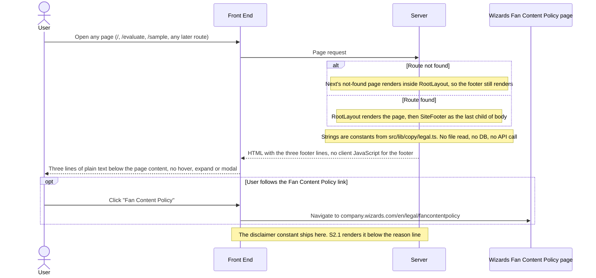
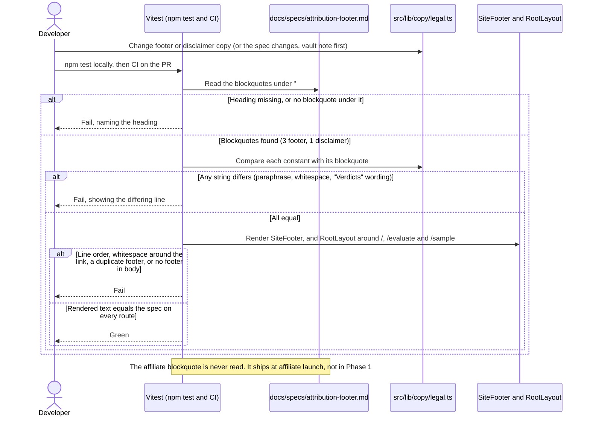

# S2.2 — Attribution footer & recommendation disclaimer

> Story: [Notion S2.2](https://app.notion.com/p/3f1a7227e26f81c69523ed0fc9a2abf8) · Design: [F2 Live Evaluation Integration](https://app.notion.com/p/394a7227e26f81b7b3ccf5f51168130c) (legal strings also in [F1 Price Recommendation Engine](https://app.notion.com/p/394a7227e26f813e8e97f395b70c0eb3), Locked copy table) · Standards: [Development Standards](https://app.notion.com/p/394a7227e26f810e956ef0c76c907c95) · PR: #9 · Critique: docs/critiques/C1-2026-10-04-phase1-designs.md#C1.02 (cluster origin) · docs/critiques/C2-2026-10-05-new-pages.md#C2-B.1, C2-B.2, C2-B.3

## Objective
Render one `SiteFooter` from `src/app/layout.tsx` on every route, with the three R6 attribution lines and the "Fan Content Policy" link taken verbatim from `docs/specs/attribution-footer.md` through a new copy module, `src/lib/copy/legal.ts`. That module also holds the recommendation disclaimer string, which S2.1 places in the panel. Tests compare every string with the spec. The story also deletes the false per-page footers on `/evaluate` and `/sample`. This closes the R6 ship-blocker. Merging S2.2 does not lift production's Ignored Build Step (ruling C2-B.2 = A).

## Endpoints
None. No API surface changes. Route handlers under `src/app/api/` do not render the root layout and are untouched.

## Data Model
None. No schema change, no migration, and no database read or write: the footer is static server-rendered text (C1.28, no writes on render).

## Sequence Diagrams

### W1: Any page renders the site footer


### W2: Legal copy guard (developer and CI)


## Test Manifest
| ID | Test | Type | Covers | Notes |
|----|------|------|--------|-------|
| T1 | `tests/helpers/attribution-spec.test.ts`: `readSpecBlockquotes(markdown, heading)` (S2.2d6) on inline fixtures: a missing heading throws `SpecSectionError` naming the heading; a heading with no blockquote throws; a prefix or near-miss heading (`## Site footer, every page (draft)`, `### Site footer, every page`) does not match; the section ends at the next `## ` heading, so a fixture whose affiliate section follows returns only the footer's blockquotes; a two-line `>` blockquote joins with one space; `>` with no following space is stripped; CRLF input gives the same result as LF; `readSpecLinkTarget` returns the URL from the `"Fan Content Policy" links to <url>` sentence and throws when that sentence is missing. On the real spec: the footer heading gives exactly 3 blockquotes, the disclaimer heading exactly 1, the affiliate heading exactly 1, and the affiliate text appears in neither of the other two | unit | AC-1, AC-3 | Test-time helper only. App code never reads markdown (F1, F2: one source, no runtime markdown loading) |
| T2 | `src/lib/copy/legal.test.ts`: `SITE_FOOTER_LINES` has length 3 and each line `toBe` the spec blockquote at the same index (read at test time via T1's helper); `RECOMMENDATION_DISCLAIMER` `toBe` the disclaimer blockquote; no exported string equals or contains the affiliate blockquote, "commission" or "Paid link"; line 3 contains "Recommendations are automated" and not "Verdicts" (the spec's one permitted substitution); the tuple and the link objects are frozen; no string has leading or trailing whitespace, a newline or a double space; the `legal.ts` source imports nothing (no `fs`, no `.md`) | unit | AC-3 | Strict equality, never a snapshot (C2-B.1) |
| T3 | `legal.test.ts`: `FAN_CONTENT_POLICY_LINK.text` is "Fan Content Policy" and occurs exactly once in line 1; `FAN_CONTENT_LINE.before + link.text + FAN_CONTENT_LINE.after` `toBe` `SITE_FOOTER_LINES[0]`; `href` `toBe` the URL `readSpecLinkTarget` parses from the spec; `new URL(href)` has protocol `https:` and host `company.wizards.com` | unit | AC-4 | |
| T4 | `legal.test.ts`: `findForbiddenClaims(text)` (S2.2d11) flags "We guarantee that", "trust our data", "proven", "guaranteed accuracy", "Guaranteed.", "is guaranteed" and "GUARANTEED ACCURA"; it passes "not guaranteed" and "Not guaranteed"; every exported legal string and the joined footer text return no findings. The legal strings also contain none of the Standards forbidden reason words as whole words (likely, expect, expected, will rise, will fall, will drop, will climb, should, probably, forecast, predict) | unit | AC-7 | The second check keeps `src/lib/copy/` clean for S1.3's copy lint |
| T5 | `src/components/site-footer.test.tsx` (RTL): `render(<SiteFooter />)`; `getByRole('contentinfo')`; exactly 3 `p` children, and the `textContent` of each `toBe` the spec blockquote at the same index (no space lost or added around the link, order fixed); the footer text contains neither the disclaimer nor the affiliate line | component | AC-1 | First AC-1 test as the story words it |
| T6 | `site-footer.test.tsx`: `getByRole('link', { name: 'Fan Content Policy' })` has `href` equal to the spec URL, is the only link in the footer, sits inside line 1, and has no `target` attribute | component | AC-4 | |
| T7 | `site-footer.test.tsx`: the footer contains no `details`, `summary`, `dialog`, `button`, `[hidden]`, `[aria-hidden]`, `[title]`, `[popover]` or `[role=tooltip]`/`[role=dialog]`, and no inline `style`; each line passes `toBeVisible()`; the `site-footer.tsx` source has no `"use client"` directive and no `useState`, `onMouseEnter`, `onFocus` or `onClick` | component | AC-6 | Server component: the footer ships as HTML with no client JavaScript |
| T8 | `src/app/layout.test.tsx`: with `next/font/local` mocked, `renderToStaticMarkup(<RootLayout><main data-testid="child">x</main></RootLayout>)` parsed with `DOMParser` has exactly one `footer.mm-site-footer`; it is `body.lastElementChild` and follows the child `main`; its three lines `toBe` the spec | component | AC-1 | Second AC-1 test as the story words it (RootLayout renders `<html>`, so RTL `render` cannot host it) |
| T9 | `layout.test.tsx`: the default exports of `@/app/page` (`/`) and `@/app/evaluate/page` (`/evaluate`, with `next/navigation`'s `useRouter` mocked) rendered inside `RootLayout`: each document has exactly one `footer` element (the per-page `mm-footer` is gone), its lines `toBe` the spec, and the HTML contains none of "CardKingdom", "CardMarket" or "Updated every 4 hours" (case-insensitive) | component | AC-1, AC-5, AC-6 | Closes C2-B.1's gap: a page-level render alone never includes RootLayout. If `next/link` needs an app-router context, it is mocked to a plain anchor (S2.2d8) |
| T10 | `src/app/sample/page.test.tsx`: the T9 assertions for `@/app/sample/page` (`/sample`) | component | AC-2, AC-5 | S2.4 AC-12 switches this file's assertion to its AC-11 redirect in the PR that retires `/sample` (S2.2d9) |
| T11 | `tests/contract/site-footer.test.ts`: no non-test source under `src/app/` or `src/components/` (`.ts`, `.tsx`, `.css`) contains "CardKingdom", "CardMarket" or "Updated every 4 hours" (case-insensitive); `evaluate-client.tsx` has no `function Footer` and no `<Footer`; no TSX uses the class `mm-footer` or `t-actions-foot` | unit | AC-5 | Command evidence too: `git grep -n -i -E 'CardKingdom\|CardMarket\|Updated every 4 hours' -- src ':!*.test.*'` prints nothing |
| T12 | `site-footer.test.ts`: `evaluate.css` has no `.mm-footer` selector; `mm-site-footer` selectors appear only in `src/components/site-footer.css`; no route stylesheet (`src/app/**/*.css` except `globals.css` and `tokens.css`) has a selector that names `mm-site-footer`, the `footer` element or `contentinfo`; `site-footer.tsx` imports `./site-footer.css` | unit | AC-8, AC-6 | The `footer` element match uses a selector-token regex, so `.t-price-footer` is not a false hit |
| T13 | `site-footer.test.ts`: `checkFooterCss(css, tokens)` (S2.2d12) on `site-footer.css`, every rule including those inside `@media`: no `display: none`, `visibility: hidden` or `collapse`, `opacity: 0`, `height: 0` or `max-height: 0`, `clip` or `clip-path`, `content-visibility: hidden`, or negative `text-indent`; a rule whose selector has `:hover` or `:focus` sets only `color`, `text-decoration*` or `outline*`; the resolved text and link colours (var chain through `tokens.css`, rgba composited over `--mox-onyx`) reach a WCAG contrast of at least 4.5:1 against `--mox-onyx`; the resolved font size is at least 11px. Negative fixtures, each flagged: `@media (max-width: 600px) { .mm-site-footer { display: none } }`; a base `opacity: 0` revealed by `:hover`; `color: rgba(255, 255, 255, 0.2)`; `font-size: 9px`; an unresolvable `var(--nope)` | unit | AC-6 | Today: `--fg-secondary` (#898989) is 5.59:1 and `--fg-primary` (#fefffe) is 19.51:1 on #0c0c0c |
| T14 | `site-footer.test.ts`: every non-test file under `src/app/` that renders `<html` also renders `<SiteFooter`, and today that set is exactly `src/app/layout.tsx`; in `layout.tsx`, `<SiteFooter />` sits inside `<body>` after `{children}`. A self-test on inline fixtures shows the scanner flags a second root layout or a `global-error.tsx` that renders `<html` without the footer | unit | AC-1, AC-2 | Guards "every route": a second root layout in a route group, or a `global-error.tsx`, would replace RootLayout |
| T15 | `scripts/test-report.test.ts`: `featureOf` maps `src/lib/copy/legal.test.ts`, `src/components/site-footer.test.tsx`, `src/app/layout.test.tsx`, `src/app/sample/page.test.tsx`, `tests/contract/site-footer.test.ts` and `tests/helpers/attribution-spec.test.ts` to F2; `src/lib/copy/reasons.test.ts` stays Unmapped (S2.2d13) | unit | DoD 3 | The test report must not list this story's tests as Unmapped |
| T16 | `npm run lint`, `npm run build` and `npm test` exit 0 locally on Node 22, and every PR check is green in CI | functional | AC-1 to AC-8 | Evidence: command output and the Actions run link |
| T17 | Preview evidence with `npm run dev` on Node 22 in the browser pane: `/` (scrolled to the footer), `/evaluate`, `/sample` and an unknown path (`/no-such/page`) each show the three lines in spec order with "Fan Content Policy" as a link to the spec URL; at a 375px viewport the lines wrap with no horizontal scroll; the footer reads above the grain overlay. The Vercel preview deployment for the PR builds green | functional | AC-1, AC-2, AC-4, AC-6 | Screenshots are attached to the PR. The 404 case shows Next's not-found page inside RootLayout |

### Evidence commands (Node 22, repo root)
```bash
source ~/.nvm/nvm.sh && nvm use 22 >/dev/null
# AGENTS.md Databases limit: `npm test` runs S1.1's integration project, so check hosts first.
# Print hostnames only; anything but localhost or 127.0.0.1 means stop.
{ env; cat .env* 2>/dev/null; } | grep -oE 'postgres(ql)?://[^[:space:]"]+' | sed -E 's#^[^@]*@##; s#[:/?].*##' | sort -u
# A host or hostaddr query parameter overrides the hostname; this must print nothing.
{ env; cat .env* 2>/dev/null; } | grep -oE 'postgres(ql)?://[^[:space:]"]+' | grep -oiE '[?&]host(addr)?=[^&#]*' | sort -u
npm run lint
npm run build
npm test
npm run test:report   # regenerate and commit docs/test-report.md
git grep -n -i -E 'CardKingdom|CardMarket|Updated every 4 hours' -- src ':!*.test.*'   # must print nothing
```

## Results                                      <!-- filled in Review; tests are authored in Testing, run here -->
| ID | Pass/Fail | Evidence |
|----|-----------|----------|
| T1 | Pass | `tests/helpers/attribution-spec.test.ts`, 28 tests: missing heading throws `SpecSectionError` naming it; no blockquote throws; a duplicated heading throws; suffixed, `###`, `#`, prefix and `##Site…` headings do not match; the section ends at the next `## ` or `# ` (a following affiliate fixture is never returned) and keeps `###` subsections; two-line join, `>` without a space, CRLF = LF, code fences ignored; `readSpecLinkTarget` parses the URL, drops a trailing full stop, throws when the sentence is missing, names other text or sits in another section. Real spec: footer 3, disclaimer 1, affiliate 1, affiliate text in neither · `be2d444` |
| T2 | Pass | `src/lib/copy/legal.test.ts` (35 tests with T3 and T4): each `SITE_FOOTER_LINES[i]` `toBe` the spec blockquote at index i; `RECOMMENDATION_DISCLAIMER` `toBe` the disclaimer blockquote; no exported string matches commission, paid link, affiliate or "When you buy through links" (D1); line 3 has "Recommendations are automated" and no string says "verdict"; tuple and both link objects frozen (an index write throws `TypeError`); no leading or trailing whitespace, newline, tab or double space; `legal.ts` code has no import, `import()`, `require`, re-export, `.md` or `fs` · `be2d444` |
| T3 | Pass | `legal.test.ts`: link text "Fan Content Policy" occurs once in line 1; `before + link.text + after` `toBe` line 1; `href` `toBe` the URL `readSpecLinkTarget` parses; `https:` on `company.wizards.com` · `be2d444` |
| T4 | Pass | `legal.test.ts`: `findForbiddenClaims` flags the plan's seven fixtures plus "cannot guaranteed", "notguaranteed" and "not guaranteed accuracy" (the `guaranteed accura` phrase is forbidden anywhere); passes "not guaranteed", "Not guaranteed", "NOT GUARANTEED"; every exported string and the joined footer return none; no Standards forbidden reason word as a whole word (the check's own whole-word cases included) · `be2d444` |
| T5 | Pass | `src/components/site-footer.test.tsx` (23 tests with T6 and T7): one `contentinfo`; exactly 3 `p` children, each `textContent` `toBe` the spec blockquote at that index; the footer text is exactly the three lines joined; no disclaimer or affiliate wording · `be2d444` |
| T6 | Pass | `site-footer.test.tsx`: `getByRole('link', { name: 'Fan Content Policy' })` has the spec `href`, is the only link, sits inside line 1, and has no `target` and no `rel` · `be2d444` |
| T7 | Pass | `site-footer.test.tsx`: no `details`, `summary`, `dialog`, `button`, `[hidden]`, `[aria-hidden]`, `[title]`, `[popover]`, `[role=tooltip]`, `[role=dialog]`, `[style]`, `[inert]`, `template` or `noscript` on or in the footer; each line `toBeVisible()`; the source has no `"use client"`, `useState`, `useEffect`, `onMouseEnter`, `onMouseOver`, `onFocus`, `onClick` or `onPointerEnter` · `be2d444` |
| T8 | Pass | `src/app/layout.test.tsx` (12 tests with T9): `next/font/local` mocked; `renderToStaticMarkup` + `DOMParser`: one `footer.mm-site-footer` (one `footer` in all), parent `body`, `body.lastElementChild`, directly after the child `main`; lines `toBe` the spec; renders with null children too · `be2d444` |
| T9 | Pass | `layout.test.tsx`: `/` and `/evaluate` (`next/navigation` mocked; `next/link` needed no mock, D4) inside RootLayout: one `footer`, no `.mm-footer` or `.t-actions-foot`, the site footer last in body, lines `toBe` the spec, no CardKingdom, CardMarket or "Updated every 4 hours", no concealing wrapper · `be2d444` |
| T10 | Pass | `src/app/sample/page.test.tsx`, 4 tests: `/sample` inside RootLayout has one `footer`, last in body, lines `toBe` the spec, no `.t-actions-foot`, none of the three false claims · `be2d444` |
| T11 | Pass | `tests/contract/site-footer.test.ts` (71 tests with T12 to T14): every non-test `.ts`/`.tsx`/`.css` under `src/app/` and `src/components/` is free of the three claims; `evaluate-client.tsx` has no `function Footer`, `<Footer` or `<footer`; no TSX uses `mm-footer` or `t-actions-foot`. `git grep -n -i -E 'CardKingdom\|CardMarket\|Updated every 4 hours' -- src ':!*.test.*'` printed nothing (exit 1) · `be2d444` |
| T12 | Pass | `site-footer.test.ts`: `evaluate.css` has no `.mm-footer` selector or text; `landing.css`, `evaluate.css` and `sample/styles.css` have no selector naming `footer`, `mm-site-footer` or `contentinfo` (selector-token regex, self-tested: `.t-price-footer`, `.footer-ish`, `#footer-x`, `.mm-footer-old` are not hits); `mm-site-footer` appears only in `src/components/site-footer.css`; `site-footer.tsx` imports `./site-footer.css` · `be2d444` |
| T13 | Pass | `site-footer.test.ts`: `checkFooterCss(site-footer.css, tokens.css)` returns no findings; `--fg-secondary` 5.59:1 and `--fg-primary` 19.51:1 on `--mox-onyx`; the plan's five negative fixtures and 18 more (visibility, height, clip, clip-path, content-visibility, text-indent, fixed and sticky position, negative z-index, `scale(0)`, a background, `transparent`, a `:focus` display change, a 10px `font` shorthand, a keyword size, `!important`) are each flagged; a missing text or link colour is flagged; native nesting and unbalanced braces fail as unreadable; reader, var-chain (cycle reported) and colour-parse self-tests (D3) · `be2d444` |
| T14 | Pass | `site-footer.test.ts`: the only non-test file under `src/app/` rendering `<html` is `src/app/layout.tsx`, and it renders `<SiteFooter />` inside `<body>` after `{children}`, once, imported from `@/components/site-footer`; the scanner flags a route-group root layout and a `global-error.tsx` without the footer, and the body check rejects a footer before the page or outside body · `be2d444` |
| T15 | Pass | `scripts/test-report.test.ts` (60 tests): the six S2.2 test files map to F2; `src/lib/copy/reasons.test.ts` stays Unmapped. `docs/test-report.md`: F2 6 files, 173 tests, no Unmapped row · `be2d444` |
| T16 | Pass | Local, Node 22.23.3: `npm run lint` exit 0 (0 errors, 1 warning, the pre-existing `/sample` one from S1.1 D2); `npm run build` green (routes `/`, `/_not-found`, `/evaluate`, `/sample`, two API routes); `npm test` 29 files, 696 passed, 2 skipped, type errors none, integration project against a throwaway Postgres on `localhost:55432`; `npm run test:report` "✅ All green", 698 tests. CI [run 38071495663](https://github.com/ayfor/mox-market/actions/runs/38071495663) on `be2d444`: "lint + build + test" green in 1m37s (`prisma migrate deploy` applied, lint 0 errors 1 warning, 29 files, 696 passed, 2 skipped); Vercel preview deployment green |
| T17 | Pass, one substitution | `next dev` on Node 22, port 3100, in the browser pane at 1280×800: `/`, `/evaluate`, `/sample` and `/no-such/page` (Next's 404 inside RootLayout) each render one `footer` with the three spec lines in order and "Fan Content Policy" linking to the spec URL (no `target`); computed text `rgb(137, 137, 137)` and link `rgb(254, 255, 254)`, 12px, `position: relative`, `z-index: 1`; `elementFromPoint` inside the footer returns the footer, so it paints above the grain overlay; on `/` the footer starts at y = 800 (one scroll below the 100vh landing, S2.2d5). At 375×812: footer 375px wide, lines 343px (16px gutters), document `scrollWidth` 375 on all four routes. No CardKingdom, CardMarket or "Updated every 4 hours" in any page's HTML. Dev log: every request 200 except the 404 path. Substitution (D5): the screenshots stay in the session, since GitHub's REST API has no image upload; the Vercel preview built green but is behind Vercel Authentication (302) |

## Deviations                                   <!-- what changed from the plan and why -->
- **D1 — T2 never reads the affiliate blockquote.** AC-3 says the copy test never reads it, so T2's "no exported string equals or contains the affiliate blockquote" is checked by absence: no exported string matches "commission" (which the affiliate line says), "paid link", "affiliate" or "When you buy through links". Only T1, the reader's own scoping test, reads the affiliate heading, as the plan says.
- **D2 — Hover thickens the underline.** S2.2d5 named the underline offset for hover; `text-underline-offset` is not `text-decoration*`, so the hover rule sets `text-decoration-thickness: 2px` instead and T13's state allowlist (colour, `text-decoration*`, `outline*`) holds as planned. Focus keeps a 2px outline.
- **D3 — Checkers fail closed beyond the plan's list.** The CSS checker also flags opacity below 1, `position` other than `relative`/`static` (S2.2d5), a negative `z-index`, `transform`, `filter` and `mix-blend-mode`, zero `width`, `max-width` and `line-height`, any `background` (contrast is checked against `--mox-onyx` only), a `var()` name `tokens.css` does not define, and a missing colour on `.mm-site-footer` or `.mm-site-footer-link`; unreadable CSS (native nesting, unbalanced braces) is a finding. The spec reader also throws on a duplicated heading, ignores fenced code, tolerates trailing whitespace on the heading line and up to three spaces before `>`. `findForbiddenClaims` needs "not" as a whole word, so "cannot guaranteed" is flagged. T6 also asserts no `rel`; T7 adds `[inert]`, `template`, `noscript`, `useEffect`, `onMouseOver` and `onPointerEnter`; T9 adds a no-concealing-wrapper check.
- **D4 — `next/link` needed no mock.** S2.2d8's fallback was not taken: NavBar's `next/link` renders under `renderToStaticMarkup` without an app-router context. Only `next/navigation` (`useRouter`) and `next/font/local` are mocked.
- **D5 — T17 screenshots are not attached to the PR.** They were captured in the browser pane, but GitHub's REST API has no image upload and the Vercel preview sits behind Vercel Authentication, so the PR carries the measured DOM evidence in T17 instead. The browser pane's own launcher could not read `~/Documents` ("Operation not permitted"), so `next dev` ran from Bash on Node 22 (port 3100) and the pane opened its URL; `.claude/launch.json` was left unchanged.
- **D6 — Prettier reordered `layout.tsx`'s first two imports** (`next` before `next/font/local`, organize-imports). Cosmetic, in a file this story edits.

## Decisions                                    <!-- S#.#d1, S#.#d2 … one line each; design-level decisions stay in Notion -->
- **S2.2d1 (scope).** New: `src/lib/copy/legal.ts` and `legal.test.ts`; `src/components/site-footer.tsx`, `site-footer.css` and `site-footer.test.tsx`; `src/app/layout.test.tsx`; `src/app/sample/page.test.tsx`; `tests/helpers/attribution-spec.ts` and `attribution-spec.test.ts`; `tests/helpers/site-footer-css.ts`; `tests/contract/site-footer.test.ts`. Edited: `src/app/layout.tsx` (renders `<SiteFooter />` after `{children}`); `src/app/evaluate/evaluate-client.tsx` (delete `Footer` and its one use); `src/app/evaluate/evaluate.css` (delete the `.mm-footer` block and its banner comment); `src/app/sample/decision-analysis.tsx` (delete the `t-actions-foot` div only); `scripts/test-report.mjs` and `scripts/test-report.test.ts` (S2.2d13); `docs/test-report.md`. Not touched: `docs/specs/**` and the rest of the harness, `src/app/sample/styles.css`, `src/app/page.tsx`, `landing.css`, API routes, Prisma, and `RECOMMENDATION_PARAMS`. No new dependency (`renderToStaticMarkup` comes from `react-dom/server`, already installed).
- **S2.2d2 (copy module shape).** `legal.ts` holds string literals only, imports nothing and has no runtime markdown loading. It exports `FAN_CONTENT_POLICY_LINK = { text: "Fan Content Policy", href: <spec URL> }`; `FAN_CONTENT_LINE = { before, link, after }`, where `before` and `after` are spec line 1's text on either side of the link text; `SITE_FOOTER_LINES: readonly [string, string, string]`, whose first entry is `before + link.text + after` and whose other two entries are spec lines 2 and 3; and `RECOMMENDATION_DISCLAIMER`. Every object and the tuple are `Object.freeze`d. Splitting line 1 into literals means nothing splits strings at runtime, so a copy edit cannot fail at render. The test compares the joined line with the spec (T2, T3).
- **S2.2d3 (path).** The story's `src/lib/copy/legal.ts` wins over F2's wording "F1's locked copy module". `src/lib/copy/` holds sibling copy modules: S2.4 names `src/lib/copy/entry-points.ts`, and S1.3 places the reason copy where its plan says. S1.3's forbidden-word lint can cover `legal.ts` without an exception (T4).
- **S2.2d4 (markup).** `SiteFooter` is a server component: `<footer className="mm-site-footer">` holding three `<p className="mm-site-footer-line">` in spec order. Line 1 renders `{before}<a className="mm-site-footer-link" href={href}>{text}</a>{after}` with no JSX whitespace between the parts. As a `footer` directly in `body`, it is the page's `contentinfo` landmark. The link opens in the same tab with no `target`, so it needs no `rel` handling. There is no `title`, no `aria-hidden` and no interactive wrapper.
- **S2.2d5 (placement and style).** The footer is the last child of `<body>` in normal document flow, neither fixed nor sticky, because a fixed footer would cover the 100vh landing grid and mobile content. Consequence: on `/`, the landing `main` is exactly 100vh tall, so the footer sits one scroll below the fold, and `/` now scrolls. Styles are co-located in `src/components/site-footer.css`, imported by the component as NavBar imports `nav-bar.css`, which AC-8 allows as "with the component". They use tokens only: `position: relative; z-index: 1` (the same lift as `.mm-app > *`, so the text paints above the fixed grain overlays on `/`, `/evaluate` and `/sample`); `max-width: 960px; margin: 0 auto`; padding from the spacing scale with a 16px side gutter; `border-top: 1px solid var(--glass-stroke-soft)`; `font: var(--ts-caption)` (12px); `color: var(--fg-secondary)`; centred text; the link in `var(--fg-primary)` and underlined. Hover and focus change only the underline offset or outline. No new design language.
- **S2.2d6 (spec reader, test-time only).** `tests/helpers/attribution-spec.ts` exports `readSpecBlockquotes(markdown, heading)` and `readSpecLinkTarget(markdown, heading, linkText)`. The reader normalises CRLF to LF and finds the line exactly equal to `## <heading>`. The section runs to the next line starting `## ` or `# `, or to EOF. A blockquote is a maximal run of lines starting `>`; each line has `^>\s?` stripped, and the lines join with one space and are trimmed. The reader throws `SpecSectionError` when the heading is missing or the section has no blockquote, so a renamed heading fails loudly instead of passing on zero comparisons. `SPEC_PATH` resolves `docs/specs/attribution-footer.md` from the repo root. It is read with `readFileSync` in tests only.
- **S2.2d7 (RootLayout test).** `vi.mock("next/font/local", () => ({ default: () => ({ variable: "font-inter", className: "font-inter", style: {} }) }))`. `renderToStaticMarkup` from `react-dom/server` runs in the component (jsdom) project, and `new DOMParser().parseFromString(html, "text/html")` gives a document to query. The `globals.css` import resolves to an empty module under Vitest's default CSS handling. If the Tailwind `@import` is ever processed, `css: false` goes into the component project.
- **S2.2d8 (route render tests).** T9 and T10 import each route's default export and render it inside `RootLayout` with `renderToStaticMarkup`, so the assertions cover the real composition of page plus layout (C2-B.1). `next/navigation` is mocked (`useRouter` returns `{ push: vi.fn(), replace: vi.fn(), prefetch: vi.fn() }`) because `EvaluatePageClient` calls it at render. If `next/link` needs the app-router context outside Next, it is mocked to a plain `<a>` and the mock is noted in the Session Log. Effects do not run under static rendering, so no `localStorage` access happens.
- **S2.2d9 (`/sample` handoff, AC-2).** `/sample` still serves at S2.2, since S2.4 retires it after S2.1 (Josh, 2026-10-05). So T10 asserts the footer on `/sample`, in its own file, `src/app/sample/page.test.tsx`. S2.4 AC-12 already says "S2.2's `/sample` footer assertion switches to the AC-11 redirect in this PR". S2.4 deletes `src/app/sample/**`, this test included, and adds the redirect test.
- **S2.2d10 (AC-5 scope on `/sample`).** The `/sample` carve-out covers the footer only (story Notes). S2.2 deletes the `t-actions-foot` div from `decision-analysis.tsx` and leaves `sample/styles.css` alone. The orphaned `.t-actions-foot` rule goes when S2.4 deletes `/sample` (S2.4 AC-12). AC-8 names only `.mm-footer` in `evaluate.css`, which this story deletes. The old lines also said "Not financial advice"; footer line 3 now covers that with the spec's wording.
- **S2.2d11 (AC-7 checker).** `findForbiddenClaims(text)` is case-insensitive. It flags each occurrence of "trust our", "proven", "guarantee that" and "guaranteed accura", and each "guaranteed" not immediately preceded by "not ". It returns the offending phrases, so a failure names them. It lives in `tests/helpers/attribution-spec.ts` beside the reader.
- **S2.2d12 (CSS checker).** `tests/helpers/site-footer-css.ts` holds a small regex rule extractor (no CSS parser dependency) that handles `@media` nesting and comments, and a resolver for `var(--x)` chains defined in `tokens.css` `:root`. It accepts hex and `rgb()`/`rgba()`; alpha is composited over `--mox-onyx`; anything unresolvable fails the check. Contrast uses the WCAG 2.x relative-luminance formula. Font size comes from `font-size` or the `font` shorthand, through `var(--ts-*)`.
- **S2.2d13 (test-report map).** F2's patterns in `scripts/test-report.mjs` gain `/src\/lib\/copy\/legal/`, `/site-footer/` and `/attribution/`. Without them, `legal.test.ts`, the contract test and the helper test would land in Unmapped. The pattern names `legal` alone, not `src/lib/copy/`, so S1.3's reason copy can still map to F1.
- **S2.2d14 (production).** No Vercel or GitHub settings change. Merging leaves the Ignored Build Step in place (C2-B.2 = A): production resumes only after S2.1, S2.2 and S2.4 are on `main` and Josh signs off. Preview deploys build normally and are the hosted evidence.
- **S2.2d15 (Notion status writes).** Bitey commits `.cursor/hooks/active-story.json` = `{"story":"S2.2"}` on this branch, so Cursor's fence allows S2.2's own Status updates here. It is deleted in the branch's last commit before the PR goes ready.

## Critique                                     <!-- entries from docs/critiques/ that touched this story; implementation-mode change list lands here -->
- **C1.02** (blocker, cluster origin): R6 footer and recommendation disclaimer had no owner, and the shipped footer copy is false. This story was created from it.
- **C2-B.1** (major, fixed on the Notion page before this plan): equality with the spec instead of snapshots, and a RootLayout render, because page-level renders never include the layout. Carried into T2, T5, T8 and T9.
- **C2-B.2 = A**: merging S2.2 does not lift the Ignored Build Step (S2.2d14). **C2-B.3 = A**: S2.2 branches from `main` after S1.1 merges (it did: `9a2837b`).
- The implementation-mode adversarial review (ADV) and the ChatGPT Codex review land here.

## Review                                       <!-- Josh's comments VERBATIM, each followed by a Disposition. One round for ordinary stories. -->
### Round 1 — Operator comments (verbatim)
Josh, 2026-10-10 02:49 (overnight directive): "alright we are going against the plan here in the interest of time. I am running you overnight. Set a goal to keep going and merging until you have completed the approved features. For each PR, perform an adversarial review prior to merge as a sub agent who is verifying the unhappy paths of the feature functionality and ensuring proper test coverage for cases presented by the feature. Also before merge, check the PR for other comments from ChatGPT and address them with updates if they present valid edge cases or errors in the implementation. Make any retroactive updates to the Notion docs if you need to pivot."

Plan approved under Josh's overnight directive, 2026-10-10 (see /Users/joshstubbington/Documents/bitey-a/notes/assets/night-run-2026-10-10.md)

### Disposition (Round 1)
- Plan approved under the directive. On that basis Bitey applied the `plan-approved` label to PR #9. Notion S2.2 Status → In Progress, and its PR property → PR #9.
- No gate questions are open. Two choices Josh can overturn: the footer sits in normal flow, so it is one scroll below the fold on the 100vh landing page (S2.2d5), and the Fan Content Policy link opens in the same tab (S2.2d4).

## Session Log                                  <!-- append-only; one entry per agent session; newest last -->
### 2026-10-10 · bitey · S2.2
- Decided: plan compiled from the Notion story (AC-1 to AC-8, Notes), Design F2, F1's Locked copy table and the Standards page; S2.2d1–S2.2d15; branch `story/S2.2-attribution-footer` from `main` at `9a2837b`.
- Tried and dropped: a runtime split of line 1 at the link text (it could throw at render, so S2.2d2 uses literals); a fixed or sticky footer (it would cover the 100vh landing grid, S2.2d5); putting `src/lib/copy/` wholesale under F2 in the report map (it would steal S1.3's reason copy, S2.2d13).
- Deviated: none.
- Open: none.
- Next: build per the manifest (T1–T17), then the adversarial review and the Codex review.
Evidence: plan commit on `story/S2.2-attribution-footer` · `npm test` not run (no code yet)

### 2026-10-10 · bitey · S2.2 (build)
- Decided: built S2.2 to the plan under Josh's overnight directive: `src/lib/copy/legal.ts`, `SiteFooter` and its CSS, the RootLayout edit, the deleted `/evaluate` and `/sample` footers and `.mm-footer`, the test-report map, and T1 to T15 in six test files plus two helpers. Notion Status In Progress → Testing once the manifest was written. Mutation checks before commit, each caught: a paraphrased footer line (8 failures), `<SiteFooter />` removed from the layout (14), a `@media` `display: none` (1), an extra space before the link (7), the footer before `{children}` (5).
- Tried and dropped: matching `.md` anywhere in `legal.ts` (its header comment names the spec, so T2 now scans code with comments stripped); exporting a shared `renderInLayout` from `layout.test.tsx` (importing a test file re-registers its tests), so `/sample`'s test renders the layout itself; an `entry-points` Unmapped case in T15 (it would couple S2.4 to this test); a browser-pane launch config for `next dev` (D5).
- Deviated: D1 to D6.
- Open: none. Josh can still overturn S2.2d4 (same-tab link) and S2.2d5 (footer one scroll below the fold on `/`).
- Next: adversarial review subagent, then ready for review and the Codex pass.
Evidence: commit `be2d444` · host check printed only `localhost` and the `host=` check printed nothing before every suite run · `npm run lint` exit 0 (0 errors, 1 warning, S1.1 D2) · `npm run build` green · `npm test` 29 files, 696 passed, 2 skipped, type errors none (local Postgres on `localhost:55432`) · `npm run test:report` "✅ All green", 698 tests, F2 6 files 173 tests · `git grep` for the false claims printed nothing · CI [run 38071495663](https://github.com/ayfor/mox-market/actions/runs/38071495663) green (lint + build + test 1m37s; Vercel preview green)
