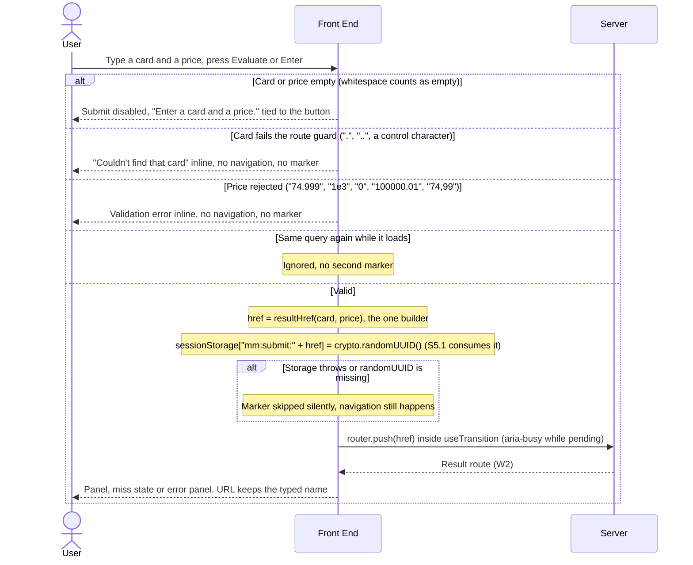
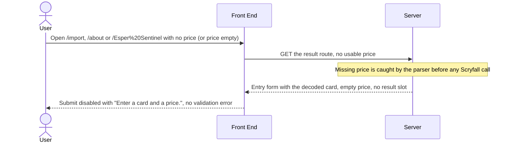
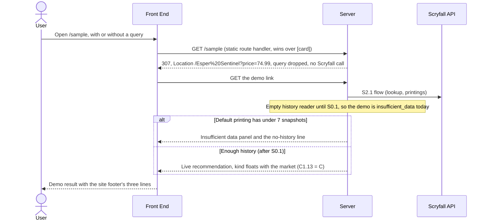
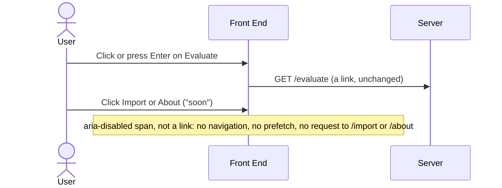

# S2.4 — Entry points to the result route

> Story: [Notion S2.4](https://app.notion.com/p/3f1a7227e26f81b2853dd9b780ab674b) · Design: [F2 Live Evaluation Integration](https://app.notion.com/p/394a7227e26f81b7b3ccf5f51168130c) (Approved, Josh 2026-10-08; §Functionality entry points, W1 edge cases, §Fields, demo link) and [F1 Price Recommendation Engine](https://app.notion.com/p/394a7227e26f813e8e97f395b70c0eb3) (Approved, Josh 2026-10-08; UI-strings table: submit helper, validation error, ambiguous card, card not found, nav marker) · Standards: [Development Standards](https://app.notion.com/p/394a7227e26f810e956ef0c76c907c95) (Draft; conventions, Testing, DoD) · PR: #13 · Critique: docs/critiques/C1-2026-10-04-phase1-designs.md#C1.29, C1.45, C1.52, C1.54 (rulings C1.06 = A, C1.13 = C, C1.28 = A, C1.44 = A, C1.45 = B) · docs/critiques/C2-2026-10-05-new-pages.md#C2-B.1, C2-B.2, C2-B.4, C2-B.5, C2-B.6, C2-B.8, C2-B.10, C2-B.11

## Objective
Point both entry forms (`/` and `/evaluate`) at the result route `/[card]?price=&finish=` through one pure builder, `resultHref(card, price)` (C1.06 = A), and set the one-shot submit marker S5.1 will consume. Give the result route its two lookup-miss states (ambiguous, not found) with nothing computed and keep every Scryfall failure on S2.1's error panel; retire `/sample` with a 307 to the demo link `/Esper%20Sentinel?price=74.99` (C1.13 = C) and delete its demo code; turn the Import and About tabs into disabled "soon" segments (C1.45 = B); and pin that a `/{card}` with no price renders the prefilled form with no Scryfall call (C2-B.11 = A, AC-16).

Carried in from earlier stories: the landing tagline joins S1.3's phrase-lint `LINT_ALLOWLIST` and `/sample`'s demo file leaves S1.3's T19 exemption list (S1.3d14, ADV-4); the landing form's `"Card name"` label literal is replaced by S2.1's `FORM_LABELS.card` ("Card", S2.1 D-3), so S1.3's one-home lint keeps passing.

## Endpoints
| Method | Path | Request | Response | Auth | Errors |
|--------|------|---------|----------|------|--------|
| GET, HEAD | `/sample` (new route handler, replaces the page) | any query, ignored | 307, `Location: /Esper%20Sentinel?price=74.99` exactly (relative, query dropped), `Cache-Control: no-store`, empty body | none | other methods 405 (Next default); `/sample/` gets Next's trailing-slash 308 first; `/sample/x` 404. Reads nothing from the request, so no user input reaches `Location` |
| GET | `/[card]` (S2.1's route, behaviour added) | path `card`; query `price`, `finish` | 200 HTML. New: a Scryfall 404 with `type: "ambiguous"` renders the prefilled form and "Pick from the suggestions"; any other 404 renders the prefilled form and "Couldn't find that card"; in both, no panel and nothing computed | none | 503, 429, a 502 with an HTML body, a rejected fetch, a timeout or a full throttle queue on the named lookup, and any failure of the prints fetch (a 404 included) → S2.1's error panel, never the miss copy and never a 500. No price (absent, empty or blank) → prefilled form, no Scryfall call (AC-16, already S2.1's parser rule, now pinned with fixtures) |

No route writes anything (C1.28): the marker lives in the browser's `sessionStorage`. `/api/prices/snapshot` is never called.

## Data Model
None. No schema change, no migration, no database read or write; `docs/architecture/erd.md` is unchanged.

## Sequence Diagrams

### W1: Submit from an entry form (landing, `/evaluate`, or the form above a result or miss)


### W2: The result route resolves the name (AC-5 to AC-9)
```mermaid
sequenceDiagram
    actor U as User
    participant FE as Front End
    participant SV as Server
    participant SF as Scryfall API
    participant HR as History reader
    participant EN as Engine
    FE->>SV: GET /{segment}?price=
    Note over SV: S2.1 guard and parser first (404, or the form with no Scryfall call)
    SV-->>FE: Page shell, prefilled form, skeleton while the lookup is pending
    SV->>SF: Fuzzy named lookup, getCardByName(name, true)
    alt 200
        SF-->>SV: Card (a fuzzy hit can carry a different name)
        SV->>SF: Every prints page
        alt Any prints page fails (404 included)
            SV-->>FE: Error panel with Retry, never the miss copy
        else Printings loaded
            SV->>HR: History and freshness, raced to 500 ms (S2.1)
            SV->>EN: computeRecommendation
            SV-->>FE: Panel for the resolved card, D2 header shows the Scryfall name
        end
    else 404 with type "ambiguous"
        SF-->>SV: ScryfallApiError 404, type ambiguous
        Note over SV: Prints, history and engine called 0 times, nothing logged
        SV-->>FE: Miss state: "Pick from the suggestions", no panel, no skeleton
    else 404 without that type
        SF-->>SV: ScryfallApiError 404
        Note over SV: Same zero calls
        SV-->>FE: Miss state: "Couldn't find that card"
    else 5xx, 429, HTML body, rejected fetch, timeout or full queue
        SF-->>SV: ScryfallApiError or another error
        Note over SV: Logged once as scryfall_failed
        SV-->>FE: Error panel with Retry, never reported as not found
    end
    FE-->>U: The prefilled form stays above; in a miss the card field's aria-describedby names the message
```

### W3: Direct link with no price (AC-16)


### W4: Retire /sample (AC-11 to AC-13)


### W5: Nav tabs (AC-14)


## Test Manifest
Shared fixtures: `src/lib/__fixtures__/entry-submissions.ts` holds one table of (card, price, expected href) rows (the five AC-1 rows plus "Lim-Dûl's Vault") and one table of rejected inputs; T5 and T7 both import it (AC-3: one table drives both forms).

| ID | Test | Type | Covers | Notes |
|----|------|------|--------|-------|
| T1 | `src/lib/result-href.test.ts`: the five AC-1 fixtures give exactly `/Esper%20Sentinel?price=74.99`, `/Jace%2C%20the%20Mind%20Sculptor?price=1234.50`, `/Fire%20%2F%2F%20Ice?price=2`, `/%2B2%20Mace?price=0.25`, `/Question%20Elemental%3F?price=3`; no `finish` param; the card is trimmed; for a set of hostile names ("100%", "A#B", "Who/What/When/Where/Why", "Ach! Hans, Run!", "Gisa's Bidding", "a&b=c", a 141-emoji name, "Lim-Dûl's Vault") the path holds exactly one `/` (the leading one) and no raw space, `?`, `#` or `%` that is not an escape; `DEMO_RESULT_HREF === resultHref("Esper Sentinel", "74.99")` | unit | AC-1, AC-11 | |
| T2 | `result-href.test.ts`, round trip: for every row above, the segment of `resultHref(name, p)` passed raw (still encoded, as Next 16.1.6 hands it, S2.1 D-1) through S2.1's `parseResultParams` gives `kind: "ok"`, `card === name.trim()` and the price's cents; a card typed as the literal text "Esper%20Sentinel" builds `Esper%2520Sentinel` and decodes once back to "Esper%20Sentinel", never to "Esper Sentinel" | unit | AC-4 (unit half) | Decoded exactly once |
| T3 | `src/lib/entry-submit.test.ts`, `checkEntry(card, price)`: empty, whitespace-only card or price → `empty`; ".", "..", " .. ", a tab or U+0085 in the card → `bad_card`; "74.999", "1e3", "0", "0.00", "-1", "100000.01", "74,99", "１２" → `bad_price`; each fixture row → `ok` with exactly its href; `checkEntry` never throws (fuzz over 200 random strings) | unit | AC-2, AC-3 | One validator for both forms (S2.4d3) |
| T4 | `entry-submit.test.ts`, marker (AC-15): `markSubmit(href)` stores a UUID (`/^[0-9a-f]{8}-[0-9a-f]{4}-4[0-9a-f]{3}-[89ab][0-9a-f]{3}-[0-9a-f]{12}$/`) under `"mm:submit:" + href` and returns true; a second call overwrites with a new UUID; `setItem` throwing `SecurityError` or `QuotaExceededError`, a `sessionStorage` getter that throws, and `crypto.randomUUID` undefined each return false without throwing; for each fixture href plus the hostile names of T1, `history.pushState(null, "", href)` in jsdom makes `consumerMarkerKey(window.location)` equal `submitMarkerKey(href)` | unit | AC-15 (C2-B.10) | S5.1 imports `consumerMarkerKey` |
| T5 | `src/app/landing-form.test.tsx` (router mocked): each fixture row → exactly one `router.push` with its exact href, and the marker key exists before the push (call order recorded); empty card or empty price → submit disabled, "Enter a card and a price." (equal to `UI_COPY.submitHelper`) is the button's accessible description, 0 pushes; each rejected price → `UI_COPY.validationError` inline as an alert, the price input `aria-invalid`, 0 pushes, 0 marker keys; ".." → `UI_COPY.cardNotFound` inline, 0 pushes; editing the field clears its error; Enter in a field submits once; a second identical submit while pending pushes nothing, a different one pushes again; the inputs are named `card` and `price`; the form has no `action` or `method` attribute; the button is `aria-busy` while pending | component | AC-2, AC-15 | |
| T6 | `src/app/page.test.tsx`: the landing page renders `LandingForm` and no element carries `action`; every visible string equals its `LANDING_COPY` constant; `metadata` defines no `title` (the root layout's `title.default`, "Mox Market — Should you buy it?", applies, S2.4d5) and its `description` is `LANDING_COPY.description` | component | AC-2, AC-10 | |
| T7 | `src/app/evaluate/evaluate-client.test.tsx` (router mocked): the same fixture table drives `EvaluatePageClient`, one push per row with the exact href inside the form's transition (the button `aria-busy` until the push settles), marker before push; the rejected table gives the same inline errors and 0 pushes as T5; `src/lib/result-href.test.ts` scan: no non-test file under `src/` other than `src/lib/result-href.ts` contains `?price=`, and every `router.push(` or `navigate(` call under `src/app/evaluate/`, `src/app/landing-form.tsx` and `src/components/entry-form.tsx` takes an identifier bound to `resultHref(...)` or `checkEntry(...).href` (AST) | component, unit | AC-3 | |
| T8 | `src/lib/scryfall.test.ts` (fetch mocked): `getCardByName` on 200 → the card; 404 `{type: "ambiguous"}` → throws `ScryfallApiError` with status 404, code "not_found", type "ambiguous"; 404 without type → status 404, type undefined; 503 → status 503; 429 → status 429; a 502 with an HTML body and a 500 with an empty body → `ScryfallApiError` with that status and code "unknown" (never a `SyntaxError`); a non-string `type` (5) → undefined; a rejected fetch and the 8 s timeout reject with the original error, not a `ScryfallApiError`; `getCardByName` never resolves null; `ScryfallApiError` is exported, `instanceof Error`, `name` "ScryfallApiError"; `getCardById` still resolves null on 404 (unchanged). `src/types/scryfall.test-d.ts`: `ScryfallError["type"]` is `string \| undefined` | unit (incl. typecheck) | AC-5 | |
| T9 | `src/lib/evaluation/lookup-miss.test.ts`, `classifyLookupError`: 404 + "ambiguous" → `ambiguous`; 404 with no type, type "other" or a non-string type → `not_found`; 400, 429, 500, 502, 503 `ScryfallApiError`s, a `TypeError`, an `AbortError`, a `ThrottleBacklogError`, a string, null and undefined → `unavailable` | unit | AC-6, AC-7, AC-8 | Story Verification: the miss mapping as a pure function |
| T10 | `src/lib/evaluation/build-evaluation.test.ts`: a lookup throwing the ambiguous 404 ("jace") → `{ status: "ambiguous" }`; the plain 404 ("asdfqwer") → `{ status: "not_found" }`; in both `getAllPrintings`, `reader.getPriceHistory`, `reader.getHistoryFreshness` and `computeRecommendation` (S2.1's `computeSpy`) are each called 0 times and the log is empty; `getCardByName` called once with (typed card, true) | unit | AC-6, AC-7 | |
| T11 | `build-evaluation.test.ts`, failures: the named lookup answering 503, 429, an HTML 502 or a rejected fetch (the four AC-8 fixtures through the real `getCardByName` with fetch mocked), plus the 8 s timeout and a full throttle queue → `{ status: "error" }` with one `scryfall_failed` log entry and 0 prints, reader and engine calls; `getAllPrintings` throwing a 404 `ScryfallApiError` → `error`, never `not_found`; a lookup resolving null or a non-object → `error` (`scryfall_malformed`) | unit | AC-8 | S2.1's "null → not_found" test is replaced (S2.4d8) |
| T12 | `src/app/[card]/lookup-miss.test.tsx` and `page.test.tsx` (the page awaited with `ResultPanel` deps injected, `next/navigation` mocked): for ambiguous and not_found the slot holds the miss state; the card input shows the typed card ("jace", "asdfqwer") and the price input the normalised price (`?price=$5` → "5"); the message text equals `UI_COPY.ambiguousCard` or `UI_COPY.cardNotFound`; the card input's `aria-describedby` names the message element's id; there is no `.mm-rec-panel`, no skeleton (`aria-busy`), no error panel and no Retry button; resubmitting from the form pushes `resultHref(card, price)` once and sets the marker; a pending resubmit shows the skeleton and the message (and the input's `aria-describedby`) is gone; a later ok result renders no miss message | component | AC-6, AC-7, AC-10, AC-15 | Miss-state form = the result page's form (S2.4d9) |
| T13 | `result-view.test.tsx` and `result-panel.test.tsx`: `status: "error"` renders `UI_COPY.errorPanel` and Retry and never the miss strings; `ResultPanel` with each AC-8 lookup fixture resolves (never throws, so the streamed page stays 200) to the error panel | component | AC-8 | |
| T14 | `build-evaluation.test.ts` and `page.test.tsx`, fuzzy hit: the query "esper sentinal" with the lookup answering the Esper Sentinel card → `ok`, the header's `h1` "Esper Sentinel"; the form keeps "esper sentinal"; the page calls neither `redirect` nor `router.replace` | unit, component | AC-9 | URL keeps the typed name |
| T15 | `tests/contract/entry-points-copy.test.ts`: an AST scan of the TSX files this story writes (`src/app/page.tsx`, `src/app/landing-form.tsx`, `src/components/nav-bar.tsx`, `src/components/entry-form.tsx`, `src/app/[card]/lookup-miss.tsx`, `src/app/[card]/result-view.tsx`, `src/app/[card]/page.tsx`) finds no JSX text containing a letter and no letter-bearing string in `aria-label`, `aria-description`, `placeholder`, `alt` or `title` attributes, and `src/app/page.tsx`'s `metadata` holds no string literal; self-test: planted JSX text, `aria-label`, `placeholder` and metadata strings are flagged, `className` strings and the decorative "+" and "◇" glyphs are not. `forbidden-phrases.test.ts`: `LINT_ALLOWLIST` holds exactly one entry, the tagline's "Should" line (`copy/entry-points.ts`, `LANDING_COPY.question[0]`, ["should"]), and S1.3's "every allowance matches a live export" test passes; S1.3's copy hygiene (T17) and one-home (T19) suites pass with `entry-points.ts` in the copy set | unit | AC-10 (C1.54), S1.3d14 | |
| T16 | `src/app/sample/route.test.ts`: `GET` and `HEAD` on `/sample`, `/sample?card=Foo&price=1` and `/sample?next=//evil.example` each answer 307 with `Location` exactly `/Esper%20Sentinel?price=74.99`, `Cache-Control: no-store` and an empty body; `fetch` is called 0 times; the module exports `dynamic = "force-dynamic"` and imports nothing from `@/lib/scryfall` or `@/lib/evaluation`; `DEMO_RESULT_HREF` parses (T2's path) to card "Esper Sentinel", 7499 cents, finish normal | unit | AC-11, AC-12 (S2.2 AC-2's switch) | Replaces `src/app/sample/page.test.tsx` |
| T17 | `tests/contract/sample-retired.test.ts`: `src/app/sample/` holds only `route.ts` and `route.test.ts`; `decision-analysis.tsx`, `styles.css` and `page.tsx` are gone; no non-test file under `src/` contains `/sample`; `copy-lock.test.ts`'s `SINGLE_SOURCE_EXEMPT` no longer lists the demo file; `site-footer.test.ts`'s pinned stylesheet and overlay lists no longer name `src/app/sample/styles.css` and its self-test plants move to a live stylesheet | unit | AC-12 | `npm run build` passing after the delete is T22 |
| T18 | `result-panel.test.tsx`, demo link: `ResultPanel` for the demo query (Esper Sentinel, 7499, normal) with the Esper Sentinel fixture and readers giving buy, fair, wait and insufficient_data each renders a panel (`.mm-rec-panel` with `data-kind` set) without asserting which kind | component | AC-13 | Never pins the kind (C1.13 = C) |
| T19 | `src/components/nav-bar.test.tsx`: Evaluate is an `a` with `href="/evaluate"`, `role="tab"`, `aria-selected` true when active; Import and About each have `role="tab"`, `aria-disabled="true"`, `aria-selected="false"`, no `href`, are not inside or equal to any `a`, are not focusable, and hold the `UI_COPY.navSoon` marker; clicking either and pressing Enter on it change nothing (no router call, `location.href` unchanged); the tablist holds three tabs; the brand link (`href="/"`) and the CTA (`href="/"`) keep their hrefs and take their labels from `NAV_LABELS`; no anchor in the nav points at `/import` or `/about` | component | AC-14 | |
| T20 | `src/app/[card]/page.test.tsx`, no price: `/import`, `/about`, `/Esper%20Sentinel`, `/Esper%20Sentinel?price=` and `?price=%20` each render the form with the decoded card, an empty price, submit disabled with the helper as its description, no validation error, no result slot, and `fetch` called 0 times | component | AC-16 (C2-B.11 = A) | |
| T21 | `scripts/test-report.test.ts`: `featureOf` maps `src/lib/result-href.test.ts`, `src/lib/entry-submit.test.ts`, `src/app/landing-form.test.tsx`, `src/app/page.test.tsx`, `src/app/sample/route.test.ts`, `src/components/nav-bar.test.tsx`, `src/app/evaluate/evaluate-client.test.tsx`, `src/app/[card]/lookup-miss.test.tsx` and `src/lib/evaluation/lookup-miss.test.ts` to F2; the `src/app/sample/page.test.tsx` row is replaced by `route.test.ts`; `docs/test-report.md` has no Unmapped row | unit | DoD 3 | S2.4d14 |
| T22 | `npm run lint`, `npm run build` and `npm test` exit 0 on Node 22 locally and every PR check is green in CI; `npm run test:report` lists T1–T21's files with no Unmapped. Local `next start` (production build, live Scryfall, empty reader): `curl -sI /sample` and `/sample?card=Foo&price=1` show 307 and the exact `Location`; each AC-1 name and "Lim-Dûl's Vault" submitted from `/` (or its `resultHref` fetched) renders that card's `h1`; `/esper%20sentinal?price=74.99` renders "Esper Sentinel"; `/jace?price=5` shows "Pick from the suggestions" and no panel; `/asdfqwer?price=5` shows "Couldn't find that card"; `/Esper%20Sentinel?price=74.99` renders a panel (date, market price, kind and the three footer lines recorded); `/import` renders the form with no Scryfall call; no HTML or RSC payload from `/`, `/evaluate` or the demo link holds `href="/import"` or `href="/about"`; `<title>` on `/` is "Mox Market — Should you buy it?". Mutations, each run and reverted: every 404 classified `not_found` fails T9 and T10; the two miss strings swapped fails T12; `resultHref` without `encodeURIComponent` fails T1 and T2; the marker set after the push fails T5; the request's query copied into `Location` fails T16; Import rendered as a `Link` fails T19; the allowlist entry removed fails the phrase lint | functional | AC-1 to AC-16 | Standards DoD 4; local build stands in for the preview (S2.4d13) |

### Evidence commands (Node 22, repo root)
```bash
source ~/.nvm/nvm.sh && nvm use 22 >/dev/null
# AGENTS.md Databases limit: `npm test` runs S1.1's integration project, so check hosts first.
{ env; cat .env* 2>/dev/null; } | grep -oE 'postgres(ql)?://[^[:space:]"]+' | sed -E 's#^[^@]*@##; s#[:/?].*##' | sort -u
{ env; cat .env* 2>/dev/null; } | grep -oE 'postgres(ql)?://[^[:space:]"]+' | grep -oiE '[?&]host(addr)?=[^&#]*' | sort -u
npm run lint
npm run build
npx vitest run src/lib/result-href.test.ts src/lib/entry-submit.test.ts src/lib/scryfall.test.ts src/lib/evaluation 'src/app/[card]' src/app/sample src/app/page.test.tsx src/app/landing-form.test.tsx src/app/evaluate src/components tests/contract scripts/test-report.test.ts
npm test
npm run test:report   # regenerate and commit docs/test-report.md
# Functional evidence: production build on localhost, live Scryfall, no database
npx next start -p 3100 &
curl -sI 'http://localhost:3100/sample' | grep -iE '^(HTTP|location|cache-control)'
curl -sI 'http://localhost:3100/sample?card=Foo&price=1' | grep -iE '^(HTTP|location)'
for p in 'Esper%20Sentinel?price=74.99' 'Jace%2C%20the%20Mind%20Sculptor?price=1234.50' 'Fire%20%2F%2F%20Ice?price=2' '%2B2%20Mace?price=0.25' 'Question%20Elemental%3F?price=3' "Lim-D%C3%BBl's%20Vault?price=1" 'esper%20sentinal?price=74.99' 'jace?price=5' 'asdfqwer?price=5' 'import'; do echo "== $p"; curl -s -H 'RSC: 1' "http://localhost:3100/$p" | grep -oE 'mm-card-name[^<]*<|Pick from the suggestions|Couldn.t find that card|Enter a card and a price\.' | head -3; done
curl -s http://localhost:3100/ http://localhost:3100/evaluate | grep -cE 'href="/(import|about)"'   # expect 0
curl -s http://localhost:3100/ | grep -o '<title>[^<]*</title>'
```

## Results                                      <!-- filled in Review; tests are authored in Testing, run here -->
| ID | Pass/Fail | Evidence |
|----|-----------|----------|
| T1 | Pass | `src/lib/result-href.test.ts` at `83eb800`: the five AC-1 rows and Lim-Dûl's Vault give their exact hrefs; no `finish`; trimmed; eight hostile names stay one segment (URL parser agrees); `DEMO_RESULT_HREF === resultHref("Esper Sentinel", "74.99")`. Mutation: `resultHref` without `encodeURIComponent` → 17 failures |
| T2 | Pass | same file: every row and hostile name decodes once through `parseResultParams` to `card.trim()` and its cents; `"Esper%20Sentinel"` typed literally builds `Esper%2520Sentinel` and decodes to `Esper%20Sentinel` |
| T3 | Pass | `src/lib/entry-submit.test.ts`: 18 rejected rows give `empty`, `bad_card` or `bad_price` (fullwidth digits included); each fixture row `ok` with its href; precedence empty > card > price; 141 vs 142 code points; 200 seeded random strings never throw |
| T4 | Pass | same file (jsdom docblock, Deviation 5): v4 UUID under `mm:submit:<href>`, overwritten on a second call; SecurityError, QuotaExceededError, a throwing getter, no storage and no `randomUUID` each return false; `history.pushState` for the six rows and eight hostile names makes `consumerMarkerKey(window.location) === submitMarkerKey(href)`. Browser: after a landing submit of "Lim-Dûl's Vault" / "$1", `sessionStorage` held exactly `mm:submit:/Lim-D%C3%BBl's%20Vault?price=1` and `location.pathname + search` matched it |
| T5 | Pass | `src/app/landing-form.test.tsx` (30 tests): one push per row, marker write recorded before the push; empty rows disabled with the helper as the button's description; bad prices and bad cards inline with `aria-invalid`, 0 pushes, 0 markers; editing clears; Enter adds no submit of its own and the implicit submit pushes once; a repeat while pending pushes nothing and a different query pushes again; `aria-busy` while pending; no `action`/`method`. Mutation: marker after the push → 6 failures |
| T6 | Pass | `src/app/page.test.tsx`: renders `LandingForm`, no `[action]`, one form; wordmark, tagline, the question as "Should / you buy / it?", the five prompt lines, placeholders and labels all equal their constants and nothing else holds text; `metadata.title` undefined, `description === LANDING_COPY.description`, layout `title.default` "Mox Market — Should you buy it?" |
| T7 | Pass | `src/app/evaluate/evaluate-client.test.tsx`: the same fixture table, one push per row, marker first; `aria-busy` until the push settles; the rejected table gives the same inline errors. Scan half in `result-href.test.ts`: only `result-href.ts` holds `?price=` in a literal (Deviation 3), and every `push`/`navigate` in the entry forms takes an identifier bound to `checkEntry(...).href` (AST, with a self-test) |
| T8 | Pass | `src/lib/scryfall.test.ts`: 200 → card; 404 ambiguous → `ScryfallApiError` 404/not_found/ambiguous; 404 untyped → type undefined; 503, 429, 400, 500 keep their status; HTML 502, empty 500, a JSON array and JSON null → code "unknown", never a `SyntaxError`; non-string fields ignored; a rejected fetch and the 8 s timeout reject with the original error; a 2xx non-object body → TypeError; every non-2xx rejects; `ThrottleBacklogError` passes through; `getCardById` still null on 404. `src/types/scryfall.test-d.ts`: `ScryfallError["type"]` is `string | undefined` |
| T9 | Pass | `src/lib/evaluation/lookup-miss.test.ts` (21 tests): ambiguous; untyped, other, case-different, numeric and null types → not_found; 400–503 → unavailable even with type ambiguous; TypeError, AbortError, ThrottleBacklogError, SyntaxError, a look-alike object, a string, null, undefined → unavailable. Mutation: every 404 not_found → 4 failures across T9 and T10 |
| T10 | Pass | `build-evaluation.test.ts`: "jace" → ambiguous and "asdfqwer" → not_found with `getCardByName` once (typed card, true) and prints, both reader calls and the engine at 0, log empty; the same through the real `getCardByName` with fetch mocked |
| T11 | Pass | same file: 503, 429, HTML 502 and a rejected fetch through the real client → error, one `scryfall_failed`, 0 downstream calls; the 8 s timeout and a full throttle queue → error; `getAllPrintings` throwing a 404 (typed or not) or 503 → error, never a miss; a lookup resolving null, undefined, a string or a number → error with `scryfall_malformed` |
| T12 | Pass | `src/app/[card]/lookup-miss.test.tsx` and `page.test.tsx`: both statuses render only their message in the slot, card and normalised price prefilled (`?price=$5` → "5"), the combobox's `aria-describedby` names the message and its accessible description is the string; no panel, skeleton, error panel or Retry; one fetch, nothing logged; a resubmit pushes `resultHref` once with the marker first; a pending resubmit shows the skeleton and drops the message and the tie; a later result shows neither. Browser (local build, live Scryfall): `/bolt?price=5` hydrated with `aria-describedby` = the message id `headlessui-description-_r_0_`, 0 panels, 0 skeletons, `.mm-result-field` computed `display: contents`. Mutation: the two strings swapped → 6 failures |
| T13 | Pass | `result-view.test.tsx`: error → copy and Retry, never a miss string; ambiguous and not_found → only their copy. `result-panel.test.tsx`: `ResultPanel` with 503, 429, HTML 502 and a rejected fetch through the real client resolves to the error panel |
| T14 | Pass | `build-evaluation.test.ts`: "esper sentinal" → ok for the resolved card. `page.test.tsx`: `h1` "Esper Sentinel", the form keeps "esper sentinal", no `redirect` and no router call. Local build: `/esper%20sentinal?price=74.99` rendered "Esper Sentinel" |
| T15 | Pass | `tests/contract/entry-points-copy.test.ts`: the seven TSX files hold no letter-bearing JSX text, literal JSX child or text attribute; `page.tsx` metadata holds no literal; the self-test flags planted text, labels, placeholders, alt, titles, children and metadata and passes classes and the glyphs. `forbidden-phrases.test.ts`: `LINT_ALLOWLIST` is exactly the question entry (Deviation 1), the live-export check passes; T17 and T19 pass with `entry-points.ts` in the copy set. Mutation: the entry removed → 3 failures |
| T16 | Pass | `src/app/sample/route.test.ts` (12 tests): GET and HEAD on four URLs (query, `next=//evil.example`, hash) → 307, `Location` exactly `/Esper%20Sentinel?price=74.99`, `no-store`, empty body, fetch 0; `dynamic` "force-dynamic"; exports only GET, HEAD, dynamic; imports only `@/lib/result-href`; handlers take no parameters; the demo link parses to Esper Sentinel, 7499, normal. Mutation: query copied into `Location` → 4 failures |
| T17 | Pass | `tests/contract/sample-retired.test.ts`: `src/app/sample/` holds only `route.ts` and `route.test.ts`; the four demo files are gone; no non-test `src/` file contains `/sample`; the copy-lock exemption list and the footer contract no longer name the demo. `npm run build` green after the delete (T22) |
| T18 | Pass | `result-panel.test.tsx`: the demo query with markets above, at and below the ask and with the empty reader each renders `.mm-rec-panel` with a `data-kind`; between them the four kinds are reached; no scenario pins the kind |
| T19 | Pass | `src/components/nav-bar.test.tsx`: three tabs; Evaluate an `a` to `/evaluate`, selected; Import and About spans with `role=tab`, `aria-disabled=true`, `aria-selected=false`, no href or tabindex, not inside an `a`, unfocusable, text label + "soon"; click, Enter and a click on the marker change nothing and call no router method; anchors are exactly `/`, `/evaluate`, `/`; brand and CTA labels from `NAV_LABELS`. Mutation: Import as a `Link` → 2 failures |
| T20 | Pass | `page.test.tsx`: `/import`, `/about`, `/Esper%20Sentinel`, `?price=` and `?price=%20` → the decoded card, an empty price, submit disabled with the helper, no validation error, no slot, fetch 0. Local build: `/import` and `/about` served the form with "Enter a card and a price." |
| T21 | Pass | `scripts/test-report.test.ts`: the new files and `src/types/scryfall.test-d.ts` map to F2 (Deviation 4); the `/sample` row is now `route.test.ts`; `docs/test-report.md` has no Unmapped row |
| T22 | Pass | Local, Node 22: host check printed only `localhost`, the `host=` check nothing; `npm run lint` exit 0 (0 problems; S2.1's `/sample` warning is gone); `npm run build` green (DB URLs inline to localhost) with `/sample` a dynamic route; `npm test` 74 files, 1992 passed, 2 skipped, type errors none (throwaway Postgres 14.8 on `localhost:55432`); `npm run test:report` "✅ All green", 1994 tests, F1 38 files 1007, F2 36 files 987, no Unmapped. `next start` (live Scryfall, empty reader): `curl -sI /sample` and `/sample?card=Foo&price=1` → 307, `location: /Esper%20Sentinel?price=74.99`, `cache-control: no-store`; the five AC-1 names and Lim-Dûl's Vault rendered their `h1`; `/bolt?price=5` "Pick from the suggestions" (Deviation 8); `/asdfqwer?price=5` "Couldn't find that card"; `href="/import"`/`"/about"` count 0 across `/`, `/evaluate` and the demo; `<title>` on `/` "Mox Market — Should you buy it?"; no request to `/import` or `/about` in the browser's network log after loading the build. Demo via `/sample?card=Foo&price=1` (2026-10-10 23:24 UTC): Esper Sentinel, MH2 #12, kind insufficient_data (no market tile at that kind), reason the insufficient sentence, data footer "Market price via Scryfall (TCGplayer), updated daily" + "No price history yet for this printing.", and the site footer's three spec lines. Mutations all failed as planned and were reverted. CI [run 38095086238](https://github.com/ayfor/mox-market/actions/runs/38095086238) on `83eb800`: "lint + build + test" green in 2m1s (`0000_baseline` applied, lint clean, build green, 74 files, 1992 passed, 2 skipped, type errors none); Vercel preview green |

## Deviations                                   <!-- what changed from the plan and why -->
1. **The landing question is one string (S2.4d5, T15).** S1.3's copy-lock T8 fails any non-test literal that is exactly a forbidden phrase, so a standalone `"Should"` line cannot exist. `LANDING_COPY.question` is `"Should you buy it?"`, the one `LINT_ALLOWLIST` entry is `{ module: "copy/entry-points.ts", path: "LANDING_COPY.question", text: "Should you buy it?", phrases: ["should"] }`, and `page.tsx` breaks it into the designed lines by word counts `[1, 2, 1]` (a reworded question keeps every word). Same pixels, same text.
2. **`ResultField` (S2.4d9).** The Headless UI `Field` sits in a small client wrapper, `ResultField`, exported from `lookup-miss.tsx` with a context flag; `LookupMiss` renders a `Description` under it and a plain `<p>` elsewhere, because a `Description` outside a `Field` throws (a unit render of `ResultView`). No new file; the fallback context was not needed: the tie works in the build (T12 browser evidence).
3. **T7's scan reads literals.** "No file contains `?price=`" reads string and template literals from the AST, since comments in `[card]/page.tsx` and `evaluate-client.tsx` document the route; `src/lib/__fixtures__/` (test data) is excluded.
4. **Report map.** `src/types/scryfall.test-d.ts` would be Unmapped, so F2 also gains `/src\/types\/scryfall/`; the report's e2e note now cites S2.4d13.
5. **T4's history half** runs in `entry-submit.test.ts` under a `// @vitest-environment jsdom` docblock rather than a second file.
6. **Blank price shows empty (AC-16).** The page passes `""` for a whitespace-only price (`?price=%20`), so the form shows "an empty price"; an invalid price still shows as typed and a valid one normalised (`shownPrice`).
7. **`getCardByName` throws a `TypeError` on a 2xx body that is not an object**, so "never resolves null" holds for a 200 too; `buildEvaluation` still guards an injected null as `scryfall_malformed`.
8. **Live "jace" is no longer ambiguous.** Scryfall's fuzzy lookup now resolves "jace" to the card "Jace" (released 2026-10-02), so the functional evidence uses "bolt" (still a 404 with type ambiguous); the unit fixtures keep "jace", mocked as the AC names it.
9. **T15 is a little stricter**: it also flags letter-bearing literals as JSX children (`{"text"}`, conditional and `&&` branches) and the `aria-roledescription`, `aria-valuetext` and `label` attributes.
10. **Footer contract rows.** Besides dropping the demo rows, `site-footer.test.ts` now names `landing-form.tsx` and `entry-points.ts` in its scan list and `result.css` in its stylesheet list, and its self-test plants moved to `result.css`.

## Decisions                                    <!-- S#.#d1, S#.#d2 … one line each; design-level decisions stay in Notion -->
- **S2.4d1 (scope).** New: `src/lib/result-href.ts`, `src/lib/entry-submit.ts`, `src/lib/copy/entry-points.ts`, `src/lib/evaluation/lookup-miss.ts`, `src/app/landing-form.tsx`, `src/app/[card]/lookup-miss.tsx`, `src/app/sample/route.ts`, `src/lib/__fixtures__/entry-submissions.ts`, `tests/contract/entry-points-copy.test.ts`, `tests/contract/sample-retired.test.ts` and the tests in the manifest. Edited: `src/app/page.tsx` (landing copy and form), `src/app/landing.css` (form hint and error, the stale comment), `src/components/entry-form.tsx` (imports `resultHref`, `checkEntry`, `markSubmit`; its private builder goes), `src/components/nav-bar.tsx` and `nav-bar.css`, `src/lib/scryfall.ts` (`ScryfallApiError` exported, error-body parsing, `getCardByName`), `src/types/scryfall.ts` (`ScryfallError.type`), `src/lib/evaluation/build-evaluation.ts` (the miss branch only), `src/app/[card]/result-view.tsx` (miss statuses), `src/app/[card]/page.tsx` (the `Field` wrapper, the normalised price), `src/app/[card]/result.css` (the wrapper's `display: contents`), `src/lib/recommendation/forbidden-phrases.test.ts` (one allowlist entry), `tests/contract/copy-lock.test.ts` (the exemption list), `tests/contract/site-footer.test.ts` (the `/sample` stylesheet rows), `scripts/test-report.mjs` and its test, `docs/test-report.md`, and S2.1's tests that pinned the old `null → not_found` behaviour. Deleted: `src/app/sample/page.tsx`, `page.test.tsx`, `decision-analysis.tsx`, `styles.css`. Not touched: `src/lib/evaluation/result-params.ts` (imported read-only), `src/lib/printings.ts`, `printing-select.tsx` and `finish-select.tsx` (S2.3), every param value and every locked string in `copy.ts`, `ui-copy.ts` and `legal.ts`, `result-labels.ts`, `src/app/layout.tsx` (S2.2), Prisma, `docs/specs/**`, and every harness file except `.cursor/hooks/active-story.json` and the post-build `AGENTS.md` refresh (S2.4d15).
- **S2.4d2 (`resultHref`, AC-1, AC-11).** `src/lib/result-href.ts` (client-safe) exports `resultHref(card, price)` = `"/" + encodeURIComponent(card.trim()) + "?price=" + encodeURIComponent(normalisePrice(price))`, with no `finish`, and `DEMO_RESULT_HREF = "/Esper%20Sentinel?price=74.99"` as a literal (T1 pins it equal to `resultHref("Esper Sentinel", "74.99")`). It validates nothing: callers run `checkEntry` first, so it is never handed an empty or dot-segment card. It is the only source file holding `?price=` (T7), and `EntryForm`'s private copy from S2.1d16 is deleted.
- **S2.4d3 (shared submit path, AC-2, AC-3, AC-15).** `src/lib/entry-submit.ts` (client-safe, no server imports) exports `checkEntry(card, price)` → `{ status: "empty" } | { status: "bad_card" } | { status: "bad_price" } | { status: "ok"; href }`, built from S2.1's `parseCardParam` and `parsePriceCents` (imported, unchanged), and the marker helpers `submitMarkerKey(href)` = `"mm:submit:" + href`, `consumerMarkerKey(location)` = `"mm:submit:" + location.pathname + location.search` (for S5.1) and `markSubmit(href, env?)`, which writes `crypto.randomUUID()` to `sessionStorage` and returns false instead of throwing when storage is blocked, full or missing, or `randomUUID` is absent (an insecure origin). Both forms run `checkEntry`, then `markSubmit`, then `navigate(href)`; the marker is written only when a navigation actually starts (never for an empty, invalid or ignored repeat submit). Markers pile up in the tab's session until S5.1 consumes them, one short key per submit, so no cap is added.
- **S2.4d4 (landing form, AC-2).** `src/app/page.tsx` stays a server component (it exports `metadata`) and renders a new client `LandingForm` (`src/app/landing-form.tsx`) in place of the `<form action="/sample">`. It keeps the landing classes and two plain inputs named `card` and `price`, labelled by `FORM_LABELS.card` ("Card", which replaces the `"Card name"` literal) and `FORM_LABELS.price` as `aria-label`s, with placeholders from `LANDING_COPY`; it navigates through `useResultNavigation()` (its own transition outside a provider), shows `aria-busy` while pending, and renders the helper (visible, tied to the disabled button) and the inline errors under the inputs, styled in `landing.css` without moving the designed panels (DOM measured in evidence). **Choices Josh can overturn:** no `CardCombobox` on the landing form (its dropdown styles belong to `/evaluate`'s form, and the landing layout is absolutely positioned); the helper is visible rather than screen-reader only.
- **S2.4d5 (landing copy, AC-10, S1.3d14).** Every user-facing landing and nav string moves to `src/lib/copy/entry-points.ts`, frozen, under S1.3's phrase lint, hygiene and one-home suites: `LANDING_COPY` (wordmark "Mox" and "Market", tagline "Market moves at instant speed.", `question` as its three designed lines ["Should", "you buy", "it?"], `prompt` as its five lines, `description`, `cardPlaceholder` "Card name...", `pricePlaceholder` "$ Price") and `NAV_LABELS`. The ruby-band question "Should you buy it?" is held as its display lines, so the one `LINT_ALLOWLIST` entry is its first line: `{ module: "copy/entry-points.ts", path: "LANDING_COPY.question[0]", text: "Should", phrases: ["should"] }`. The page's own `title` ("Mox Market — Should you buy it?") is dropped: the root layout's `title.default` is the same string, so it keeps one home in S2.2's `layout.tsx`, needs no new em-dash home and no allowlist entry (T22 checks the served `<title>`). The prompt's "We&rsquo;ll" becomes ASCII "We'll", because S1.3's hygiene rule admits no U+2019 in copy modules. **Choices Josh can overturn:** the ASCII apostrophe; the allowlist entry (Josh's alternative: reword the tagline).
- **S2.4d6 (`ScryfallApiError`, AC-5).** `ScryfallApiError` is exported with `status: number`, `code: string`, `type?: string` and the body's `details` as its message; `ScryfallError` gains `type?: string`. `request()` reads an error body defensively: JSON with string fields fills `code`, `type` and `details`; a non-JSON, empty or malformed body gives `code` "unknown", no `type` and the HTTP status text, so every non-2xx is a `ScryfallApiError` (an HTML 502 was a `SyntaxError` before). Network errors, aborts and `ThrottleBacklogError` pass through unchanged. `getCardByName(name, fuzzy)` returns `Promise<ScryfallCard>` and rethrows every error (the null branch goes); `getCardById` keeps its null-on-404, since nothing in this story calls it.
- **S2.4d7 (miss mapping).** `src/lib/evaluation/lookup-miss.ts` exports `classifyLookupError(error: unknown): "ambiguous" | "not_found" | "unavailable"`: a `ScryfallApiError` with status 404 and `type === "ambiguous"` is ambiguous; any other 404 is not_found; everything else is unavailable.
- **S2.4d8 (`buildEvaluation`, AC-6 to AC-8).** The miss branch only (S2.3 edits after resolution): the named lookup gets its own try, and a thrown error goes through `classifyLookupError`; ambiguous and not_found return `{ status: "ambiguous" }` and `{ status: "not_found" }` with nothing logged (a miss is an answer, not a failure) and nothing else called; unavailable logs `scryfall_failed` and returns `error`. The prints fetch keeps its own try, so a prints failure of any kind (a 404 included) is `error`. A lookup resolving null or a non-object is `error` with `scryfall_malformed` (S2.1's "null → not_found" test is rewritten to the thrown 404). `EvaluationDeps.scryfall.getCardByName` now returns `Promise<ScryfallCard>`.
- **S2.4d9 (miss state, AC-6, AC-7).** `ResultView` renders `LookupMiss` (`src/app/[card]/lookup-miss.tsx`, client) for both miss statuses, inside the slot where the panel would go: one message, `UI_COPY.ambiguousCard` or `UI_COPY.cardNotFound`, as a Headless UI `Description`, with `data-status` set and no panel, tiles, disclaimer, Retry or skeleton. The miss-state form is the result page's own `EntryForm` above it, already prefilled. To tie the message to the card field (`aria-describedby`, AC-6), the result page wraps the form and the slot in one Headless UI `Field` (`className="mm-result-field"`, `display: contents`), because `ComboboxInput` overwrites any `aria-describedby` passed to it with its own `Field`'s descriptions (S2.1 D-16; checked in Headless UI 2.2.9's prop merge). The message is server-rendered in the streamed slot, and the tie lands at hydration; a new submit swaps the slot for the skeleton, which unmounts the description and drops the tie. For `kind: "ok"` the page now passes the normalised price to the form (AC-6: "the normalised price"; `?price=$5` prefills "5"); an invalid price keeps the typed text so the error points at what was typed. **Choice Josh can overturn:** an ambiguous miss does not open suggestions by itself; the next keystroke fetches them. If `Field` cannot reach the slot's streamed `Description` in the build, the fallback is a small context that renders the message in the form under the card field, recorded as a deviation.
- **S2.4d10 (`/sample`, AC-11, AC-12).** `src/app/sample/route.ts` exports `GET` and `HEAD` returning `new Response(null, { status: 307, headers: { Location: DEMO_RESULT_HREF, "Cache-Control": "no-store" } })` and `dynamic = "force-dynamic"`, so no build-time 307 is cached at the edge for a year; it reads nothing from the request, so the query is dropped and no input reaches `Location`. A static segment wins over `[card]`, so the request never reaches the result route or Scryfall. 307, not 308 (AC-11). The demo page, its bento and its stylesheet are deleted (C2-B.6: S2.1's `result.css` already carries the panel styles it needs). S2.2's `/sample` footer test becomes the redirect test; the stale comments at `landing.css:58` and `nav-bar.css:2` are reworded without the path.
- **S2.4d11 (nav, AC-14, C1.45 = B).** Evaluate stays a `Link` tab. Import and About become `<span role="tab" aria-disabled="true" aria-selected="false">` with their label and a `.mm-nav-soon` marker reading `UI_COPY.navSoon`; they have no `href`, no click handler and no `tabIndex`, so they are not focusable and never navigate or prefetch. `NavSection` narrows to `"evaluate"`. Every nav string comes from `NAV_LABELS` (brand text and its accessible name, tab labels, CTA text and its accessible name); hrefs `/`, `/evaluate`, `/` are unchanged. The disabled style (muted, `cursor: default`, no hover change) lives in `nav-bar.css`.
- **S2.4d12 (S1.3 carry-ins).** `LINT_ALLOWLIST` gains the single entry in S2.4d5 (S1.3's "every allowance matches a live export" test guards it); `SINGLE_SOURCE_EXEMPT` in `tests/contract/copy-lock.test.ts` drops `src/app/sample/decision-analysis.tsx` (its "each exempt file exists" test fails until it does).
- **S2.4d13 (verification, no Playwright).** S2.1d17 offered Playwright at this story; S2.4 adds none (no new dependency or CI job). Coverage is RTL on every client component, the awaited result page with injected deps, the route handler called as a function, and functional evidence on a local production build (`next start`, live Scryfall, empty reader) with curl and, when the Browser pane is visible, screenshots and a network log. Preview deployments sit behind Vercel authentication (S2.2's note), so the local build is the hosted stand-in for AC-4, AC-9, AC-13 and AC-14. **Choice Josh can overturn:** add Playwright for the entry journeys.
- **S2.4d14 (report map).** F2's patterns in `scripts/test-report.mjs` gain `/src\/lib\/(result-href|entry-submit)/`, `/src\/app\/landing-form/` and `/src\/lib\/copy\/entry-points/`; `src/app/page.test.tsx`, `src/app/sample/`, `src/app/evaluate/`, `src/app/[card]/`, `src/components/` and `src/lib/evaluation` already map to F2. T21 pins it.
- **S2.4d15 (harness, production).** Bitey commits `.cursor/hooks/active-story.json` = `{"story":"S2.4"}` on this branch and deletes it in the branch's last commit before the PR goes ready. The `AGENTS.md` lines this PR makes stale (the landing form posts to `/sample`; `/sample` is a static demo; the C1.06 line's "S2.4 retires it") are refreshed by Bitey in that same last commit, with the WORKLOG line: the story Notes deferred it to after merge only because implementers are fenced from `AGENTS.md`, and tonight Bitey builds the story. With S2.1, S2.2 and S2.4 on `main`, production may resume only on Josh's sign-off (C2-B.2 = A); nothing in Vercel or GitHub settings changes here.

## Critique                                     <!-- entries from docs/critiques/ that touched this story; implementation-mode change list lands here -->
- **C1.29** (major), **C1.06 = A**: both entry forms target the result route through one builder; the miss states; `/sample` retired (AC-1 to AC-12).
- **C1.45 = B** (minor): Import and About as disabled "soon" tabs (AC-14, T19).
- **C1.52** (minor): the price input validated and normalised by S2.1's one parser on both forms (AC-2, AC-3, T3, T5, T7).
- **C1.54** (minor): every string on the touched surfaces from a copy module (AC-10, T15).
- **C1.13 = C**: the demo link keeps `?price=74.99` and its result floats (AC-11, AC-13, T18). **C1.28 = A**: nothing written; the marker is browser-side (AC-15). **C1.44 = A**: Recent Evaluations is gone since S2.1, so C1.29's recent-row clause has nothing to retarget.
- **C2-B.1, C2-B.4** (S5.1 consumes AC-15's marker; `consumerMarkerKey` exported for it), **C2-B.5** (the card resolves inside S2.1's keyed Suspense; the miss replaces the skeleton, S2.4d9), **C2-B.6** (the demo stylesheet goes; `result.css` carries the panel), **C2-B.8 = A** ("soon" and the two miss strings are F1 UI-strings rows, already in `ui-copy.ts`), **C2-B.10** (the marker key format, T4), **C2-B.11 = A** (no reserved-name list; a bare `/import` renders the form, AC-16, T20), **C2-B.2 = A** (production resumes only on Josh's sign-off).

## Review                                       <!-- Josh's comments VERBATIM, each followed by a Disposition. One round for ordinary stories. -->
### Round 1 — Operator comments (verbatim)
Josh, 2026-10-10 02:49 (overnight directive): "alright we are going against the plan here in the interest of time. I am running you overnight. Set a goal to keep going and merging until you have completed the approved features. For each PR, perform an adversarial review prior to merge as a sub agent who is verifying the unhappy paths of the feature functionality and ensuring proper test coverage for cases presented by the feature. Also before merge, check the PR for other comments from ChatGPT and address them with updates if they present valid edge cases or errors in the implementation. Make any retroactive updates to the Notion docs if you need to pivot."

Plan approved under Josh's overnight directive, 2026-10-10 (see /Users/joshstubbington/Documents/bitey-a/notes/assets/night-run-2026-10-10.md)

### Disposition (Round 1)
- Plan approved under the directive. On that basis Bitey applied the `plan-approved` label to this PR. Notion S2.4 Status → In Progress, and its PR property → this PR.
- Choices Josh can overturn: no combobox on the landing form and a visible helper (S2.4d4); the ASCII apostrophe in "We'll" and the tagline's allowlist entry (S2.4d5); an ambiguous miss does not open suggestions by itself (S2.4d9); no Playwright (S2.4d13); `AGENTS.md` refreshed in this branch's last commit rather than after merge (S2.4d15). No new dependency.

## Session Log                                  <!-- append-only; one entry per agent session; newest last -->
### 2026-10-10 · bitey · S2.4
- Decided: plan compiled from the Notion story (Description, three sequences, AC-1 to AC-16, Verification, Notes and its gate flags, S1.3's ADV-4 note), Design F2 (Approved: entry points, W1 edge cases, §Fields, demo link), Design F1 (Approved: the UI-strings rows), the Standards page, the night-run directive, and S2.1's and S1.3's plans for the seams (S2.1 D-1, D-3, D-16, S2.1d5, S2.1d6, S2.1d16, S2.1d17; S1.3d14). Branch `story/S2.4-entry-points` from `main` at `230ec61`. S2.4d1–S2.4d15.
- Tried and dropped: config `redirects()` for `/sample` (Next passes the incoming query through to the destination, so `?card=Foo&price=1` would survive; AC-11 drops it); resolving the name in `page.tsx` before the Suspense boundary (it would hold every direct load on Scryfall before any byte, and split `buildEvaluation`, whose mocks AC-6 names); a separate miss-state form below the result form (two forms on one page); passing `aria-describedby` to `ComboboxInput` (Headless UI overwrites it); moving the page title into the copy module (its em dash would need a new S1.3 em-dash home, and `layout.tsx` already holds the same string as its default); the question as one string with CSS-forced line breaks (the landing layout is pixel-positioned).
- Deviated: none.
- Open: the five choices under Disposition.
- Next: build per the manifest (T1–T22), then the adversarial review and the Codex review.
Evidence: plan commit on `story/S2.4-entry-points` · `npm test` not run (no code yet)

### 2026-10-10 · bitey · S2.4 (build)
- Decided: built per S2.4d1–S2.4d15 with Deviations 1–10. `ScryfallApiError` exported and read defensively; `getCardByName` never resolves null; `classifyLookupError` maps only Scryfall's 404 to a miss; `buildEvaluation` returns ambiguous or not_found with nothing called or logged; `ResultView` renders `LookupMiss`; the result page wraps form and slot in `ResultField`; `resultHref`, `checkEntry` and `markSubmit` shared by `LandingForm` and `EntryForm`; `/sample` is a 307 route handler and the demo files are gone; Import and About are "soon" spans; landing and nav strings in `src/lib/copy/entry-points.ts`.
- Tried and dropped: the question as three literal lines (copy-lock T8, Deviation 1); pinning live "jace" as the ambiguous evidence (it now resolves, Deviation 8).
- Deviated: Deviations 1–10.
- Open: the five Disposition choices; the `AGENTS.md` refresh and the `active-story.json` delete land in the branch's last commit (S2.4d15), after the adversarial and Codex reviews.
- Next: adversarial review, then ready for review and the Codex pass. Notion S2.4 Status → Testing.
Evidence: commit `83eb800` · host check printed only `localhost`, the `host=` check nothing · `npm run lint` exit 0, 0 problems · `npm run build` green · `npm test` 74 files, 1992 passed, 2 skipped, type errors none (throwaway Postgres 14.8 on `localhost:55432`) · `npm run test:report` "✅ All green", 1994 tests, no Unmapped · `next start` evidence in T22 · the plan's seven mutations each failed as planned and were reverted · CI [run 38095086238](https://github.com/ayfor/mox-market/actions/runs/38095086238) green on `83eb800` ("lint + build + test" 2m1s; Vercel preview green)
